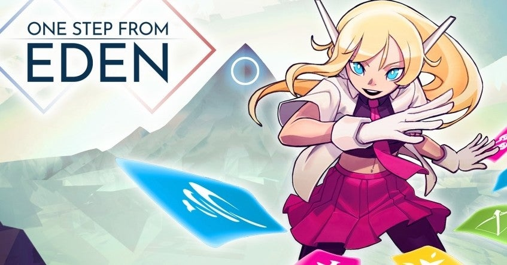
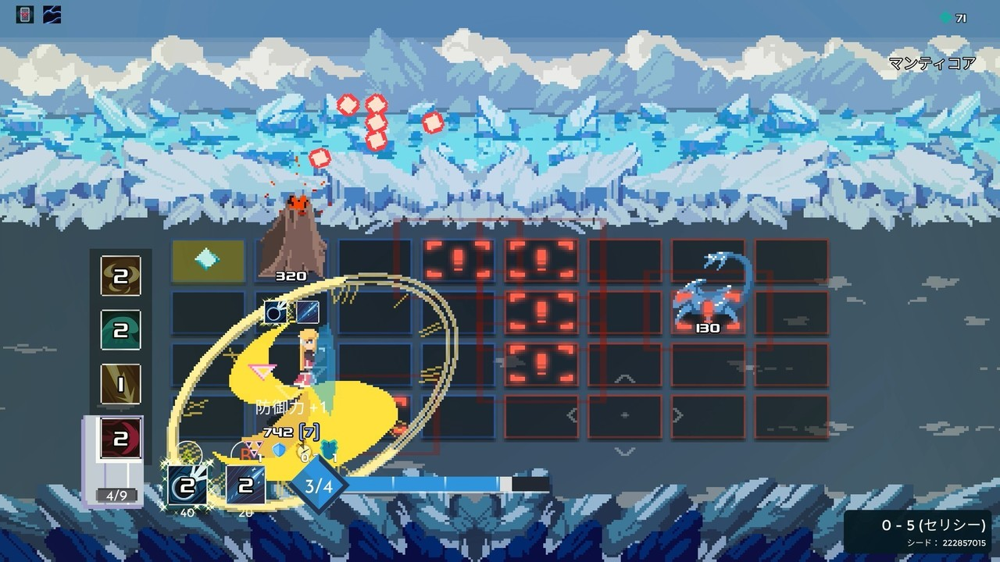
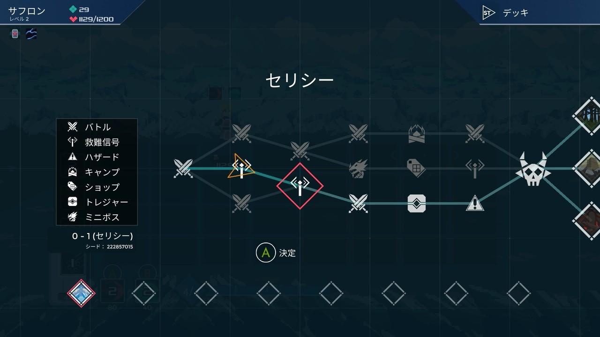
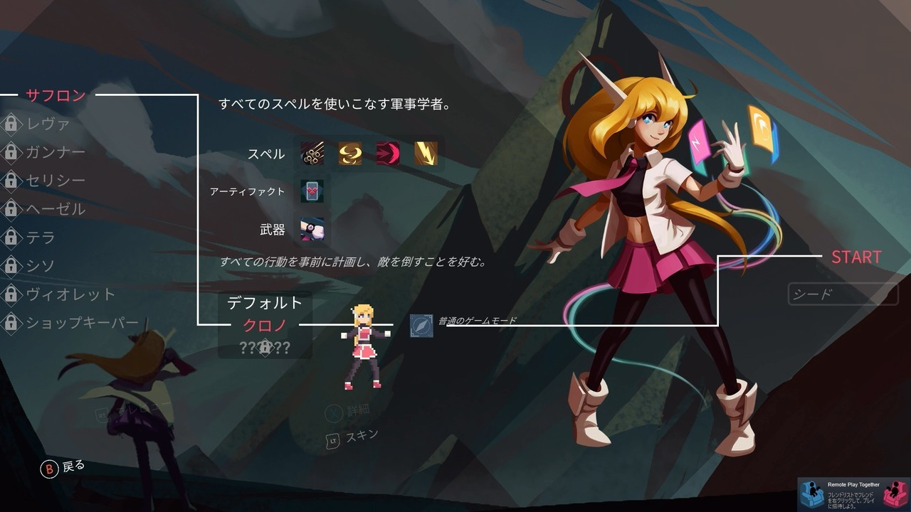

<figure>

</figure>

　**『ONE STEP FROM EDEN』**は、数日前に発売されたばかりのゲームだ。たまには新しい作品も紹介しないと。

　ゲームは、敵味方でそれぞれ4x4に分割されたパネルの上を移動しながら、手持ちのデッキからドローしたカードを使い、相手を倒すという内容。**『SLAY THE SPIRE』**の、ローグライトなステージクリア型カードデッキゲームと、2001年にゲームボーイアドバンスのローンチソフトとしてリリースされていた**『バトルネットワーク ロックマンエグゼ』**を組み合わせたようなゲームである。Steamと任天堂スイッチ用にリリースされている。

　開発は、Thomas Moon Kangという個人デベロッパー。ドット絵も描きながら、ゲームも作っているようである。ちなみに、オフィシャルサイトの製作者を見てみると、音楽は はがね という日本人作曲者である。やはり最近リリースされた対戦シューティング**『MAIDEN & SPELL』**の音楽も担当している人だ。

　ゲーム中のヴィジュアルは、最近の流行に則って、ピクセルアートな雰囲気で描かれている。カードデッキの表示がすごく小さいのが特徴で、バトル中はすべてアイコンとして表示されている。シンプルでわかりやすい画面だ。

　ゲームは、**『SLAY THE SPIRE』**のように、枝分かれしたマップ上を、コースを選択して進み、止まったマスでバトルや、その他のイベントをこなしていくというもの。バトルは、パネルの上を移動する敵の動向を見ながら、カードデッキから、2つのスロットにドローされるカードを見て、二者択一で適切なカードを使用し、敵に攻撃を繰り出していく。

　非常にわかりやすいシステムで、初めてプレイしてもルールを理解するのは容易である。ただ、このバトルがとにかく速い！　最初のうちは、目まぐるしいほどのスピードで動き回る敵と、その敵がばらまいてくる弾幕のような攻撃に圧倒されてしまうはずだ。また、カードによって効果範囲や攻撃のリーチが異なるため、自分の立ち位置をどこに置いて攻撃すればよいのか、そこも戸惑うかもしれない。しかし、複雑なルールが存在しないため、何回かプレイしていれば、そのスピードに慣れてくるから不思議だ。ある程度、自分と敵の動きが見えるようになってきたら、今度はじっくり戦略を考えればよい。

　ゲームをプレイしていくと、プレイヤーの使えるキャラクターや、スキン、攻撃に使用するスペル（カードのことだ）がアンロックされ、プレイの幅は広がっていく。この辺り、上手にやり込みたくなる要素が用意されている。

　1プレイの時間は、今のところ10分～15分程度。おそらく、上達してくるともっと長い時間かかるかもしれないが、それでも割とコンパクトに遊べるゲームではないだろうか。ちょっと高難易度なゲームバランスに最初は面食らうかもしれないが、気軽に遊んで奥が深いゲームになりそうな予感である。

　どうやら、ゲームのスピードが速いという指摘はたびたびあるようで、開発者のインタビュー記事では、ゲームのスピードを遅くする能力を選ぶといいというアドバイスもされている。

[https://www.gamespark.jp/article/2020/03/31/97956.html](https://www.gamespark.jp/article/2020/03/31/97956.html)

　いずれにしても、ゲーマーとしては、この高速長難易度に負けず、ゲームを攻略してみたいところだ。しばらくやり込んでみることにしよう。

[https://www.youtube.com/watch?v=FACwXh-u7Uc](https://www.youtube.com/watch?v=FACwXh-u7Uc)
