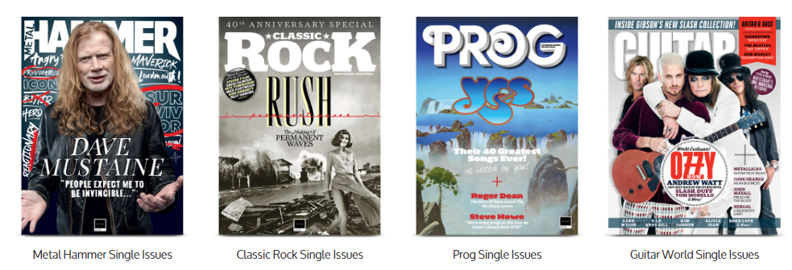

<figure>

</figure>

　サブスクリプションが最近の流行だ。音楽はもちろん、映画やドラマ、ゲームもサブスクリプションの時代である。

　僕も、数年前からサブスクリプションはあれこれ利用していて、音楽はGoogle Play Musicをずっと使っている。これのおかげでCDを買うことはほとんどなくなった。映画やドラマもNetflixで見ている。本については、Kindle Unlimitedを試したことがあるが、これはあまり読みたい本がラインナップされなくてやめてしまった。

　たいていのサブスクリプションサービスには、お試し期間のようなものがあるので、無料で体験して決められるのがいい。

　最近のお気に入りは、雑誌のサブスクリプションだ。普段雑誌は、それほど数多く買わないのだが、読んでみたい記事があるときは買う。しかし、ふと気づくと、サブスクリプションサービスの競争が激化しているせいで、各社とも過剰とも言える、豊富なラインナップを揃えるようになったようだ。

　早速、数社の雑誌サブスクリプションをお試ししてみた。うん、これはとてもいい。なかなか買うところまではいかない雑誌が読み放題ということで、あれこれつまみ食いのように読んでしまう。ゴシップ週刊誌とかいつも買わないのだけど、ついつい読んでしまう。ゲームの雑誌も買わないのだが、これも読んでしまう。

　もちろん、雑誌を読むので、少し大きい画面が必要だ。以前買ったiPad Proの12インチを縦持ちして雑誌を読むと、おおむね実物サイズで読めるので便利だ。縦持ちだと、見開きには対応できないのだけど、そのときは横持ちにする。多少画面は小さくなるけど、これで十分だ。ニュース雑誌もじっくり読めていいし、今まで買ったことないけど、料理雑誌なんて読んでみると意外におもしろい。

　ところが、よく買っている音楽雑誌はサブスクリプションのサービスがない。これは残念だ。そう思っていろいろ調べてみると、なんとイギリスのメタル雑誌**『METAL HAMMER』**はサブスクリプションがあるではないか。これは読んでみたい。

　もちろん海外のサイトなのだが、値段を見ると1年間で28.5ドル。イギリスの雑誌だけど、USドルで買える。英語なので、完璧に読むのは難しいかもしれない。まあ、知っているジャンルだからなんとかなるだろう。そう思って、1年間購読することにした。日本の音楽雑誌とは全然視点が違っておもしろい。新しい世界が開けるような気持ちである。

　さらに見てみると、プログレッシブ・ロック専門誌**『PROG MAGZINE』**なんてのもある。こっちも楽しそうだ。これはきりがないな。

　もっと探していると、ゲーム雑誌も充実している。**『PC GAMER』**は、その名の通りPCのゲームに特化した雑誌だ。こういうの読みたかったんだよ。日本でPCゲームに焦点を当てた定期刊行物ってないので、貴重である。ちなみに、**『PC GAMER』**はUK版とUS版があるので、ちょっと悩むところだ。

　それから、**『retro GAMER』**なんて雑誌もある。これは、その名の通り古いゲームを取り扱った雑誌。日本のレトロゲームとはまた違ったゲームが登場しておもしろい。

　なんて、探しているだけでも時間が過ぎてしまう。まあ、英語の雑誌は読むのに時間がかかるので、あまりサブスクしすぎないようにしよう。

　というわけで、最近のマイブームである雑誌のサブスクリプション。過剰なサービスはユーザーにとって嬉しいところであるが、あまり行き過ぎて、採算が取れないようなことにならずに続いてくれるといいなと思うのである。
