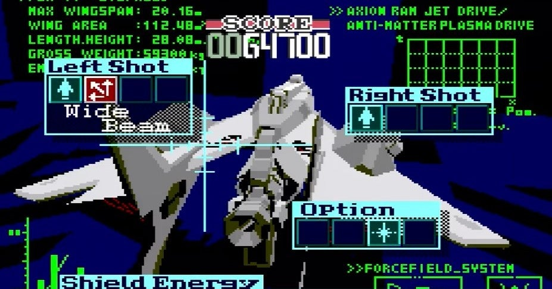

<figure>

</figure>

　最近は、ゲームで遊ぶときにいつでもそのプレイを録画している。何か攻略に役立てようとか、俺のスーパープレイを見せてやるぜ！　とか、そういうことではないのだが、自分が遊んだログを残したいようなつもりで記録している。

　で、今はYouTubeなんて便利なサイトが普及してるので、その動画をYouTubeにアップしている。今のところ容量制限もなく、ゲームのプレイログが残せる素晴らしいやり方だ。ちなみに、ひと昔前はニコニコ動画だった。ニコニコ動画は、その後サイトの仕様がYouTubeに大きく水をあけられたような状態なので、もう使っていない。

　実は僕には、こういう動画投稿サイトが登場する以前から、なぜかプレイログを残したい欲があって、結構昔から、ゲームプレイを記録していた。

　ニコニコ動画以前はどうしていたのか。ビデオ入力（またはS端子）のキャプチャーボードを使って、ゲーム機の映像をパソコンに取り込んでいた。この頃は、どこかにアップロードすることもなく、自分のハードディスクの中に動画をためこんでいるだけであった。もっとも、これらの動画データは、その後見直すこともなく、そのうち消去してしまったのだが。（今思うと、ちょっともったいない）

　さらに遡ると、パソコンでキャプチャーする以前は、ビデオデッキで録画していた。ここまで来ると、かなりマニアックな趣味というか、病気である。ゲーム機をVHSのビデオデッキに入力して、ビデオテープに録画するのである。

　一番思い出に残っているというか、準備段階も含めて大作だったのが、メガCDの**『シルフィード』**である。当時メガCDを持っていなかった僕は、友人にメガCD一式を借りて、**『シルフィード』**をやり込んだ。**『シルフィード』**は、敵の攻撃の激しさに反して自機の装備の不甲斐なさが目立つ、困ったシューティングゲームだった。しかし、パターンを覚えればなんとかなるゲームで、何回も何回も遊んで、なんとかノーコンティニューでクリアできる感じになってきた。ここまで来たら、やっと録画できる。何しろ、ビデオテープに録画するのだから、あまりやり直しをしたくない。デジタル録画が当たり前の今の時代にはわかりにくい感覚だが、ビデオテープは何回も録画を繰り返すと、画質の劣化が顕著に現れる。ゲームプレイの録画も、何回も練習して一発録りする、いわばライブ感覚が必要なのだ。腕のいいミュージシャンみたいでかっこいい話だ。全然そんなことないか。

　まあ、そんな馬鹿なことをしてプレイ録画を残していた。他にも、PCエンジンの**『スーパーダライアス』**や**『サイドアームスペシャル』**、**『グラディウスII』**など録画していた。**『イースI・II』**はプレイ時間が長くて、全編録画はあきらめてボス戦だけ記録していた。**『イースIV』**に至っては、さらにプレイ時間が長くて、録画することを断念した。今ならパソコン使って簡単に録画できるのに。

　その頃録画したVHSテープも、すべて捨ててしまい、今は手元に残っていない。本当に残念だが、一人でシコシコと録りためたビデオに拘泥して、いつまでも保管しているのもちょっと気持ち悪いので、これでいいのかもしれない。とにかく、そんな昔からの趣味（？）が、今も継続していて、ほとんど毎日のように、YouTubeにゲームの動画をアップしているのである。

　でも、そのビデオに録り始めたきっかけが何だったかと言うと、実は、ファミコンの**『ドラゴンクエストII』**で、復活の呪文を写し間違えたことだったりする。あの長い復活の呪文を間違えたことがショックだった僕は、当時ビデオデッキで録画するという画期的な方法を思いついたのだ。実に今から33年前の話。そんなときからゲーム画面を録画していたのだね。まさに、ゲーム動画はライフワーク。

[https://www.youtube.com/watch?v=xmOo1K4VisE](https://www.youtube.com/watch?v=xmOo1K4VisE)
