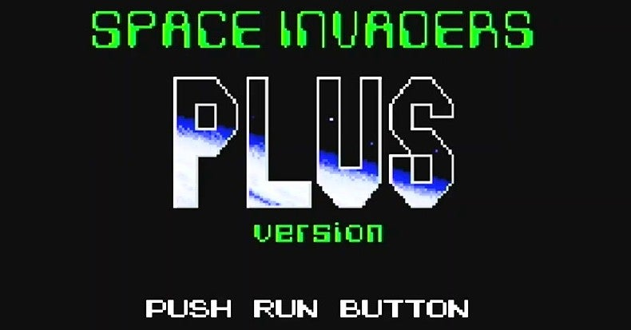
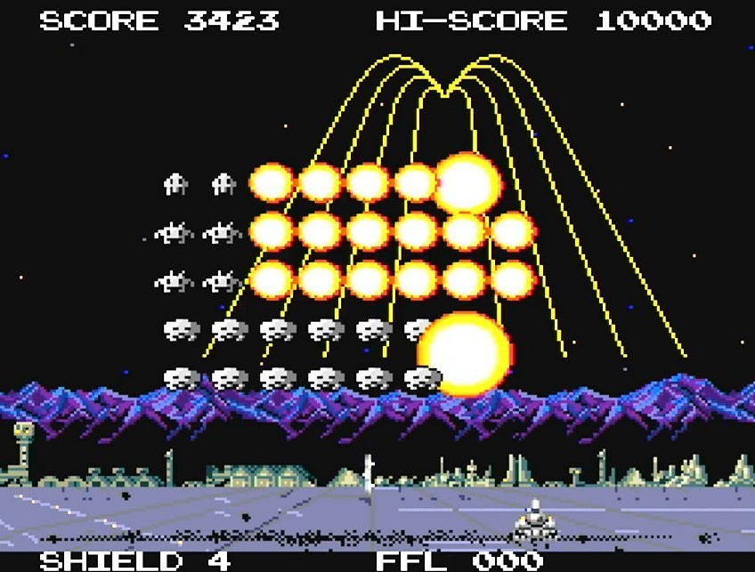

<figure>

</figure>

　**『スペースインベーダーズ 復活の日』**は、そういうタイトルのゲームだ。1990年にPCエンジン用ソフトとしてタイトーから発売された。

　もちろん、オリジナルの**『スペースインベーダー』**にアレンジを加えた内容になっていて、タイトル画面からオリジナルバージョンである「本家」と、アレンジバージョンの「分家」を選択して遊ぶことができた。

　**『スペースインベーダー復活の日』**は、このアレンジバージョンの完成度が非常に高いゲームだ。アイテムや敵のバリエーションを増やし、シューティングゲームらしい進化を遂げながら、必要以上に派手なアレンジを施すことなく、ゲームとして楽しんでプレイできる範囲の改良がなされている。

　原作にあった、自機の前に配置されて敵弾を防ぐ「トーチカ」は廃止され、その代わり、自機はシールド制の一撃死のないシステムに変更されている。家庭用らしい優しさであると同時に、トーチカがないために、ステージ開始と同時に激しい戦闘に突入し、非常にテンポがよい。

　**『スペースインベーダー』**と言えば、UFOで点数を稼ぐことが常道であったが、アレンジ版では、UFOはアイテムキャリアの役目を果たしている。このアイテムの調整が絶妙なところも、このゲームの優れた点であった。

　画面上にシャワー状に降り注ぐレーザー、インベーダー目指して飛んでいく誘導弾、自機を守るバリアなどなど、9種類のアイテムがそろっているが、その威力と弾数のバランスが上手に設計されていて、どのアイテムを取っても使えないということはないし、逆に、圧倒的に有利になるということもない。アイテムは完全にランダムドロップであるが、ゲーム展開を左右するほどの運ゲーになっていないところに好感が持てた。

　敵の攻撃は、斜めに飛んでくる弾、高速で飛んでくる弾など、わずかなバリエーションがある。しかし、こちらも派手になりすぎず、それでいてステージが進むと弾速が上がって確実に難易度が上がるという、シューティングファンには適度なやりごたえを持って楽しめる調整になっていた。

　総じて、見た目にすごく派手ではないのだけど、くり返し遊んでいくうちに、アイテムの使い所や、ステージによって配置の異なる敵のさばき方など、一見して地味な部分でプレイヤーの腕が上がっていく。結果、これが『スペースインベーダーズ 復活の日』を、毎日遊べるスルメゲーに仕上げていた。

　そんな理由から、当時PCエンジンでこのゲームをプレイしていたときは、毎日繰り返して遊ぶことが習慣になっていたのだ。小気味よいBGMと、抑え気味に描かれた宇宙のグラフィックも美しく、ゲームの堅実さを印象づけていた。

　先日、PCエンジンminiが発売になったが、残念なことにこのゲームは収録されていない。おそらく、PCエンジンの歴史の中では地味なソフトなのだろう。かろうじて、Wiiのバーチャルコンソールで遊べるが、こちらも販売は終了してしまっている。今となってはなかなか遊べる環境もないゲームだが、またどこかで再会できることを期待している1本だ。

　ちなみに、オープニングにはワイヤーフレームによるデモが収録されており、PCエンジンとしてはなかなか見ごたえのある動きを見せてくれている。こちらも一見の価値ありだ。

[https://www.youtube.com/watch?v=3BUF2bLyzlg](https://www.youtube.com/watch?v=3BUF2bLyzlg)
