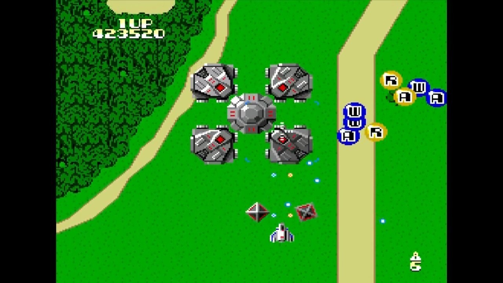

<figure>

</figure>

　**『ゼビウス　ファードラウト伝説』**は、ナムコが1990年に発売した、PCエンジン用のゲームである。なお、開発はコンパイルが担当したらしい。（ネット上でしか情報を得られなかったが、エンドクレジットにはコンパイルのスタッフらしき名前が並んでいる）

　このゲームも、移植ソフトによくあるオレジナル版とアレンジ版のカップリングになっている。タイトル画面には、「FARDRAUT」と「ARCADE」の表示があり、どちらかを選んでプレイできる。

　もちろん、このアレンジ版こそが**『ゼビウス　ファードラウト伝説』**の真骨頂である。アレンジ版は、ゲーム全体が4つのラウンドで構成されており、ラウンドの幕間には原作開発者の遠藤雅伸の設定をベースとしたストーリーが、グラフィクとともに語られる。当時のゲーマー、特にゼビウスに心酔したゲーセン少年ならば、このSF設定の魅力を堪能できたのではないだろうか。

　ゲームシステムそのものは、原作の**『ゼビウス』**から大きく逸脱しないデザインとなっている。自機は、空中攻撃用のザッパーと、地上攻撃用のブラスターを撃ち分け、スクロールするステージを進んでいく。自機は、特定の敵から放出されるアイテムを取得することでザッパーとブラスターの攻撃範囲が広がるというアレンジが為されており、地味なパワーアップながら、原作の雰囲気を壊さない程度に遊びやすい配慮となっているのは嬉しいところだ。

　また、前述したラウンドごとのストーリーによって、デザインの異なる自機を操作することになるが、こちらはストーリー上の演出であって、自機によって性能が異なるわけではない。最後のラウンドだけは、原作にも登場したキャラクター「シオナイト」が、敵や敵弾を防御してくれるオプションとして自機の周囲を回るように装備される。初代**『ゼビウス』**では、ただ登場して去っていくだけだった「シオナイト」が、ともに戦ってくれるのは、ファンにとって嬉しいワンポイントアレンジだった。

　マップも、初代**『ゼビウス』**に登場したような地形が再登場して懐かしかったりする他、BGMはラウンドごとに別の曲が用意されているが、それでも初代のシンプルな電子音をなぞるかのようなミニマムな作りになっていて、一貫して作品の世界観を壊さないアレンジを堅持しているのが、好感触だった。

　ただし、やっぱり1990年に登場したシューティングゲームとしては、地味だったのかもしれない。当時それほど大きく話題にならず、ファンアイテムのようなゲームで終わってしまったような印象はある。

　そして、残念なことに、PCエンジンminiには、このゲームも収録されていないのである。おそらく、PCエンジンminiの発売前のアンケートでも得票数は限られていたのだろう。結果発表に『ゼビウス　ファードラウト伝説』の名前が登場することはなかった。これで、このゲームも遊ぶ機会が無くなったと思うと、非常に残念なところではある。

　なお、1988年に、このゲームに先んじて、MSX2用に同タイトルのゲームが発売されているが、こちらも同様のコンセプトのゲームではあったが、少々パワーアップが派手で、ちょっとイメージが異なることは付け加えておこう。
