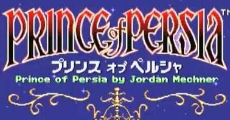
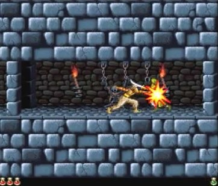
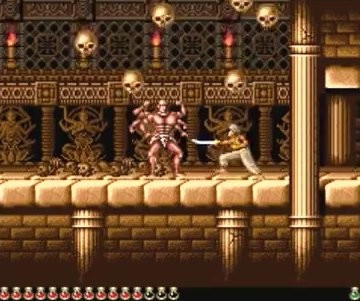

<figure>

</figure>

　なぜかツイッターのトレンドに「スーパーファミコン」というワードが入っていた。任天堂スイッチが品薄で買えないから、スーパーファミコンで遊ぼう！　といった流れなのか？　真相はよくわからない。

　ところで、スーパーファミコンと言えば**『プリンス・オブ・ペルシャ』**である。いや、もちろん他にも遊んだソフトはいっぱいあるのだが、スーパーファミコン版の**『プリンス・オブ・ペルシャ』**は名作だ。

　この手の洋ゲーを日本のコンシューマ機に移植すると、だいたいは滑った内容になるのかなと思っているのだが、**『プリンス・オブ・ペルシャ』**は奇跡的によい出来の、アッパー移植だった。余談だが、スーパーファミコンには、**『ダンジョンマスター』**や**『レミングス』**、**『シムシティ』**など、上手に移植された洋ゲーが多いのが嬉しかった。

　**『プリンス・オブ・ペルシャ』**は、もともとアップルII用として1989年にリリースされたゲームである。ブローダーバンド社らしい、滑らかなアニメーションで描かれる人物の動きがリアルで、広大な王宮の中をさまよい歩き、悪い魔法使いにさらわれた姫を探し出すという内容だ。慣性のついた主人公の動きは滑らかすぎて思うように動けないときがあり、それが難易度の高さを生み出していた。

　スーパーファミコン版も、このリアルな動きを継承して、よさ気な感じで移植されているのだが、それに加えてステージ数が増加している。さらには、アップルII版には登場しなかったオリジナルの敵も追加されていて、基本的なゲームシステムこそアップルII版を踏襲しているものの、全体的には別ゲーとして作り直されている印象だ。

　僕は、最初にX68000版でこのゲームをプレイしたのだが、その後遊んだスーパーファミコン版の豪華な移植には驚かされた。ちなみに、タイトル画面には、**『スタークルーザー』**や**『ウィバーン』**などで古くからのパソコンゲームファンにお馴染みのアルシスソフトウェアの名前がクレジットされている。うん、いい仕事している。

　そんな隠れた名作**『プリンス・オブ・ペルシャ』**スーパーファミコン版を思い出したということで、ついさっきプレイしてみた。そうしたら、これが難しい。スタートメニューからトレーニングを選んで、基本操作を学ぼうとしたのだが、これがもうクリアできない。踏むと落ちる板にぶら下がったら、その後どうするんだっけ……？　ぐらいのレベルである。結果、1時間ほどプレイしてあきらめた。

　どうやら、今**『プリンス・オブ・ペルシャ』**を攻略するには、かなり気合がいりそうな感じだ。それでも、このゲームが名作であることには変わりない。機会があったらプレイしてみてほしい。
