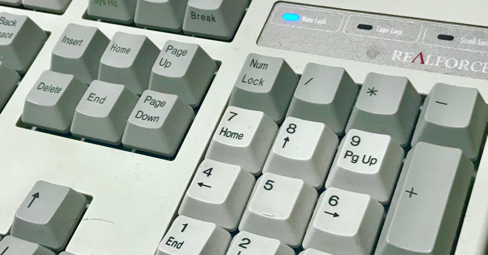

<figure>

</figure>

　東プレの『REALFORCE』というキーボードを、もう10年以上使っている。このキーボードは、「静電容量無接点方式」という、電極が接することなく入力を検知するスイッチを使用していて、その打鍵感が快適なことで有名な逸品だ。

　『REALFORCE』に出会うまで、僕は様々なキーボードを試した。主に、人間工学に基づいたなんてうたい文句のものを選んでいて、いつもちょっと変わった形のキーボードを買っていたのだ。

　ところがある日、秋葉原のキーボード専門店で『REALFORCE』に触れてびっくり。なんの変哲もない普通のデザインのキーボード。それなのに、なんという軽やかなキータッチ。一気に気に入ってしまった。

　昔から、ホームページなんか作って駄文を描き散らかしていた僕は、自然とキーボードを使うことが多くなり、少しでも使いやすいものを欲していたように思う。『REALFORCE』はそんなニーズにぴったりのキーボードで、単に無接点で打鍵感が軽いというだけでなく、キーによって（それを押す指によって）、バネの強さが変えてあるという凝った製品だったのだ。

　新しいキーボードを試すことが趣味のようになっていた僕は、早速一発で惚れ込んだ『REALFORCE』を購入。当時の価格は、今より少し安くて18000円程度。それでも、僕にとっては、それまでに買っていたキーボードからすると3倍ぐらいの価格で、とても高かった。しかし、その価格に見合うだけのことはあり、このキーボードはすっかり僕のお気に入りとなったのである。

　と言うわけで、それから10年以上が経つが、未だに同じキーボードを使っている。つくりも頑丈なのか、故障もまったくなく、今でも買った当時と同じ感覚で使える。別に他のキーボードで文字が打てないとか、そういうことを言うつもりはないのだが、やっぱり『REALFORCE』がいいなあ、という感覚になってしまったのは事実だ。

　さて、『REALFORCE』を買ったことで、僕のキーボードを買うという趣味はすっかりなりを潜めた。今となっては、他のキーボードに買い替える気も起きず、このキーボードを安定して使い続けているというわけである。

　しかし、最近、この『REALFORCE』シリーズにもゲーミングデバイスの波が押し寄せ、LED内蔵のキーボードなんてのも登場してきている。うん、光るキーボードもかっこいいかもしれない。10年ぶりにキーボード買ってみるのもいいかもしれないな。
