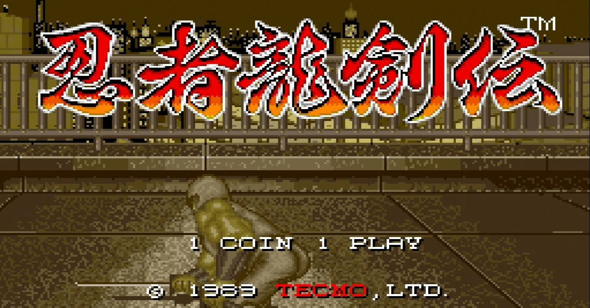
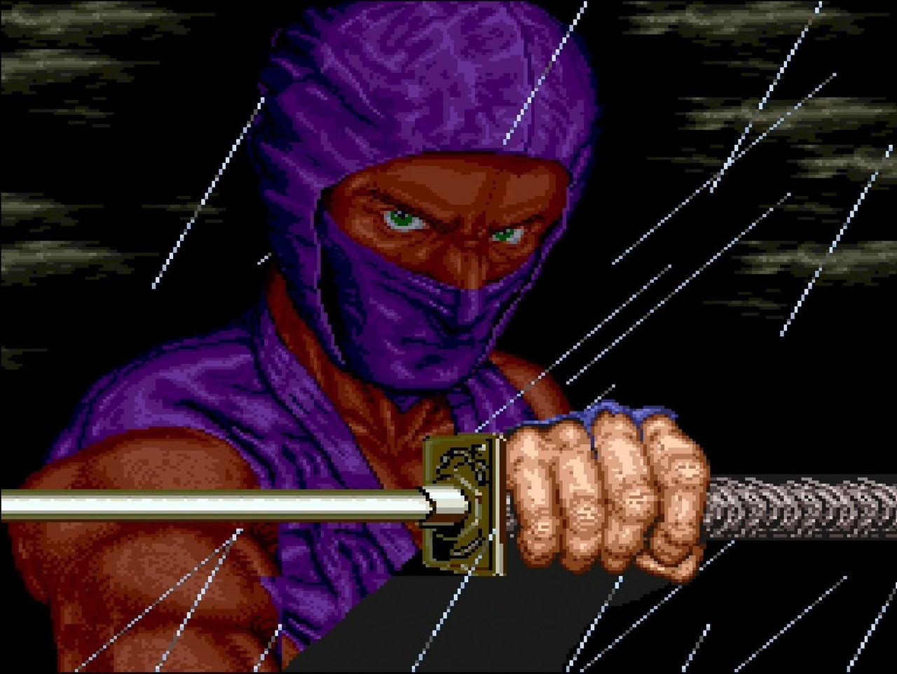
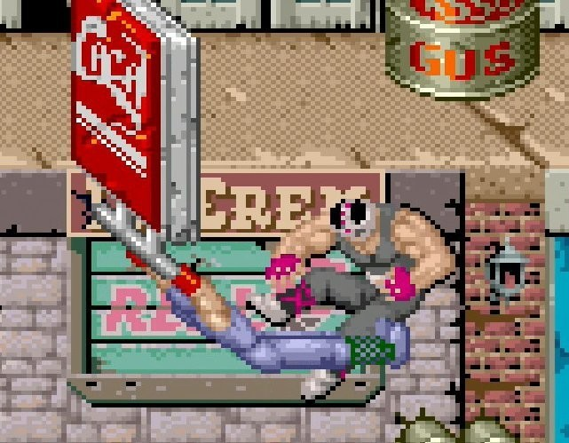
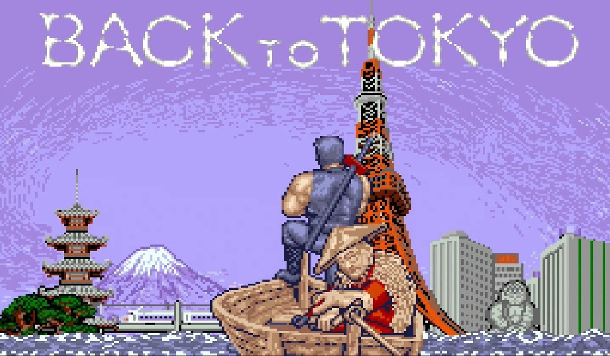
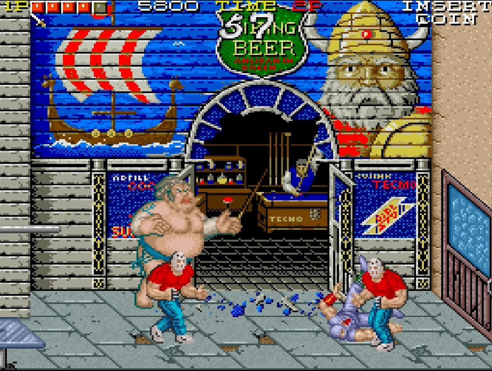
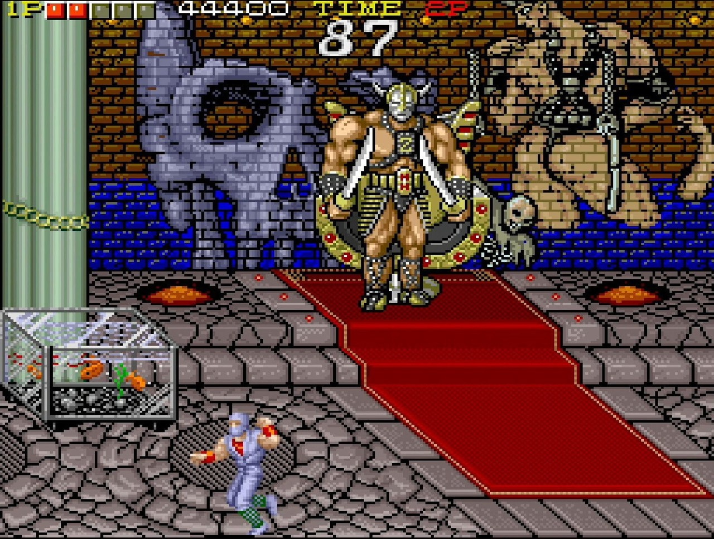

<figure>

</figure>

　**『忍者龍剣伝』**と言ったら、なんと言ってもアーケード版である。フジテレビの人気テレビゲーム番組**『ゲームセンターCX』**にファミコン版が登場したことから、ともするとファミコン版**『忍者龍剣伝』**が名作のように捉えられている向きもあるかもしれない。しかし、今日はっきりと言おう。正直、**ファミコン版、アーケード版どちらも微妙なゲーム**だ。

　アーケード版**『忍者龍剣伝』**は、テクモが1988年にリリースした忍者アクションゲームである。今で言うベルトスクロールアクションの黎明期に登場したゲームで、プレイヤーは「闘え（攻撃）」「跳べ（ジャンプ）」「握れ（看板などにつかまってぶら下がる）」の3ボタンを使って、日本から遠くアメリカの地で正体不明の敵組織と戦い続ける。「握れ」ボタンがレバーにに取り付けられた特殊コンパネで、これがこのゲーム最大の特徴になっているが、別に普通の3ボタンコンパネでよかったんじゃないかという気もする。

　ゲームの世界観は、洋画などにありがちな、ちょっと間違った日本像を全面的に押し出したものになっている。おかしなペインティングを施した相撲レスラー、ステージの幕間で寿司を食べる忍者、大仏と富士山と東京タワーが同居する東京の風景が登場するエンディングなど、ある意味ティピカルな「勘違いニッポン」が意図的に織り込まれている。

　こういった毒毒しいヴィジュアルが、朴訥で荒々しいドット絵で描かれた画面は、よくわからないエナジーに満ちていて、インパクトにあふれている。しかし、それだけの個性を持っていてなお**『忍者龍剣伝』**を微妙なゲームたらしめているのは、敵のアルゴリズムや、自機である忍者の攻撃判定のふがいなさにある。

　まず、とにかく敵の攻撃判定が強いのだ。ベルトスクロールアクションの常として、正面から敵に当たるとボコボコにされることは多いのだが、それにしても、この**『忍者龍剣伝』**の敵の攻撃は極めて優先的にプレイヤーにヒットする。さらに、敵の数が多い上に、投げ技で投げた敵を当てて、押し寄せる敵を蹴散らすことはできない。つまり、多人数で攻めてくる敵に囲まれると、1体の敵を相手している間に、他の敵にボコボコにされることが多い。これが、すごくストレスになるゲームなのだ。逆に言うと、数で迫る敵を上手にさばけるようになることが、このゲームの最大の攻略ポイントとなる。

　前述した「握れ」ボタンは、この敵の大群に対する強力な反撃手段だ。看板にぶら下がった忍者は、レバーと攻撃ボタンで左右にキックを繰り出せる。このキックは、普段の攻撃判定とは裏腹に、実に強力な当たり判定を持つ。迫り来る敵を次から次へとふっ飛ばすことができる爽快な攻撃だ。しかし、長い丸太を持った敵にはリーチが足りず、左右から同時に押し寄せてくる敵にはやはり対応できず、ボコボコにされてしまう。

　要するに、慣れるまでは、ありとあらゆる敵の攻撃がプレイヤーにストレスを感じさせるところが『忍者龍剣伝』最大の難点であるのだ。（もっとも、もう少しがんばればなんとかなりそうに感じさせるところは、アーケードゲームとして適切な難易度調整なのかもしれない）

　同時に、ケレン味たっぷりのヴィジュアルには、ところどころアニメや漫画のオマージュと言うか、有り体に言えばパクりっぽいデザインが多数登場して、この辺は人によっては鼻白むところかもしれない。

　それでもなお、このゲームを「名作」と呼んでしまうのは、そのカオスな要素をごった煮にしつつ、アクションゲームとして完成度の高い次元に持っていってしまった力業のようなところが気に入っているせいかもしれない。

　さらに言えば、そのゲーム世界を盛り上げるBGMが素晴らしいのだ。後に**『ときめきメモリアル』**の開発にも参加して名を馳せるメタルユーキこと斎藤幹雄のペンによる楽曲群は、なぜかヘヴィメタル／ハードロックのスタイルが貫かれている。なんだ、お前の好みの音楽ってだけじゃん、と言われればまったくその通りで恐縮なのだが、忍者、アメリカ、勘違いニッポンと来て音楽がヘヴィメタル。こんなのどう考えたって変な笑い出るでしょ。

　斎藤幹雄は、後にコナミでも**『サンダークロスII』**でヘヴィメタル調の名曲群を世に残してくれるわけだが、それに先駆けて、いや、それよりももっとアグレッシブな楽曲が**『忍者龍剣伝』**では聞けるのだ。ラウンド1で聞かれる”Shadow Soldier"の趣味丸出しのドラマティックサウンドは涙なしには聞けない。

　現在**『忍者龍剣伝』**は、PS4のアーケードアーカイブスでプレイできる。正直、微妙すぎて移植はされないと思っていたゲームなので、今この時代に**『忍者龍剣伝』**が再び遊べることを素直に喜びたい。レトロゲーム好きのみなさんには、この微妙忍者世界を体験して、謎のパワーと煮え切らないゲーム性にむせび泣いてほしい。

　ところで、そのアーケード版**『忍者龍剣伝』**の1面BGMをそのままヘヴィメタルスタイルでカヴァーしているバンドがいるらしい。世の中広いというか、目のつけどころがいいじゃないか！　と応援したくなった。

[https://www.youtube.com/watch?v=eh5nzJdBv\_o](https://www.youtube.com/watch?v=eh5nzJdBv_o)

[https://supermadnes.bandcamp.com/track/shadow-soldier-ninja-gaiden-arcade](https://supermadnes.bandcamp.com/track/shadow-soldier-ninja-gaiden-arcade)
