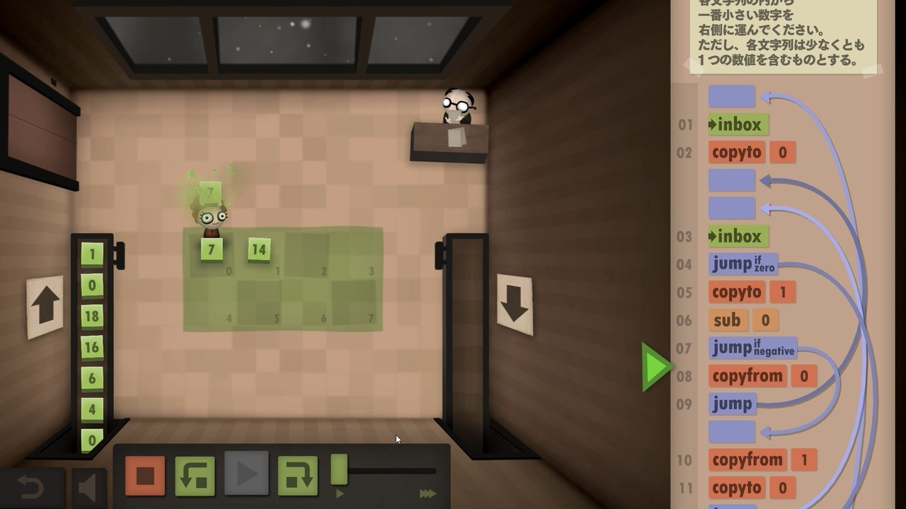
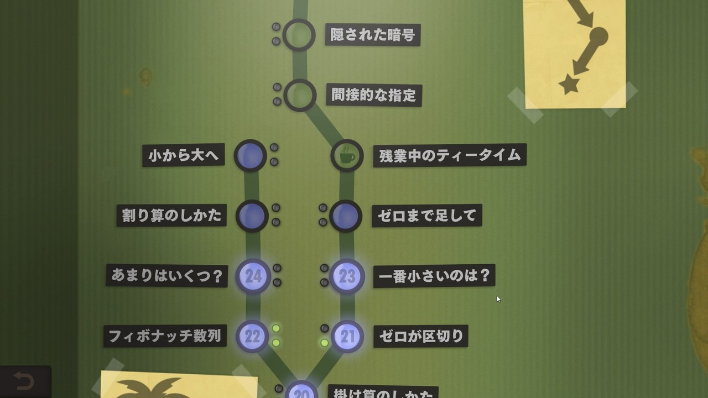

<figure>

</figure>

　**『ヒューマン・リソース・マシーン』**は、プログラムを作って遊ぶアカデミックなゲームだ。

　プログラムと言っても、難しいスクリプトを書くようなことはしない。画面上に、命令が書かれたパネルを付箋のように貼り付けて行くだけの簡単操作でお題にそった動作を実現する。命令は、足し算や引き算、その結果を判別してプログラムの動作を制御するものなど、極めて単純なものに限られているので、理解するのは簡単だ。これをいかに組み合わせてアルゴリズムをプログラムとして組み立てるところを楽しむゲームというわけだ。

　ゲーム画面は、社屋の一室を模したようなレイアウトになっている。部屋には、社員と思しき人物と、その上司らしき人物がいる。プレイヤーは、この上司が出題するお題に従って、プログラムを作る。

　部屋の床には番号のついたマス目が配置され、ベルトコンベアで次々と運び込まれる数字や文字の書かれた箱（？）をこの上に置くことができる。ゲームの目的は、出題に応じてこの箱を操作し、正しい結果をベルトコンベアで出力することだ。

　ただし、プレイヤーは、ゲーム内に登場する社員を自由に動かすことができるわけではない。社員はあくまでプログラムに従って動作するので、プレイヤーは適切な結果が導き出されるようにプログラムを組み立てなければならない。

　要するに、この部屋はコンピュータを具体物で表現したヴィジュアルである。入力／出力装置であるベルトコンベア、メモリとして使用できる床で構成されている。忙しく動き回る社員は、唯一データを操作できるレジスタの役割を担う。

　前述したようにプログラムを直感的な操作で作ることが可能で、実に簡単である。マウスオペレーションで簡単に命令を並べることができるインターフェースは秀逸だ。

　ただし、この簡単に書けるプログラムが曲者だったりする。命令パネルから伸びる矢印を任意の場所へ自由自在に動かし、思いつくがままにプログラムを組み立てているうちに、そのプログラム画面は絡まった紐のごとく複雑に入り乱れてしまう。いわゆる「スパゲッティ」状態のプログラムができやすいのだ。

　上司の出題は、プログラム経験者ならばそれほど難しいものではない。ちょっと考えればアルゴリズムは思いつくようなものばかりだ。しかし、思いつきがすぐ画面に反映できるため、プレイヤーは、スパゲッティプログラムになってこんがらがった矢印と格闘しながら課題を解くことになるだろう。むしろこのゲームは、スパゲッティとの戦いが攻略の大部分と言えるかもしれない。

　とは言え、ゲームは、問題数も41問と適切な量であること、ステージが途中で分岐し、クリアに必須なステージと上級プログラムのステージに分かれていることなどもあり、自分のスキルや集中力（？）に合わせてチャレンジできる遊びやすいつくりになっている。また、各ステージに設けられたプログラムの長さと、実行ステップ数の基準をクリアするチャレンジもできるようになっている。より上級者は、プログラムのさらなるシェイプアップにも挑戦できるという仕掛けだ。

　何やら子どもにはプログラム教育とやらが必須とされている昨今だからこそ登場してきたようなゲームであるが、実際にスクリプトを書くような高度なゲームもいくつかある中、この**『ヒューマン・リソース・マシーン』**は、ヴィジュアルと操作性に優れたプログラミング学習ゲームと言えるかもしれない。プログラミングに興味ある人は一度チャレンジしてみてほしい。

　なお、任天堂スイッチ用にも移植されているので、そちらでも同様に遊ぶことができる。

　さて、**『ヒューマン・リソース・マシーン』**をクリアしたら、次は続編の**『セブン・ビリオン・ヒューマンズ』**が待っているぞ。
