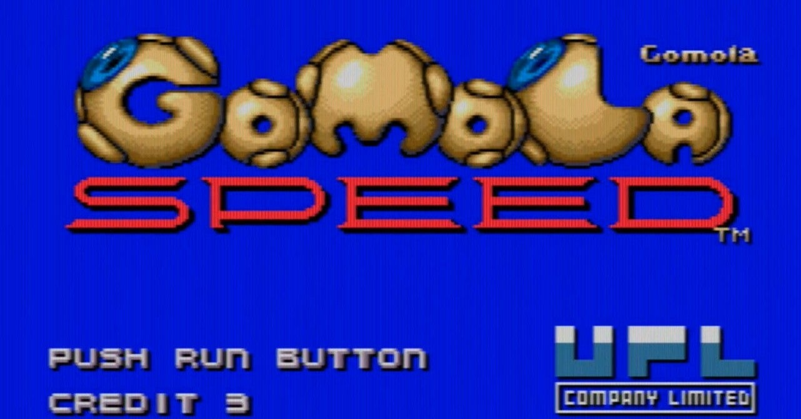
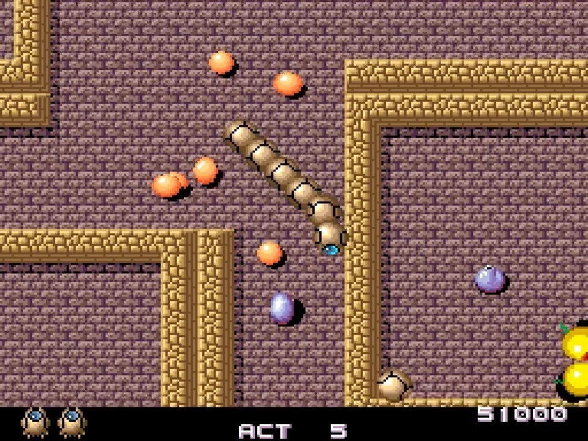

<figure>

</figure>

　**『ゴモラスピード』**はPCエンジンのゲームだ。1990年にUPLよりリリースされた非常にユニークなゲームシステムを持ったアクションゲームである。

　プレイヤーは、ゴームと呼ばれる機械のような、生物のような自機を操る。ゴームは、迷路状に入り組んだ（あるいは、単にだだっ広い）ステージから自分の胴体を見つけて捕食（？）することで自分の体を蛇のように長く伸ばしていく。ゴームは長く伸びた胴体を使い、敵キャラクターをくるりと囲むことでその敵を倒すことができる。ステージ中のどこかに存在する出口を探し、そこから脱出するとステージクリアだ。

　迷路のデザインは、どこかアタリの**『ガントレット』**を思わせる趣もあり、生物的で有機的な動きをする敵キャラクターも含めて、外宇宙に存在するエイリアン的存在を意識したかのようなヴィジュアルも異彩を放っていた。

　UPLは**『忍者くん』『アトミックロボキッド』**など可愛らしいキャラクターのヒット作をリリースする一方で、全体的には変わったゲームシステムのゲームを多くリリースしているメーカーで、この**『ゴモラスピード』**もそのひとつだったように感じられる。エンディングのクレジットには、UPLのちょっとユニークなゲームを数多く手掛けた藤沢勉の名前（ローマ字で♡TSUTOMU FUJISAWA表記）が見られるので、やはりそういうことなのだろう。

　ゲーム中バックに流れるBGMは、画面の雰囲気にマッチした神秘的な雰囲気で、PCエンジンの音源をうまく生かしたリバーブ効果が、そのミステリアスさに拍車をかけている。最初のステージなどで流れるメインのBGMは、アメリカのロックバンド**『ブルー・オイスター・カルト』**の代表曲**”(Don't Fear) The Reaper"**にも似たメロディラインが印象的で、このゲームのちょっと不思議な感覚を演出するのに一役買っている。ボーナスステージでは一転して明るい曲が流れるが、こちらは『忍者くん阿修羅の章』のBGM作曲や、ゲームアーツの作品にも楽曲を提供していることでおなじみのメカノアソシエイツによるものらしい。（サイト**『UPL墓掘り人』**情報）

　実に不思議な印象と、他には見られないゲームシステムを持った**『ゴモラスピード』**。当時、どうして僕がこの変わったゲームに目をつけて購入したのか忘れてしまったのだが、かなりハマってプレイしていた。しかし、いかんせん難易度が高く、敵を囲むという地道な攻撃方法と相まって、全25ステージを攻略するには相当の根気を要した。ゲームの印象がちょっと渋めで地味だったこともあり、広く人々の記憶に残る大ヒットゲームにはならなかった。

　で、いつものように、これもPCエンジンminiに収録されてない！　って話をするわけだが、まあ、このゲームは収録されなくても無理ないかなという感じはする。ちなみに、敵を囲むためにコントローラーの十字ボタンをぐりぐりと回転するように押すわけだが、親指が痛くなること請け合いのゲームだった。

　なお、同UPL社の作品に**『宇宙戦艦ゴモラ』**というゲームがあるが、こちらとの関係は不明だ。なんで「ゴモラ」という名称にこだわっているのか知りたいものである。

[https://www.youtube.com/watch?v=b70xVsrG8CM](https://www.youtube.com/watch?v=b70xVsrG8CM)
