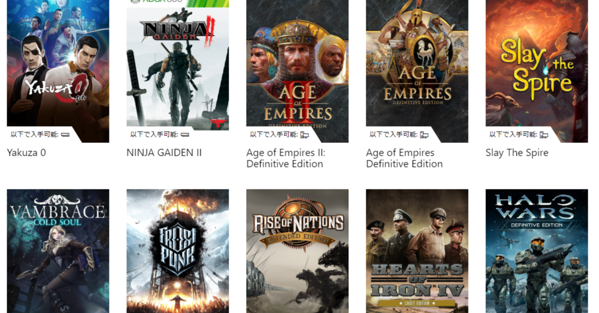
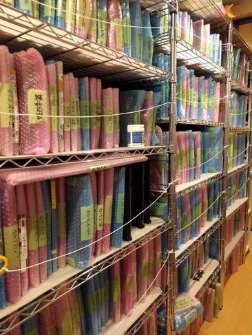

<figure>

</figure>

　話題の**『Xbox Game Pass for PC』**に加入してみた。今なら（最初の1ヶ月）100円！　その後は月額425円で、有名タイトルが遊び放題というお得なサービスだ。

　まあ、これがお得かどうかは加入後にどれだけ遊ぶかで決まってくるわけだが。ちなみに僕は、数ヶ月前にエレクトロニック・アーツの提供する**『Origin Access BASIC』**というサービスに加入している。こちらもあまり話題になっていないが、要するにサブスクリプションでゲームが遊び放題になるサービスだ。実はその後あまり遊んでない。

　ところで、サブスクリプションのサービスに加入するまでもなく、僕はいわゆる積みゲーが多く、ゲーム遊び放題のサービスなど利用する前にむしろその積んであるゲームから遊び放題じゃないかという突っ込みを入れたくなる。実際、今回**『Xbox Game Pass for PC』**に加入してみると、Steamで買ったまま（物理的には積んでないけど）積んであるゲームがいっぱいラインナップされていた。まったくの無駄である。しかし、もし最初からサブスクリプションサービスが存在すれば、この積みゲーはそもそも存在しなかったのではないだろうか。

　そう、積みゲーは従来のソフト買い切りのシステムだからこそ発生する、日々の少ない時間では遊び切れないゲームの墓場（？）なのだ。おそらく、これからはゲームもサブスクリプションのサービスが普及し、積みゲーの概念そのものが消えていくのではないだろうか。そこにはただ、「いつか遊びたいゲーム」のような淡い希望を持ったゲームのリストが存在するだけだ。

　逆に、Steamのようなダウンロードオンリー型のサービスよりひと昔前にさかのぼってパッケージのゲームを買えば、これは物理的にも立派な積みゲーである。棚にきれいに並べてコレクションしてあろうが、置く場所がなくて本当に積み上げてあろうが、積みゲーだ。邪魔なこと上なく、我々の居住空間を際限なく侵食する、悪魔のごとき蒐集物である。

　よくよく考えれば、その昔パッケージでゲームを買うことなどなかった時代がある。ビデオゲームはゲームセンターにのみ存在し、家でゲームを遊ぶことがなかった時代である。それならば、その頃は積みゲーというものはなかったのか。いや、そうではない。ゲームセンターのゲーム機を集め、蒐集し、積み上げる輩も存在するのだ。1000枚以上のビデオゲーム基板を買い集め、新居の1フロアが基板部屋と化した剛の者もいると聞く。

　こうなってくると、単にゲームが積んであるということにとどまらず、そのゲームを遊ぶのも、売ったりして処分することも難しくなる。ゲーム基板を持っている人間は、死ぬまでそれを手放すことなく溜め込む人も多いことだろう。パッケージのゲームソフトなら、多少は手放しやすいのだろうか。そうかもしれない。しかし、コンプリートしたゲームソフトなどはやっぱりなかなか手放し難いのが人情だろう。

　しかし、ゲームがサブスクリプションになった今、ゲームマニアはこうした収集欲から解放されるのかもしれない。遊びたいときにゲームをインストールし、飽きたら削除してストレージの領域を空ける。そうやって、自分の手元にとどまるゲームはなくなっていくに違いない。

　僕は個人的に、このように手元にゲームがとどまらくなることを、「ゲームの流動性が高い」と表現するようにしている。今までも遊び終わったゲームを売買することはあったが、これからはもっとゲームの流動性が高まり、ゲームファンの手にゲームが残らなくなるのかもしれない。そう考えている。

　このことは積みゲーマーにとって興味深いテーマとして、今後も検証していこうと思っている。
