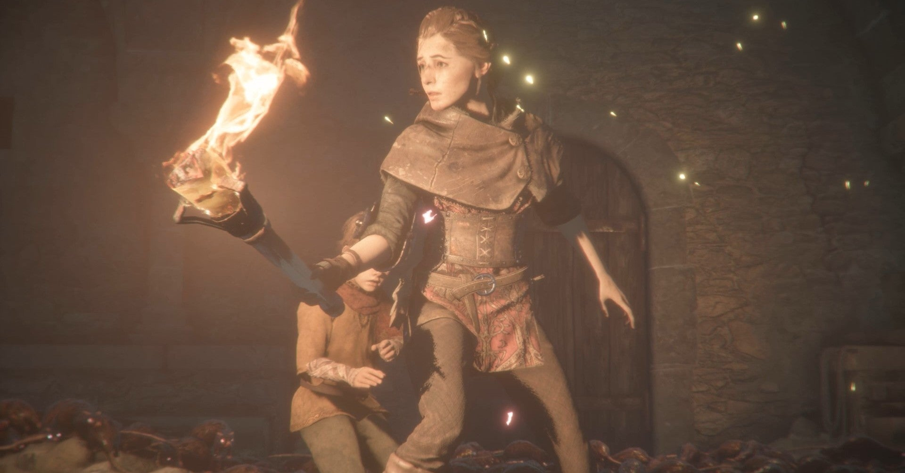
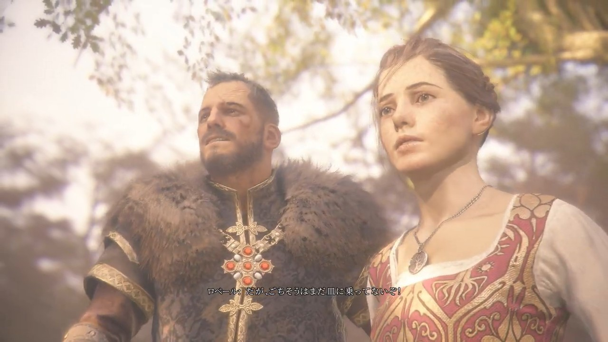
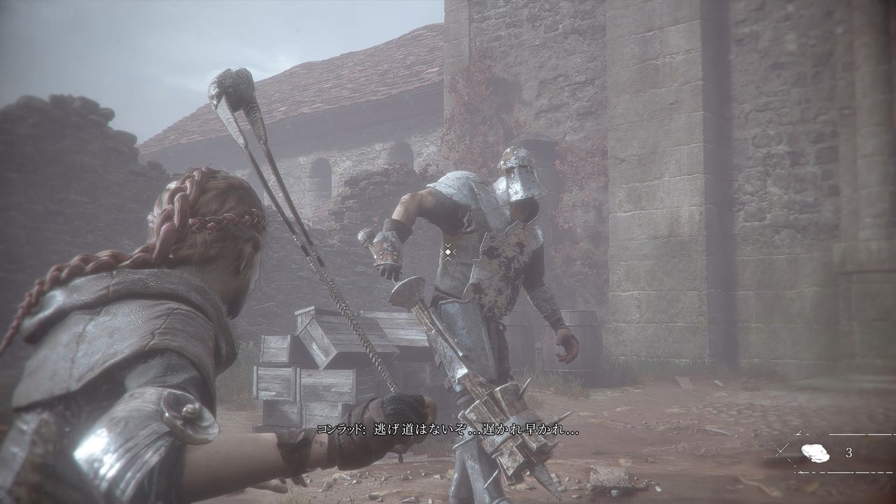
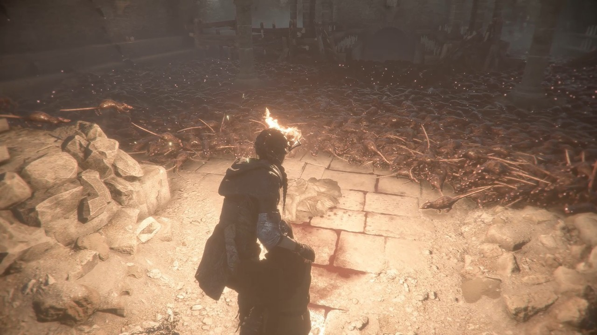
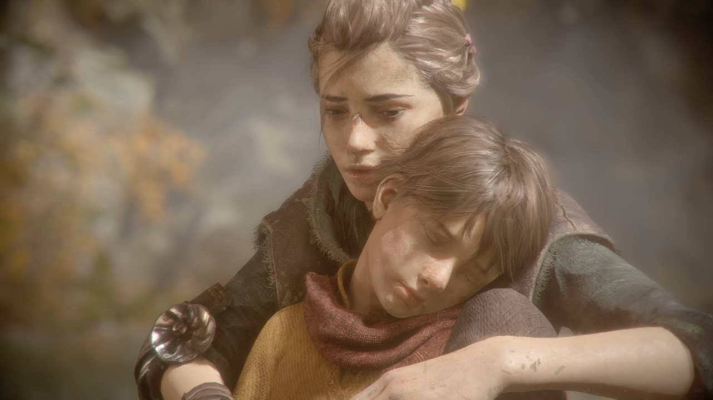

<figure>

</figure>

　**『プレイグ テイル -イノセンス-（A Plague Tale: Innocence）』**は、中世、14世紀のフランスを舞台にした、サバイバルアドベンチャーゲームだ。

　ゲームの主人公は、侯爵の娘アミシアと、その弟ユーゴ。ゲームは、アミシアとその父ロベール・デ・ルーンが森で借りの仕方を教わるチュートリアルから始まり、異端審問官に派遣された兵士たちから2人の姉弟が逃げ出すところまでテンポよく展開する。

　当時のフランスは百年戦争やペストの流行で疲弊し、人々の生活も荒んだものとなっているが、2人の姉弟が逃げ込んだ村も、流行り病によって荒廃している。村人にいわれなき疑いをかけられるアミシアたちは、ここでもやはり逃げ場を探して奔走することになる。

　序盤から、とにかく様々なものから逃げることが多いこのゲーム、ステルスと、アミシアの持つスリングショットで逃走経路を切り開いていくシステムになっている。プレイするまでは、もっとアドベンチャー的なゲームになるのかと思いきや、実際に遊んでみると意外にプレイヤー自身がエイムして石を投げたり、タイミングを図って村人の背後をすり抜けたり、アクションゲームらしい仕様になっていた。

　中世フランスの片田舎を描いたグラフィックは緻密で、建造物から自然の描写まで、実にリアルで美しい。ストーリーが進むと、ゲームの冒頭からの懸案であった、謎の地響きやアミシアの飼い犬の命を奪ったものの正体であるネズミの大群が登場するが、この恐怖のネズミたちもリアルなグラフィックで描かれる。もしかすると、群れをなして動き回る小動物の姿は、人によっては嫌悪感を抱くかもしれない。それほど表現力のあるCGになっているのだ。

　結果的に、異端審問官、村人、ネズミの大群と、様々なものから逃げ惑うアミシアとユーゴ。適度なアクションを交えつつ、何もわからぬまま巻き込まれた過酷な運命からも逃げ出すストーリーが展開していくのだ。

　実を言えば、物語の下地になる設定や、主人公たちの置かれている状況は駆け足で説明されたものの、侯爵である父親が、なぜ異端審問官に目をつけられたのか。弟ユーゴが狙われている理由は何なのか。核心に触れる謎は、プレイした段階ではまったく伏せられたままになっている。その真相を確かめたいという衝動も、ゲームをプレイするための強力な牽引力となっている。

　その設定のユニークさも手伝って、先を見るのが楽しみなゲームとなっている**『プレイグ テイル -イノセンス-（A Plague Tale: Innocence）**』だが、昨日も記事に書いた、**『Xbox Game Pass for PC』**でプレイできるゲームにラインナップされている。最初の1ヶ月間100円を、このゲームのために支払っても惜しくないかもしれない。興味を持ったら是非プレイしてほしい。

