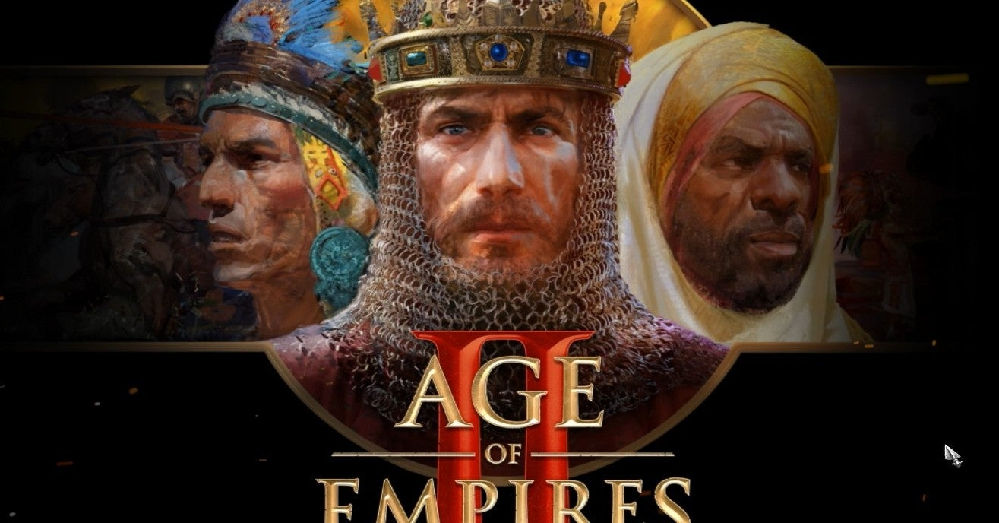
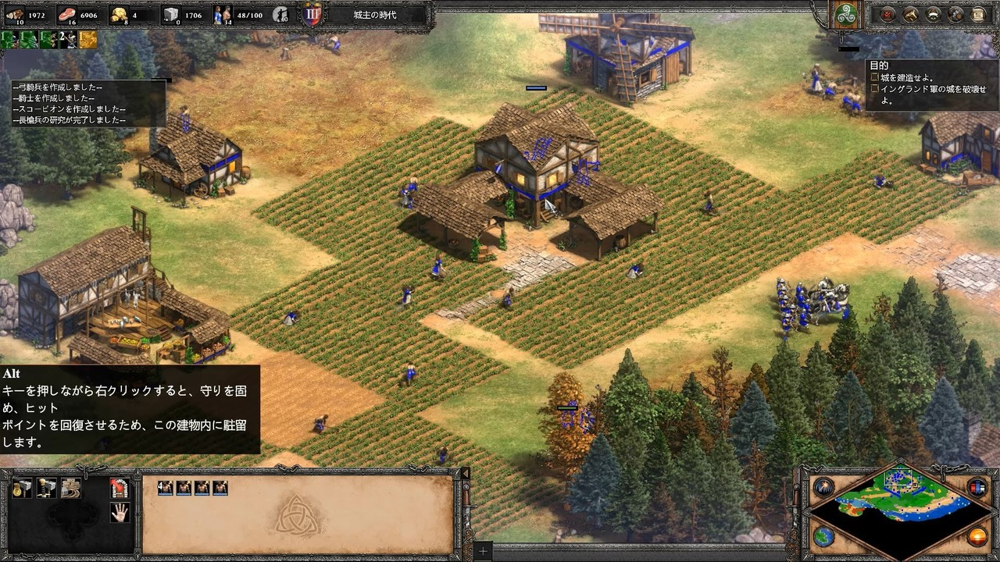
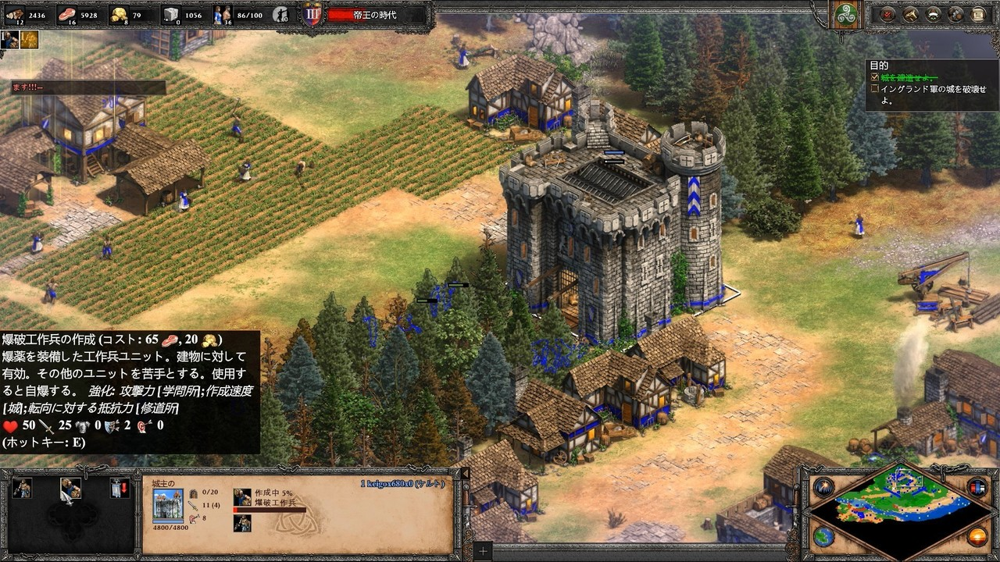

<figure>

</figure>

　以前**『初めて遊んだRTSはアートオブウォー』**と題して、僕のRTS好きについて書いたが、その中にも登場する**『Age of Empires』**シリーズの第2弾。それが**『Age of Empires II』**だ。

[https://note.com/keigox68000/n/n1f1af3d92a0c](https://note.com/keigox68000/n/n1f1af3d92a0c)

　このゲームはRTS、つまり「リアルタイムストラテジー」なので、その名の通りリアルタイムでゲームが進行する。**『Age of Empires』**シリーズが画期的だったのは、ユニットひとつひとつの動きを細かく指示するのではなく（細かく指定することもできるが）、マウスオペレーションで複数のユニットをドラッグすることで、中規模の部隊をガバっと一気に指定し、まとめて支持を与えて動かせるところだ。これによってプレイヤーは、あたかも自分の軍勢に命令を与えて戦っているように感じることができる。このダイナミックなゲームシステムは、シミュレーションゲームにおける一大発明かもしれない。実際にひとつひとつのユニットが細かいアニメーションで動く様は、リアルで見ていて楽しいものだ。

　また、戦闘だけでなく、同時に内政をリアルタイムに行っていかなければならないのも新しい試みであった。プレイヤーは、兵士ではない普通の民衆に命令を与え、動物を狩り、木材などの資源を集め、農耕で食料を生産して国民を増やしつつ軍備を整えていく必要がある。ときには漁業にも手を伸ばし、必要があれば宗教で人民をまとめ、テクノロジーを発展させることで、自分の操作する国の文明そのものを進化させていくこともできる。プレイヤーのやるべきことは多岐にわたり、単なる戦争ゲームを超えて、もはや一国の歴史的進化を目の当たりにすることができる壮大なスケールのゲームなのだ。

　**『Age of Empire II』**では、歴史上実在した複数の文明をモデルに、それぞれ特徴あるグラフィックと個性で異なった国を操作して遊ぶことができる。史実をなぞるように展開するキャンペーンや、フリーシナリオで展開するゲームモード、インターネットを介した対戦など、豊富なゲームモードで飽きずに遊ぶことができるのも特徴だ。

　今プレイしているのは、基本的なシステムは1999年に発売された、最初の**『Age of Empire II』**を元に、その後高解像度に対応した**『Age of Empires II HD』**などを経て、更にリメイクされた**『Definitive Edition』**と呼ばれる最新バージョンで、4Kグラフィック対応や、かつて発売されたDLCの内容を含むなど、タイトル通りの決定版らしい進化を遂げて2019年に満を持して発売された。

　先日、**『Xbox Game Pass for PC』**の話題に触れたが、素晴らしいことにこの**『Age of Empires II:** **Definitive Edition』**も、そのラインナップに含まれているのだ。**『Age of Empires』**を最も遊んだRTSとして挙げる僕としては、この第2弾も徹底して遊びたいところだ。

　残念なことに、ゴールデンウィークを来週に控えた現在も、まだまだ旅行やショッピングを楽しむという状況にはなっていないようで、世の中にはさらなる「Stay Home」が求められているようだ。今年の連休はこんな超弩級RTSを遊び倒してみるのもいいのかもしれない。

[https://www.youtube.com/watch?v=DTpqoUdfLEM&feature=emb\_title](https://www.youtube.com/watch?v=DTpqoUdfLEM&feature=emb_title)
