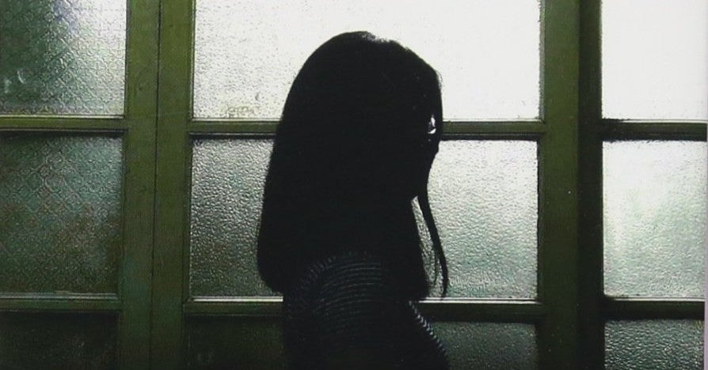

<figure>

</figure>

　長い長い自粛生活を皆さんいかがお過ごしだろうか。1日も早く外へ出て自由に羽を伸ばしたいところだが、まだもうしばらくは仕方ない。こういときこそ、積んであるミステリ小説の消化がはかどるというもの。今、積んであるミステリで、積ミステリっていうのはどうだろう、と思いついた。全然ダメだな。

　それはともかく、**『ブルックリンの少女』**は、フランスの作家ギヨーム・ミュッソによるミステリ小説である。このギヨーム・ミュッソという作家は知らなかったのだが、著者紹介によると、今フランスで一番人気のある作家の一人らしい。うーむ、なかなか海外の事情はわかりにくいものである。

　さらに、ミュッソの経歴を読むと、高校卒業後に渡米。ニューヨークでアイスクリーム売りのアルバイトなどを経験、大学卒業後は高校教師を経て小説家になったらしい。このアイスクリーム売りのバイト経験は特記するようなエピソードなんだろうか。いろいろ謎が多い作家である。いや、これ紹介文が謎だろ。

　物語は、人気小説家のラファエルが、過去を語ろうとしない婚約者アンナに、結婚を前にそのことを問い詰めたことに端を発する。アンナは、ラファエルの問いに答える代わりに、1枚の写真を見せる。その写真に衝撃を受け、戸惑ったラファエルはアンナの元から出奔してしまいそうになる。すぐに自分の行動を顧みて、アンナのところに戻るラファエルだが、時すでに遅し。取り乱したラファエルを見て、今度はアンナが姿を消してしまうのだ。

　こんな感じで始まる物語の冒頭から、ミステリらしい謎に包まれた展開で、数ページ読んだだけで、ストーリーに引き込まれる。

　やがてラファエルは、元警部の男の助けを借りながらアンナの消息を探っていくが、事実がわかるにつれ、過去の死亡事故や不可解な事件が明るみに出てくる。婚約者を信じたいと思いながら、あまりに大きく展開する事件の全貌に恐れおののきながら、後戻りはできないラファエル。果たして事件の真相はどういうことなのか、婚約者アンナの正体は何なのか。すべての謎のからくりが知りたくて、470ページの長編をあっという間に読み終えてしまった。

　手堅く、テンポよくまとめてあるところにうまさを感じる作品。当然、この人の他の作品も読みたくなってしまう。ということで調べてみたところ、日本でも何冊か作品が出版されていたようである。しかし、その大半が今では絶版。読めないとなると読みたくなるのが人情。いずれまた、外へ出られる日々が来たら古本でも探してみよう。まずは今読める作品を追ってみるのもいいかもしれない。

[https://www.amazon.co.jp/dp/4087607518](https://www.amazon.co.jp/dp/4087607518)
