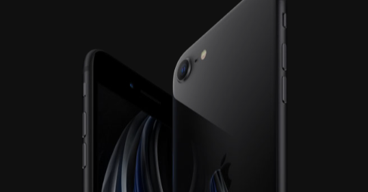

<figure>

</figure>

　うとうとしていたら、あと20分で日付が変わる時間。noteの更新をしなければ。20分で。

　こういうときに何を書けばいいか、ちょっと困るのだが、最近思っていたiPhoneを買い換える気が全然起きないなあ、という話を書いてみよう。

　その昔、NOKIA 6630というスマートフォンのご先祖様みたいな携帯電話を使っていた。一応PCと接続してアプリケーションを転送できるところがスマートフォン的だった。調べたら、もう16年も前のことだ。

　その頃からスマートフォン的なものが好きだったので、そのすぐ後にiPhoneが発売されたときも、割とすんなり乗り換えというか、飛びつくように買ったのを覚えている。ボディ前面に大きな液晶ディスプレイを搭載したiPhoneは、それまで使っていたNOKIAのスマートフォンとはまったく別の感覚であった。それまでも、電子手帳とかPDAとか使っていて、そういうものが進化して、なおかつ電話の機能を持った感じである。

　今見ると古臭い初代iPhoneの曲線を持ったデザインも、当時はかっこよかったし、すべてをタッチパネルで操作する感覚も、それまでの携帯電話とはまったく別物だった。ネットからSNS、音楽プレイヤーまですべてiPhone1台で用が足りてしまうのだから、それまで持っていたiPodも不要になってしまった。iPhoneには、それだけのインパクトがあったのだ。

　しかし、そんなiPhoneもひとつだけ不便な点があった。スマートフォンを手に入れる前まで使っていた、おサイフケータイの機能がないのだ。ガラケー最後の時代に、おサイフケータイを便利に使っていた僕としては、再び現金生活に戻るのは実に不便なことに感じられた。特に、当時はクレジットカードが使えないコンビニすらあり、おサイフケータイが無くなった瞬間に、どうしても現金生活に戻らざるを得なかったのだ。

　その不便さが解消されるには、モバイルSuicaが登場するのを待たなければならなかった。モバイルSuicaが登場する頃には、iPhone以外のスマートフォンも普及しており、それらがSuicaの機能を持っているのは当たり前の世の中だった。一部ガラケーですら、モバイルSuicaに対応していたのだ。

　アップルはどうしてiPhoneにFelica機能を搭載しないのか。ずっとそう憤っていたのだが、2016年にiPhone7が登場するときに、やっとユーザーの希望が叶えられる。ようやく日本でモバイルSuicaなどに対応したiPhoneが登場するのだ。これだけ待っていたのだから、僕がiPhone 7 Plusを発売と同時に買ったのは言うまでもない。（ちなみに、iPhone 5からの乗り換えだった）

　その頃には格安SIMに乗り換え、メジャーなキャリアのお高い料金プランからも解放されていた僕は、もうこれがスマートフォンの決定版じゃないかというぐらいの勢いでiPhone 7に乗り換えたのだ。

　それから4年経った。未だにiPhone 7 Plusを使っている。そう、スマートフォンでキャッシュレスが実現してしまった今、僕にはスマートフォンを買い換える理由がなくなってしまったのだ。あれから、指紋認証が消え、よりかっこいい全面液晶が実現。さらには3つのレンズでデジタル一眼もびっくりな写真を撮影できるぐらい高性能になったiPhoneが登場した。でも、全然食指が動かないのだ。僕にとって、もっとも大事だったのは、現金を使わずに生活ができるための手段だった。それがたまたまiPhoneだったわけだ。

　でも、そろそろ買い替えて新しいガジェットを楽しんでみたいとも考えている。そんな欲を満たすスマートフォンの登場を待っていないこともないのだ。

　はい、あと2分で日付変わります。お見事。
