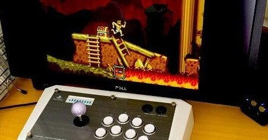

<figure>

</figure>

　今日ツイッターで、**「ゲーム環境さらしてけ」**というハッシュタグが流れていたので、自分のゲーム環境の写真を放出してみた。

[https://twitter.com/keigox68000/status/1255115461898821632](https://twitter.com/keigox68000/status/1255115461898821632)

　と言っても、何の変哲もないパソコン用モニターに、市販品のアーケードスティック（まあ、アーケードスティックが一般家庭にあるかどうかは別として）を組み合わせただけの、極めてシンプルな環境だ。

　ただし、これはコンシューマのゲーム機を遊ぶ環境ではない。アーケードゲームの基板を接続して遊ぶための、専用の環境だ。実はデスクの下は配線でごちゃごちゃなので写真に写すのはやめた。ちなみに、コンシューマ機は同じ部屋には1台も置いてなくて、すべて居間に持ち込んで、2つ並べたモニターで奥さんと遊ぶようにセッティングしてある。

　10年ぐらい前に、ゲームセンターのゲーム。いわゆる「アーケード基板」を買ってみようと思い立った。その買い始めから、あまり大袈裟な機材を揃えないで、ミニマムな環境でゲーセンのゲームが遊べるようにしようと考えていた。

　ここ数年はレトロゲームが流行っていて、80年代～90年代ぐらいのゲームセンターを再現するのも流行のひとつようだ。自分の家や部屋を使って、本当に当時のゲームセンターのような空間を作り出している人たちもいる。僕も、知人に何人かそういう人がいて、遊びに行かせてもらったことがある。やっぱり、本格的なゲームセンターの機材（主に筐体）を使ったゲーム環境というのは素晴らしくて、本物のレバーやボタンを使って、安定した姿勢でゲームをプレイできるということは、（特に当時ゲーセンに通った）ゲーマーにとっては夢の空間とも言える。

　しかし、そこはいろいろ事情があって、家にゲーセンを再現できないこともある。僕の場合は主に場所の問題。次に部屋の見栄えの問題。最後にブラウン管などのメンテの手間問題。それらが障害となって、ゲーセン部屋はきっぱりとあきらめている。ただし、こだわりの最後の砦という感じで、アーケードスティックのレバーとボタンだけは、ゲーセン仕様のものを取り付けて使っている。本当はブラウン管を導入すると、ゲーセン出身のゲーマーが一番気になる**遅延問題**が解決できる。だから、ブラウン管が欲しいところではあるが、そうなるとあとのメンテと管理が大変なので、そこで線を引いているような状況だ。

　いずれ、今借りている部屋も引き払って、一軒家に引っ越すこともあるかもしれない。そのときゲーム環境はどうするんだろう、と考えることもある。でも多分、今ぐらいのシンプルな環境で居続けるに違いない。

　自分の家でゲーセンを再現している人たちは、皆一様にマメで、根気よくその環境を作り上げ、メンテしている。僕にはその根気がない。いっときの情熱で飛びついても、その後引き続き環境を保っていく自信がないのだ。特に、ブラウン管のメンテをずっと続けていける自信がまったくない。分をわきまえて、民生品でできる範囲の環境を作っていくことが身の丈にあったゲーム環境というものだ。

　たかがゲーム環境。されどゲーム環境。実はゲーマーにとっては、すごく真面目に考えてしまうことだったりするのであった。
