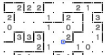

<figure>

</figure>

　ニコリは、紙の上で遊べるいろいろなパズルを作っている会社だ。パズル専門雑誌を出版したり、雑誌にパズルを提供したりしている。

　僕は、このニコリの作った**『スリザーリンク』**というパズルが好きでよく遊んでいた。**『スリザーリンク』**は、マス目に配置された数字を見ながら、その数字の数だけマス目の周りに格子状に線を引いていく、単純なルールのパズルだ。

　紙の上で遊ぶパズルと言えば、数独が有名だが、ああいう類いのパズルの仲間のようなものだ。

　と言っても、紙の上で遊ぶのは間違えたときに訂正が面倒なので、もっぱらゲーム機を使って遊んでいた。実は任天堂3DSには、このニコリのパズルがあれこれと移植（？）されていて、紙やパズルの本がなくても、簡単に遊ぶことができた。そのどれもが、だいたい500円前後で買えるものばかり。リーズナブルで長く遊べるコストパフォーマンスに優れたゲームだ。

　そういうパズルゲームを買っては、1日ひとつずつ解いていくと、結構いつまでもパズルを楽しめる。毎日パズル漬けだ。ニコリのパズルには、**『スリザーリンク』**以外にも、一筆書きパズルの**『ヤジリン』**、縦横の数字の合計から埋める数字を考える**『カックロ』**、数字同士を線でつなぐ**『橋をかけろ』**、数字に従って盤面に照明とみなした丸を置いていく**『美術館』**など、それぞれに特徴があっておもしろいパズルが数多くある。中には、元ネタとなるパズルが存在するものもあるが、どれもニコリによってアレンジ、監修がされていて、よりパズルとして洗練されている。

　これらがみんな、3DSに移植されていて楽しかった。しかも、同じメーカーからリリースされた一連のパズル群は、操作性も共通していて遊びやすかった。

　時代が任天堂スイッチに移行して、この辺りのパズルゲームがまたリリースされるかと思っていたのだが、あまりリリースされない。例外的に**『数独』**だけはいくつかリリースされている。やっぱり、他のパズルゲームよりネームバレユーに勝るだけあって、当然のように移植されているのだ。これも遊んでみていて、それについては概ね満足なのだが、やっぱりニコリのパズルも遊びたい。特に、**『スリザーリンク』**がまた遊びたい。まあ、3DSを棚から出してきて遊ぶことはできるのだが、新しいゲーム機にもまたリリースしてくれると嬉しいというわけだ。

[https://www.amazon.co.jp/dp/4890728465](https://www.amazon.co.jp/dp/4890728465)
