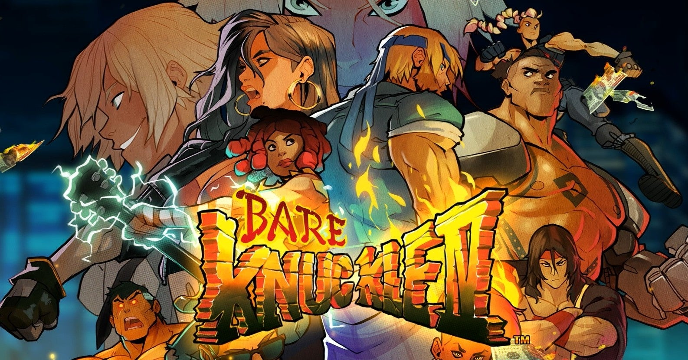
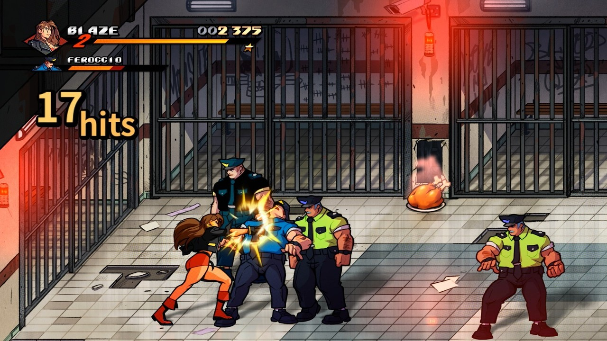

<figure>

</figure>

　**『ベアナックル4』**が発売になった。一応、その昔メガドライブ用にリリースされていたベルトスクロールアクション**『ベアナックル１～３』**の続編ということになるのかな。ただし、当時のようにセガからのリリースではなく、フランスの**DotEmu**がパブリッシャーとなっての発売だ。

　開発開始のニュースは結構前から聞こえてきていたのだが、すごく期待して待っていたというわけではなく、当時とは全然違う環境、異なる開発陣でどんなものが出来上がってくるのだろうという、正直言って不安と疑問しかなかった。

　それでも僕にとって、**『ベアナックル』**は好きなゲームで、今でもときどきプレイするタイトルのひとつだ。いろいろなゲーム機に移植されているのだが、出るたびに買っていたりもする。**『ベアナックル』**は、すごーく難しいゲームというわけでもなく、それでいて基本を押さえないとクリアできない難易度で、あまり疲れることなく、でも適度な緊張感を持って遊べる良作だ。当時、FM音源の最先端を突っ走っていた**古代祐三に**よるBGMもあいまって、繰り返し遊びたくなるゲームなのだ。（クリアまで遊ぶとちょっと長いんだけど）

　そんなわけで、早速Steamで**『ベアナックル4』**を買ってみたわけだが、これが思いの外面白い。いや、なかなか当時遊んだ人向けにサービス精神旺盛な作りになっている。

　アメコミ調に書き直されたヴィジュアルは、一見すると全然違うゲームが出てきてしまった印象を受けるが、一旦コントローラを握って操作してみると、ほとんど当時の**『ベアナックル』**感覚で浅べることがすぐにわかる。いや、細かいこと言うと**『ベアナックル2』**を踏襲したデザインだ。もちろん、現代風にちょっとアレンジしたところはあるけれど、少なくともこの操作感は**『ベアナックル2』**そのものだ。

　しかも、アメコミ調の絵なのに、動きが**『ベアナックル』**していて、やり込んだ人間にも、違和感なくキャラクターが動かせる。メガドライブ上でドット絵が動いていたのと同じような感覚で遊べるのだ。

　ゲーム中に登場するアイテムが、ちょっと豪華になっていたりするんだけど、一番の基本である体力回復アイテムの、リンゴと丸焼きチキンがそのままっていうのも嬉しい。笑っちゃうぐらい**『ベアナックル』**だ。

　難易度設定も詳細にできるようだがノーマルで遊んでみた限り、ああ、これぐらいの難易度が**『ベアナックル』**だよね、という感じで進める。ちょっと簡単な感じもするけど、経験者はハード以上に挑戦してねという意味かもしれない。

　敵キャラクターも懐かしい面々が登場していて、戦う相手なのに、旧友に再会したような愛着が湧いてしまう。未プレイの人にネタバレしたくないので詳細は書かないが、あるボスキャラクターの攻撃演出にはリアルに「えー！」と叫びつつ、ニヤニヤしてしまうような、**『ベアナックル』**ファンなら誰にでもわかる派手なギミックが仕込んである。是非プレイして楽しんでほしい。

　ストーリー的には、過去の作品からかなり時間が経っているようである。髭面のアクセルが登場してきて、すぐにそれとわかる。が、しかしブレイズが若々しい。アクセルがこれだけ年取っていて、ブレイズこの見た目だと、かなり無理したおば……あ、いや、そういうのはやめておこう。とにかく、昔からの**『ベアナックル』**ファンなら楽しめること受け合いの新作が登場だ。実は、今ステージ10でゲーム止めたまま、これを書いている。早くアップして続きをやりたいので、今日はこの辺にしておこう。
