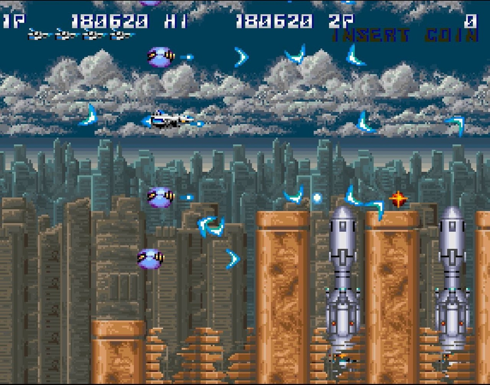

<figure>

</figure>

　**『サンダークロス』**は、1988年にコナミが世に送り出した横スクロールシューティングである。どうしてそんなゲームの話を今書くのかというと、ゴールデンウィークのSteamセールで、コナミの**『アーケードクラシックスアニバーサリーコレクション』**というソフトが安くなっていたからである。

　**『アーケードクラシックスアニバーサリーコレクション』**は、80年代コナミ全盛期とも言える時代のアーケードゲームが8タイトル収められたお得なソフトである。とりあえず**『サンダークロス』**を遊んだ。なぜか。それは、僕にとって**『サンダークロス』**は、いつでも気負わずに遊べるお手軽ゲームだからだ。

　**『サンダークロス』**というゲームは、自機の上下に4つのオプションを装備し、ボタンでその広がり具合を上下に動かしながら、全7ステージをバリバリと進んでいく、同社の**『グラディウス』**に似たような似ていない、他にありそうで、あまりないシューティングゲームだ。

　しかし、その独自のゲームシステムが当時のゲーム界で異彩を放っていたかと言うと、全然そんなことはない。**『グラディウス』**のようにオプションが画面内をぐりぐり動き回るわけでもなく、常に一定の幅に固定されたオプションで効率よく敵を倒していく様は、どちらかと言えば見た目に地味で、あまりテクニックも必要とせず攻略することが可能だった。そう、要するに**『サンダークロス』**は簡単なのだ。どうしてコナミはこんな難易度の低いゲームをそのままロケに出してしまったのか。疑問に思うほど簡単なのである。

　当時、ゲーム仲間の間でも**『サンダークロス』**の簡単さはすぐに広まり、数回プレイしただけでクリアできるゲームとして有名になってしまった。結果、いつでも誰かが1クレジットで長時間プレイしてるゲームと化してしまった。

　そんな**『サンダークロス』**をゲーセンであまり姿を見なくなってからしばらく経ったある日、大学の先輩の下宿でこのゲームに再会する機会があった。その先輩の部屋には基板環境があって、2枚だけアーケード基板があった。その1枚が**『サンダークロス』**だったのだ。（ちなみにもう1枚は**『サイコソルジャー』**だった。）

　で、100円も入れていない。いくらでもコンティニューできるとなると、もともと簡単な**『サンダークロス』**がさらにダラけた感じのゲームになってしまうわけだ。それでも僕は繰り返し**『サンダークロス』**を遊んでいた。それはひとえに、**『サンダークロス』**の音楽が抜群にかっこよかったからだ。FM音源を駆使したBGMはどれも洗練の極みに達し、当時流行りのPCM音源によるリズムなどに頼らずとも迫力あるサウンドを実現していた。**『サンダークロス』**の楽曲は、当時ゲームミュージックアルバム**『コナミシューティングバトル』**などでもアレンジされていたが、やはり原音が一番かっこいい。今でも**『サンダークロス』**の曲を聞くと、ゲームの退屈さに反して血湧き肉躍る感覚がある。そう考えると、やっぱり『サンダークロス』は楽しいゲームだ。研ぎ澄まされた緊張感を味わうだけがゲームのすべてではないはずだ。

　ちなみに、持ち主の先輩は**『サンダークロス』**を指して「接待ゲーム」と称していた。攻略が面白いと言うより、人が遊びに来たときに適当に楽しく遊んでもらうのに適したゲームという意味だ。  

　うん、なんだか**『サンダークロス』**に失礼な感じになってしまったが、そんなことはない。コナミにだってこういうユルいゲームがあったということはポジティブに捉えたいものだ。

