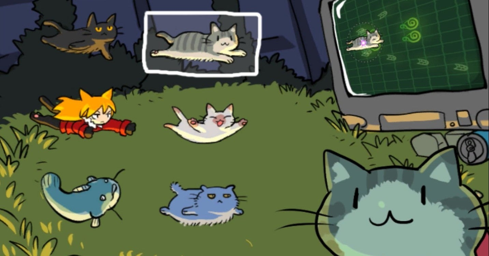
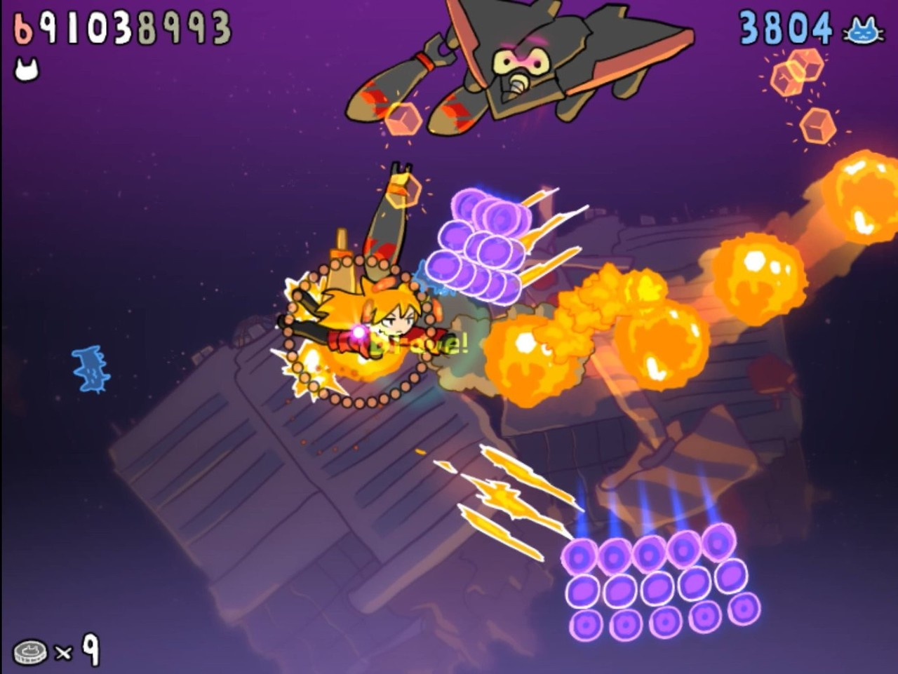
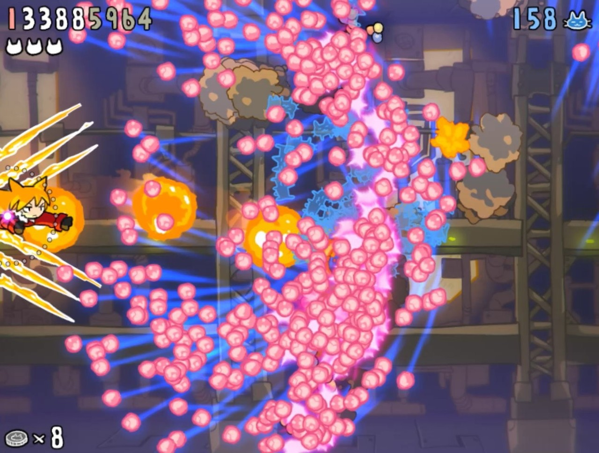
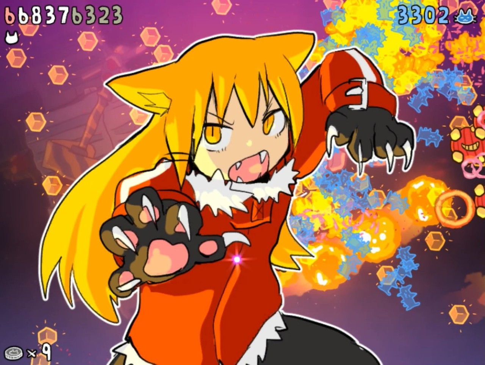

<figure>

</figure>

　**『ネコネイビー』**は**デスモフモフ**開発のネコを主人公とした横スクロールシューティングゲームである。Steam版と任天堂スイッチ版がリリースされている。

　一見してぱっとわかるのだが、主人公の猫がかわいい。最初は3匹の猫から自機を選択するのだが、プレイしていくうちに6匹に増える。うん、だんだん猫じゃない感じになってくるが。一応猫だ。

　自機だけじゃなく、敵もなんだか手書き風のゆる～いキャラクタ大集合で、全体的にかわいい感じのシューティングゲームなのだ。ああ、要するにキャラクターがかわいいシューティングですね。なるほど。と思ったら、大間違い。**『ネコネイビー』**の魅力はキャラクターのかわいらしさだけではない。

　ちょっとプレイすると気づくのだが、まず敵の攻撃が激しい。プレイヤーを圧倒する弾幕と、絶妙なタイミングと波状攻撃で次々に現れる敵。そして強力な兵器を装備したボス。そのすべてが、アーケードゲームクォリティと言ってもいい。そう、**『ネコネイビー』**は、ゆる～いキャラクタで楽しげな見た目を持ちながら、アーケードゲームの魂を宿した硬派なシューティングゲームなのである。そう言われれば、どこかのゲームで見たキャラクターに似たキャラクターも登場している。そういうパロディやオマージュが、このゲームのオリジナリティに昇華しているところが実に素敵だ。

　ところで、**『ネコネイビー』**には3種類の難易度が用意されている。誰でも楽しく遊べる配慮だが、最も難しいDEATHモードに、このゲームの本質が隠されている。初めてプレイするDEATHモードでは、より激しさを増した弾幕に誰もが驚くことだろう。いや、弾幕というより、これは壁だ。壁のように押し寄せる弾をどうやって避けるのか。実はそういうときのためにボムがある。シューティングゲームのお約束で、ボムを使うことで弾を消せる。さらに、このゲームのサービス精神旺盛なところは、ボムは敵を倒して出現する猫アイテムを回収することでリチャージして、何回も繰り返し使えるのだ。

　ゲームとしては、その猫アイテムをいかに効率よく出現させ、そして回収して素早くボムを使えるようにするかが勝負になる。敵の出現パターンを覚え、適切な場所でボムを使うことで、上手に弾幕を消していくことが、ゲーム攻略とハイスコアへの鍵となる。これが非常にテンポのいいゲーム展開を作り出していて楽しい。

　プレイを繰り返すうちに、絶対に攻略不可能だと思っていたゲームが徐々に攻略できるんじゃないか？ そして最終的にはノーコンティニューでクリアできるところまで到達できる。そのバランス調整が見事だ。同時に、この徹底したボムゲーっぷりが**『ネコネイビー』**に圧倒的なオリジナリティを与えている。

　世の中に、アーケードゲームを模したゲームは結構ある。単に見た目が似ている、ゲームシステムが似ているというゲームは数多くあれど、その中身までアーケードゲームの精神性を持ったゲームというのは実は少ないのかもしれない。**『ネコネイビー』**はアーケードゲームに精通した作者の思いと、その楽しさをオリジナルのシステムでこのゲームに落とし込もうという気概が見て取れる。それがプレイするほどに伝わってくる熱いシューティングゲームに仕上がっている。こういうゲームが遊べるのはシューティングゲームファンとして純粋に嬉しいことだ。

　この**『ネコネイビー』**だが、今ならゴールデンウィークのセールでSteam版が半額の540円で買える。お得すぎるぐらいお得だ。この機会にぜひプレイしてみてはどうだろうか。全面クリアしても20分程度のお手軽ゲームというのもおすすめポイントだ。

