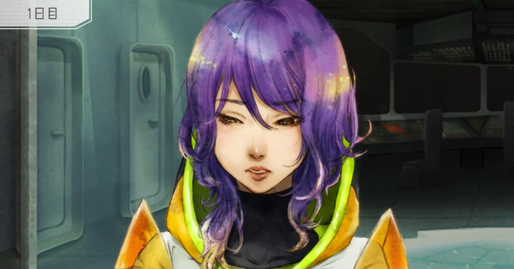
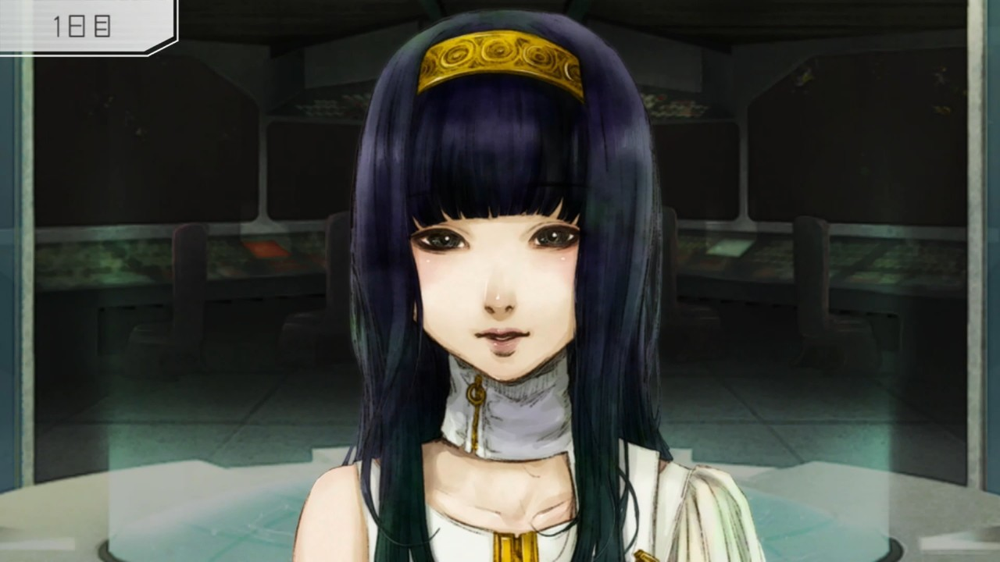

<figure>

</figure>

　**『グノーシア』**は、この4月30日に任天堂スイッチで発売されたアドベンチャーゲームだ。

　アドベンチャーゲームと言っても、テキストを読んでストーリーを追うだけのゲームではない。端的に言えば、SF設定を身にまとった人狼ゲームである。宇宙船に乗船した（最大）14人の乗組員たち。その中に混じった「グノーシア」、人狼ゲームで言うところの「狼」を探し出すのが目的だ。または、グノーシア側でプレイする場合は1日1人ずつ人間を殺害し、乗組員の半数がグノーシアになれば勝利だ。

　他にも、1日1人ずつ乗組員の正体を調べる「エンジニア」、（処刑ではなく）コールドスリープされた乗組員の正体を調査できる「ドクター」、ひとりの乗組員をグノーシアの襲撃から守る「守護天使」、勝負が決したときに生存しているとただ一人の勝者となる「バグ」など、原作である『汝は人狼なりや?』にも登場する配役が用意されている。

　もしかすると、対人戦ではないコンピュータ相手の人狼ゲームなので、ゲーム最も要の部分である、「議論して怪しい乗組員をコールドスリープ行きにする」という駆け引きの部分に不安を持つ向きもあるかもしれない。しかし心配はいらない。**『グノーシア』**には、それをフォローするためのゲームシステムが用意されている。

　ゲーム内で記憶を失っている設定である主人公は、人間対グノーシアの戦いに決着がつくたびに、次のループへと突入する。ゲームを繰り返すたびに、それぞれの役割と、参加する人数を変えながら、何回も同じ宇宙船の中での探り合いを重ねていく。その中で主人公は、様々なイベントを経験し、登場人物のバックボーンを知り、このゲームの謎に迫っていく。

　また、プレイヤーはプレイのたびに経験値を得て、自分の能力値を上げていくことができる。能力値によってスキルを手に入れると、例えば相手の嘘を見抜けるようになったり、議論の際にコールドスリープの投票を誘導したり、ゲーム全体をコントロールすることができるようになる。

　決して純粋な駆け引きによる人狼ゲームではないのだが、コンピュータゲームの味気ないやり取りに終始しないように、そこはゲームらしいシステム上の工夫がされている。実際、プレイを重ねてキャラクターの性格が理解できてくると、それも含めてスキルを上手く使った遊び方ができるようになる。そこが**『グノーシア』**の面白いところである。

　**『グノーシア』**は、2019年にPlaystation VITA版として発売されている。**『メゾン・ド・魔王』**を制作したゲーム開発サークル **プチデポット**の作品だ。2017年頃には**『グノーシア』**リリースのアナウンスがあったものの、その後開発の遅れで去年の発売になったようだ。

　1プレイの時間が10分～15分程度とコンパクトに遊べるおかげで、何回もループを繰り返すゲームシステムが負担にならず、ついつい新しいループに挑戦してしまうところもおすすめの**『グノーシア』**。人狼ゲームが好きかどうかに関わらず遊んでみてほしい。

[https://www.youtube.com/watch?v=OsoMrRCLeog](https://www.youtube.com/watch?v=OsoMrRCLeog)
