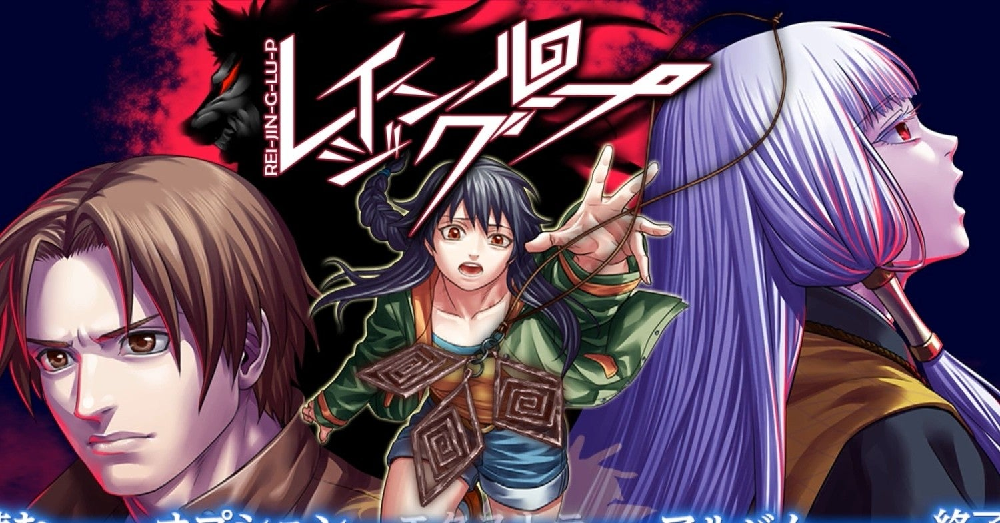
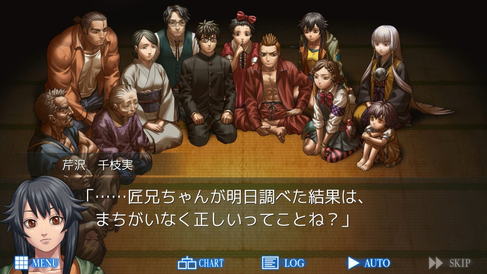
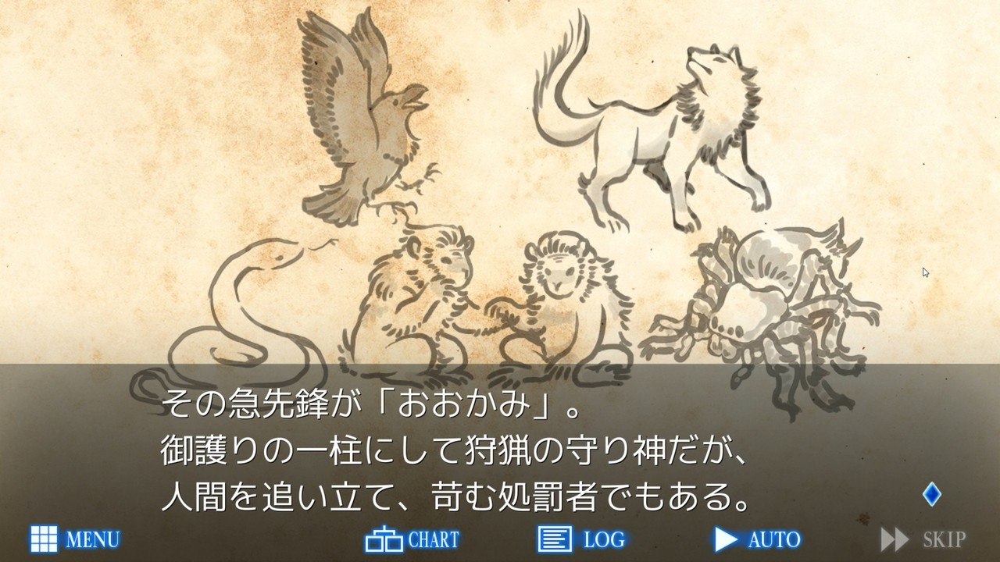

<figure>

</figure>

　昨日**『グノーシア』**の話を書いたばかりで、今日は**『レイジングループ』**の話題。そう、こちらも**『汝は人狼なりや？』**をテーマにしたアドベンチャーゲームである。

　**『レイジングループ』**は、2015年に**ケムコ**がリリースしたゲームなので、発売からそれなりに時間が経っている。ずっと気になっていたのに加えて、最近ではSteamのフレンドがずーーーっと遊んでいて、スクリーンショットを上げたりしているのを横目で見て、いつか遊びたいと思っていたゲームなのだ。**『グノーシア』**で久々に人狼ゲームに触れたのがきっかけで、興味が再燃した形である。

　**『グノーシア』**は、本当にランダムに役割も決められ、コンピュータゲームとしてアレンジはあるものの、基本は**『汝は人狼なりや？』**のルールをなぞっている。しかし、**『レイジングループ』**はもっとナラティブで、いわゆる物語をコンピュータ上で読むアドベンチャーゲームの形式をとっている。それでいながら、人狼の要素をストーリーに組み込み、選択肢で分岐しながら、巧みに人狼を暴き出すようなゲームシステムが取られている。

　ストーリーは、バイクの事故で「おおかみ」信仰の息づく辺鄙な村の集落に迷い込んだ主人公の陽明が、その集落に言い伝えられる殺人儀式「黄泉忌みの宴」を通して人狼の餌食にならないように怪しい人物を割り出し、事件を解決していくというものだ。このストーリーが、民俗学的な雰囲気と、土着的な怪しさに基づいて構築されていて、日本古来の伝統的な恐怖と闇を想起させるような設定がなされている。西洋的な設定だった『汝は人狼なりや？』を、見事に我々の身近な民間伝承に組み込むことに成功している。個人的に大好物の設定だ。

　最初は、絵柄が漫画的というかアニメ的というか、そんな雰囲気を醸し出していることと、一部会話のノリがいかにもパソコンアドベンチャーゲームですよと言わんばかりのオタク臭さを漂わせているところに懸念を感じたものの、そんなものはプレイ開始の15分ですぐに気にならなくなる。それどころか、ストーリーと、鍵を手に入れて新たな分岐を探し出すゲームシステムに一気に引き込まれ、むしろ登場人物に愛着が湧いてくるぐらいのめり込めるのだ。

　たまたま人狼熱が再燃してプレイを始めた**『グノーシア』**と『**レイジングループ』**。しばらくは、同じ**『汝は人狼なりや？』**をベースとして持つゲームだが、まったく異なるプレイ感の両者を並行しながら楽しんでいけそうだ。

　ただ、件のSteamフレンド、**『レイジングループ』**を200時間超プレイしていて、その重量級を予感させるボリュームに戦慄している。いや、それだけ遊べればむしろ幸せだとポジティブにとらえよう。よし、がんばるぞ。
