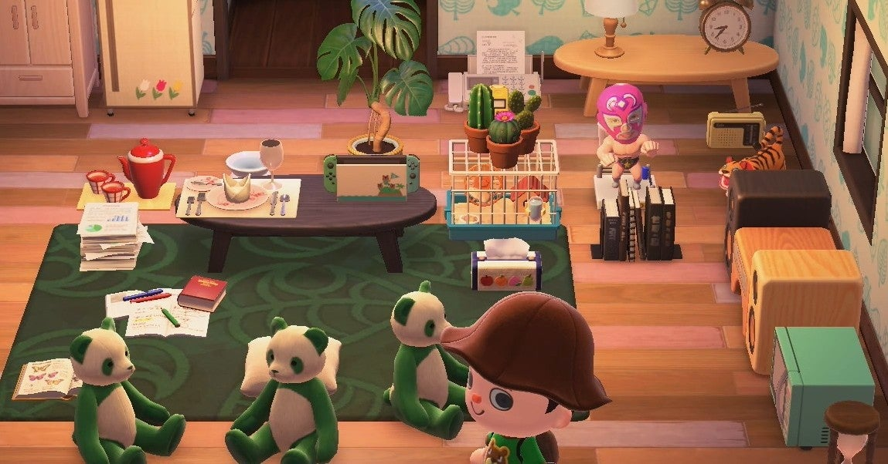

<figure>

</figure>

　一応、世間の人並みに**『あつまれどうぶつの森』**を遊んでみたりしている。

　なんで「一応」なのか。それは、自分の島と比べて、他の人の島がすごすぎて気後れしているからである。**『あつまれどうぶつの森』**は、自分の住む島に様々な施設を建てたり、外から移住してくる島民のために住居を割り当てたりして、島をにぎやかにしていくというゆるい目的がある。なんで「ゆるい目的」と表現したかというと、そこをそんなに目指さなくても、それなりに遊べるからだ。適当に釣りをし、適当に果物を収穫し、適当に島民とおしゃべりしていても全然問題ない。不動産の支払いは大変だけど、上を目指さなければ、スローライフで十分に暮らせる。夢のような島生活を送れるゲームなのである。

　しかし、だ。オンラインでフレンドの島を訪問してみると、他の島の発展っぷりに圧倒される。区画整理された居住区。マイデザインで作られた石畳の道路。色とりどりの花が植えられている花壇。ナチュラルウッドの家具で統一された上品な部屋。ゲームマニア垂涎のアーケード筐体やピンボールマシンがずらり。どの島もきちんと整えられ、かつコンセプトに基づいた計画都市が広がっている。これは何か違うゲームをプレイしているんじゃないかと思わせるような風景だ。

　一方、僕の島はどうだ。入手したものを適当に並べただけで、まるで自分のリアル生活を思わせるように乱雑な室内。その部屋もいっぱいで家の外にまで好き勝手に置かれたアイテム。これってもしかしてゴミ屋敷？　と言いたくなるような様相を呈している。

　さらには、島を美しく飾り立て、整備するには、ゲーム内でベルと呼ばれるお金が必要になってくる。僕はゲームの中で、日々果実を収穫して日銭を稼いでいる。すごく地道だ。ところが、一気に稼ぐ人は「カブ」を買う。カブは日によって買取額が変動するので、高値で売り抜ければ莫大な利益を得ることができる。カブで1000万ベルを稼いで悠々自適の生活を送っているフレンドもいる。

　実のところ、**『あつまれどうぶつの森』**は、そのスローライフっぽく見せた外観とは裏腹に、プレイヤーたちに無言のうちに必死の金策を要求する、シビアなゲームなのだ。

　そんな感じで、早くもドロップアウト感を味わっている『あつまれどうぶつの森』だ。毎日午前と午後にカブ価をチェック、店頭の家具ラインナップを確認。統一性のあるファニチャーをきれいにレイアウト。そういうことがどうにも苦手なのだ。要するにずぼらな性格には向かないゲームということだ。整頓された家具も、整えられた道路も、すべて几帳面で真面目な性格のなせる技。根気があってこそ作り出せる景観。そもそも、実生活で几帳面でない人は、ゲームの中でも環境をきれいに整えることは無理だったのである。
