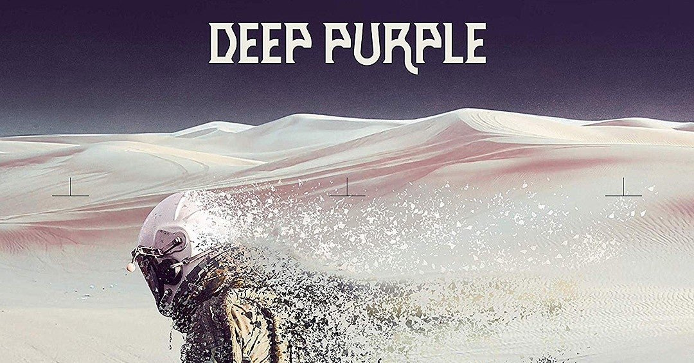

<figure>

</figure>

　**ディープ・パープル**のニューアルバム**『Whoosh!』**が8月にリリースされるというニュースが流れている。なんと、このアルバムを最後に、**ディープ・パープル**は活動を終了するそうだ。

　**ディープ・パープル**のデビューが1968年なので、実に半世紀にわたって音楽活動をしてきたことになる。（途中少し活動してなかったけど）僕が**ディープ・パープル**聞き始めたのは1990年頃で、そのときはすでに大御所バンドだったし、初期のアルバムを後追いでき聞いて、凄いバンドだなーと思ったりしていた。

　ちなみに、当時の頃のヴォーカルは**ジョー・リン・ターナー**。メンバーの入れ替わりも激しいバンドで、ギターが**リッチー・ブラックモア**から**スティーブ・モーズ**に交代したときは、それで**ディープ・パープル**として成り立つの！？　とか思ったりもした。でも、思うとすでに**リッチー・ブラックモア**より、**スティーブ・モーズ**の方がキャリア長くなっちゃってるんだよね。時の流れは速いものだ。聞き始めた当時デビュー20年の大御所バンドと思っていたけど、それからすでに30年ってことか。年取るわけだよ、お互いに。

　さて、その**ディープパープル**のラストアルバムから、新曲のPVが2曲ほど先行で配信されている。早速聞いてみたのだが、ミドルテンポで重々しい曲調の**"Throw My Bones"**は、**ディープ・パープル**らしいメロディが聞けるドラマティックな曲でなかなかかっこいい。

[https://www.youtube.com/watch?v=QUW7PvvbbO4](https://www.youtube.com/watch?v=QUW7PvvbbO4)

　もう1曲の**"Man Alive"**はギターのヘヴィなリフと**ドン・エイリー**のオルガンが渾然一体となり、哀愁漂う歌メロとあいまって、スケールの大きさを感じさせるハードロック曲に仕上がっている。

[https://www.youtube.com/watch?v=ojHRoKzQwfE](https://www.youtube.com/watch?v=ojHRoKzQwfE)

　もう、リッチー・ブラックモアもジョン・ロードもいないのに、それでもディープ・パープルらしいサウンドを作り出してくるのはもはや驚異的だ。全盛期のようなフラッシーなハードロックサウンドとは違う大人の音作りだが、まだ活動を続けても、全然行けるんじゃないかと思わせてくれる。そんなことをしみじみと考えてしまった。

　とは言え、年齢的にもメンバーは思うところがあって活動終了を決めたのだろう。体力的な衰えとともに、ハードロックバンドとして醜態を晒すよりは、有終の美を飾って伝説のバンドに昇華する方が、彼らにとってもファンにとっても理想的なラストなのかもしれない。

　いや、しかしこれ聞いていると、また気が変わって戻ってきましたー！　的なノリで再結成してもらってもいいんじゃないかな。そんな希望も持ちつつ、活動終了のそのときには、お疲れ様そしてありがとうと言いたいバンドである。
