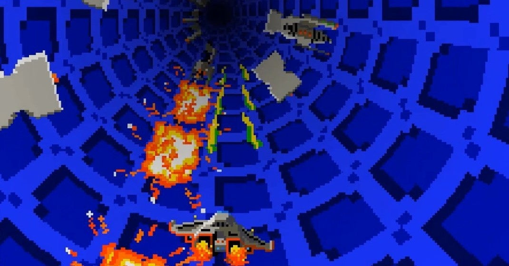

<figure>

</figure>

　アーケードアーカイブスで**『チューブパニック』**というゲームがリリースされたので、古いゲームの3D表現の工夫を思い出していた。

　今やゲームにおける3D表現は、当たり前の技術である。単にモニターの中で3D空間を表現するのみにとどまらず、VRなんて技術も登場し、ゲームの中の世界は我々の暮らすこの世界と限りなくシームレスになりつつあるのかもしれない。今回は、そんな当たり前のゲームにおける3D表現も、初期のゲームにおける様々な挑戦から始まってることを振り返ってみよう。

　現在のリアルな3D空間とは異なるが、**セガ**の**『ザクソン（1982）』**は、その立体的な構造物の表現に驚いた。いわゆるクォータービューを使ったゲームフィールドは、様々な形状のブロックを積み重ねたようなオブジェクトが配置され、本当に立体的に見えた。もっとも、構造物の少ない宇宙空間での三次元的な位置の把握に難があったのも事実だが、これは仕方ないことだった。

[https://www.youtube.com/watch?v=ul2vX8-dmTA](https://www.youtube.com/watch?v=ul2vX8-dmTA)

　同じく**セガ**の**『ZOOM909（1982）』**は、画面中央に消失点を設けた、自機を背後から見るTPS視点のようなシューティングゲームだ。映画**『スターウォーズ』**におけるデス・スターの溝を模したようなステージをはじめ、平原を高速で流れてくるラインで立体感を表現することに成功している。また、こちらは画面中央から星が流れてくることで、宇宙空間における立体感の表現にも成功している。画面奥（中央）に向かって、グラデーションで表現した色彩も、リアルな立体感に拍車をかけていた。破綻のない3D空間と、スピード感の両者を実現した素晴らしいゲームだ。

[https://www.youtube.com/watch?v=T-SrMyjljSM](https://www.youtube.com/watch?v=T-SrMyjljSM)

　もうひとつ**セガ**のゲームを紹介しておこう。**『サブロック3D（1982）』**は、潜水艦の潜望鏡を覗いた視点で展開するシューティングゲーム。前述した**『ZOOM909』**と同じく、画面中央が消失点となっていて、自分に近づくに連れ徐々に大きくなるキャラクタで立体感を表現している。同時に、筐体に取り付けられた3Dグラスによる立体視も活用し、極めてリアルな3D空間を生み出していた。海上と海中で異なる効果音で発射されるミサイル、魚雷、そして金属管を表現したドットや夕暮れになると紫色から赤く染まる空など、グラフィック的にも目をみはる美しさがあった。

[https://www.youtube.com/watch?v=89wnSkENud0](https://www.youtube.com/watch?v=89wnSkENud0)

　**アタリ**の**『スターウォーズ（1983）』**は、ベクタースキャンという別アプローチでの3D表現の究極であろう。映画**『スターウォーズ』**のクライマックスである、デス・スター攻撃をコンパクトにまとめたステージ構成が見事なゲームだ。画面上のすべての物体が線画で描かれるベクタースキャンはその構造上、電子ビームが重なった部分の輝度が高く描画される。独特の輝きを持って立体的に描かれる**『スターウォーズ』**の世界は、シンプルな線画にも関わらず、我々を熱くさせるだけの熱量を持っていた。

[https://www.youtube.com/watch?v=6iAD5aN-DnU](https://www.youtube.com/watch?v=6iAD5aN-DnU)

　最後は、**ニチブツ**の**『チューブパニック（1984）』**だ。時代的には、今回紹介した一連の作品の中でもっとも新しい。この頃になると3D表現もかなりこなれている。**『チューブパニック』**では、画面中央の消失点はもちろんだが、プレイヤーが進むステージを、チューブ状の円筒の中を進んでいく設定を用いている。レバー操作によってぐるぐると回転する円柱状のステージは、本当に立体的なチューブの中を突き進んでいるかのような錯覚を起こさせる。動きもスムースで、スピード感も抜群だ。  

[https://www.youtube.com/watch?v=q58XNh1Sm2o](https://www.youtube.com/watch?v=q58XNh1Sm2o)

　さて、思いつくままにいくつか初期の3D表現に挑戦しているゲームを紹介してみた。本当は「3Dならこのゲームでしょ！」っていうのが、まだまだいくつもある。レースゲームには、上手に3D表現を実現しているものがたくさんあるし、ベクタースキャンのゲームも透視図のような立体を描画することに長けていた。さらに、80年代中盤からはより立体や3Dの表現が進化していくことになるのだが、ちょっと紹介しきれないので今回はこれにて！
