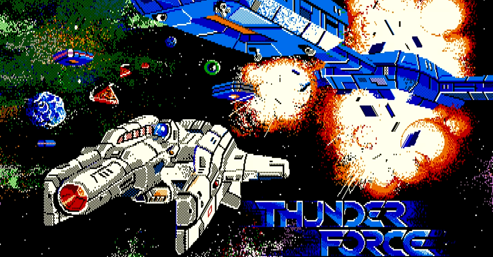
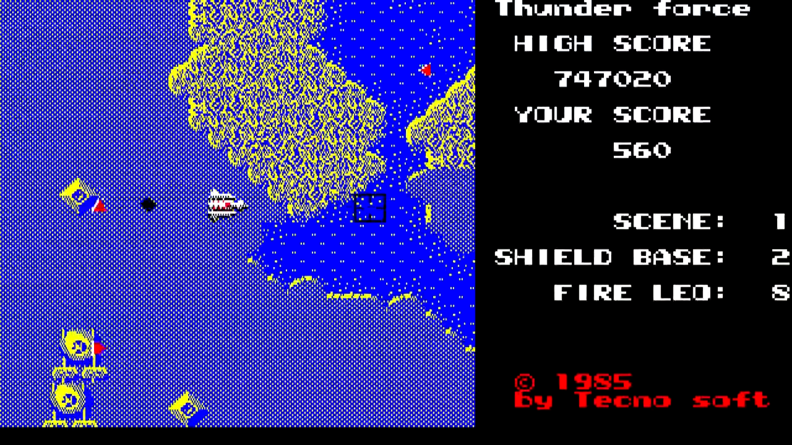
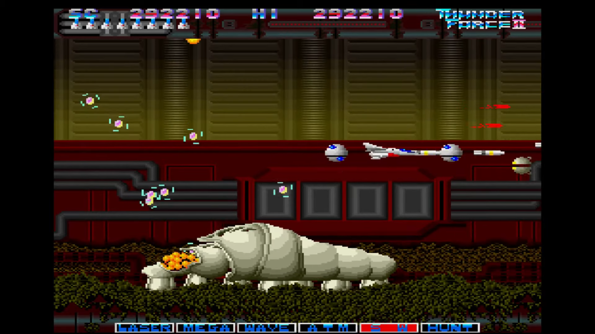
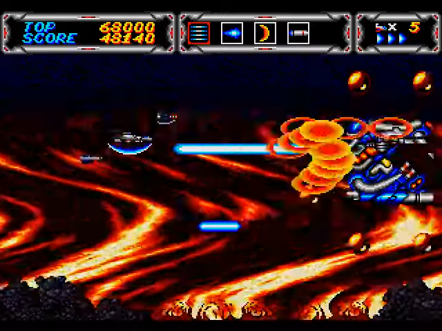
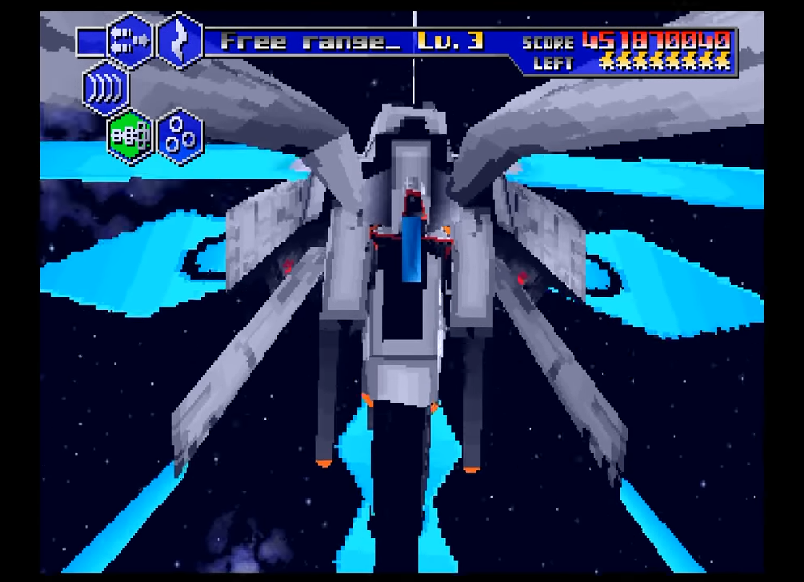
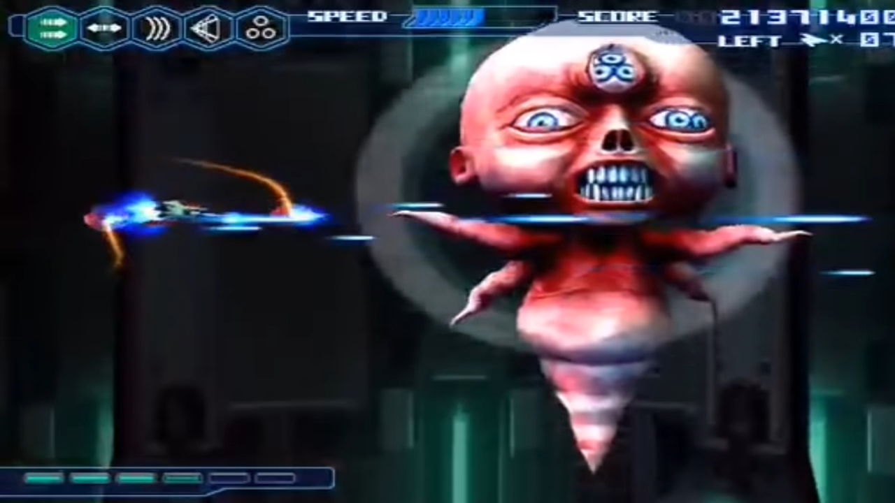

<figure>

</figure>

　任天堂スイッチのSEGA AGESシリーズに**『サンダーフォースAC』**が登場したので早速買ってみた。

　**『サンダーフォース』**はテクノソフトが世に送り出した、息の長いシリーズだ。僕はたまたまプレイする機会に恵まれて（全機種ではないが）シリーズの最初から最後（？）まで遊んでいたりする。

　最初の**『サンダーフォース』**は友人の家で遊んだFM-7版だ。処理速度を稼ぐためにグラフィック画面を節約しているために色が寂しかった。**『サンダーフォース』**は、きっと**『ゼビウス』**を全方位スクロールでやったらすごいだろうという発想にできあがっているに違いない。そのアイデアは、あまり活かしきれたように思えなかったけど。FM-7版に続いて、PC-8801mkIISR版もプレイした。こちらも画面は寂しかったが、FM音源によるBGMがついていた。豪華だ。しかし、曲がなぜか**『ウィリアムテル序曲』**だったため、どうにも滑稽なイメージが拭えなかった。当時テレビで人気だった**『オレたちひょうきん族』**のオープニング曲だったため、その印象も強かった。その後、MZ-1500版もプレイする機会があったのだが、こちらはPSGを使用して、カラフルな美麗グラフィックで驚いた。すげーと思った。しかし、BGMは相変わらず**『オレたちひょうきん族』**だった。

　**『サンダーフォースII』**は、X68000版を遊んだ。高解像度で色数が増えたグラフィックを使用し、登場するキャラクターすべてがグラデーションでてかてかと光っていて凄かった。しかも、多重スクロールをふんだんに使った画面は、迫力ある映像を作り出していた。まあ、ちょっと画面が見にくくて遊びにくかったが。さらに、**『サンダーフォースII』**では、これまでの全方位スクロールステージに加えて、横スクロールのオーソドックスなスタイルのステージも用意されていた。パワーアップもバリエーションに富んでいて、当時のシューティングゲームのスタイルに則った、正常進化だったと言える。

　**『サンダーフォース』**シリーズが、シューティングゲームの一大タイトルとして花開くのは、メガドライブでリリースされた**『サンダーフォースIII』**からであろう。これまでの全方位スクロールをきっぱりと捨て、横スクロールのステージ一本にしたのは正解だ。武器切り替えという前作のシステムを受け継ぎながら、新たなゲームとして生まれ変わった感がある。FM音源のBGMも、前作から遥かにパワーアップしてかっこよかった。学生時代の友人が、「友達が今度出るゲームの曲作っているんだよ」と聞かせてくれたカセットテープが、ステージHydraのBGM**”Back To The Fire"**だった。すごくやり込んで思い出深い一作だった。このIIIを元にアーケード移植されたのが**『サンダーフォースAC』**だ。しかし、なぜかメガドライブ版とちょっと雰囲気の変わったBGM。削除された名曲。そんなものが目に付き、どうしても好きになれなかった。でも、アーケードに移植されたことからも、当時の**『サンダーフォース』**シリーズの盛り上がりはうかがい知ることができる。

　IIIの成功で勢いづいたテクノソフトは、同じメガドライブで**『サンダーフォースIV』**を発売する。これもIIIの流れを汲む横スクロールシューティングで、より迫力あるBGMとさらに神がかったグラフィックでゲーマーたちを驚かせてくれた。でも、個人的にはちょっとやり過ぎかなと思っている。あまりに凝った敵が多く、処理落ちが発生したり、グラフィックが美しすぎて画面が見にくかったりしていた感は否めない。何より難易度が高くて遊んでいて疲れる。

![THUNDER FORCE IV  サンダーフォースIV メガドライブ実機SoundMod [720p60fps] - YouTube](assets/ne2d1c5f6c0ea_picture_pc_19004d7aa8dacecdb27eb0fb6ed722eb.png)

　広く市民権を得た**『サンダーフォース』**シリーズは、ハードをセガサターンに移し、**『サンダーフォースV』**が発売される。3Dのグラフィックを使用した映像と、九十九百太郎によるBGMは、何か新世代の幕開けを感じさせてくれたし、次々と登場する圧巻のボス映像は、カルト的な人気を得るに至った。光の翼を持って羽ばたくボスなんて、やりすぎ以外の何物でもなく、当時のゲーマーたちは神と対峙するかのような気持ちでゲームを攻略したものだ。

　そんな**『サンダーフォース』**シリーズにも、最期のときがやってくる。**『サンダーフォースVI』**は、PS2で発売された、シューティングゲームファンの誰もが待ち望んだ新作のはずだった。しかし、過去の栄光を引きずり、新たなシステム的発展もなく、過剰な演出にばかりこだわった**『サンダーフォースVI』**は、残念ながらファンを落胆させた。著名なゲーム音楽作曲家を総動員して作られたはずのBGMに統一感はなく、ファンの誰もが、求めているものとの違いを感じずにはいられなかった。そんなファンの残念な気持ちをあざ笑うかのように登場するラスボス。一体何をしたかったのだろうか。そんな残念な気持ちでいっぱいのファンを後目に、**『サンダーフォースVI』**は忘れ去られた。

　今回、任天堂スイッチに移植された『サンダーフォースAC』をプレイしていて、このシリーズの思い出が走馬灯のように駆け巡った。今後新作が出るようなことがあれば、過去の残念な思い出は帳消しにできる。しかし、現状そんなことは起こり得ないだろう。思い出の美しい部分にだけ我々は生きるしかないのかもしれない。それでもいいのだ。我々は、あの強く輝いていた『サンダーフォース』を心に、今日も生きるのであった。

　え？　紹介してない作品があるって？　それはシリーズではないのでしょう。

[https://www.twitch.tv/videos/622687034](https://www.twitch.tv/videos/622687034)
