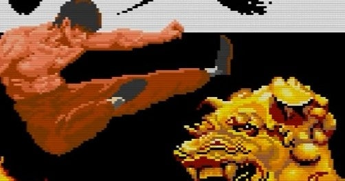

<figure>

</figure>

　ついさっきまで、**メガドラミニ**で**『スラップファイトMD』**を遊んでいた。いつプレイしても楽しく遊べるいいゲームだ。

　さて、そんな感じで**メガドラミニ**はときどき遊んでいるのだが、一方で、3月に発売された**PCエンジンmini**は買ってもいない。何か、すごく気に入らない点があるとか、プレイステーションクラシックのように、ゲームの再現性に致命的な欠陥があるとか、そういう理由ではない。

　**PCエンジンmini**は、そのゲームのラインナップにどうも納得がいっていないのだ。いわゆる名作が集まっていることは否定しないし、タイトルによってはアーケードゲームの移植版をよりアーケードゲームに近づけたアレンジも収録されている豪華仕様だ。しかし、正直に言えば、ちょっと遊びすぎて手垢のついたタイトルが多すぎる。**『ニュートピア』**も**『イース』**も**『スーパースターソルジャー』**も、当時**PCエンジン**で死ぬほどやり込んだゲームだ。愛着もあるし、今遊んでも楽しいゲームだと思う。

　でも、だからこそ今あらためて遊ぶかと言われると、「うーん……」と悩んでしまうのだ。**『ニュートピア』**のラスボスの曲は震えが来るような名曲で、もう一度ラスボス ラファエルと戦ってみたい。でも最初から**『ニュートピア』**をもう一回遊ぶのかと思うと、ちょっと躊躇する。

[https://www.youtube.com/watch?v=8AQuJfrRAtU](https://www.youtube.com/watch?v=8AQuJfrRAtU)

　**『グラディウスII』**は、CD-ROM2の機能を駆使して、**PCエンジン**のスペックからはあり得ないぐらいの移植度で我々の度肝を抜いた化け物のようなゲームだ。**PCエンジン**のゲームの中でも一二を争う名作と言っても過言ではない。しかし、改めて遊ぶのだろうか。アーケードアーカイブスでもリリースされている**『グラディウスII』**。いや、もっと言えばその後アーケード基板まで買ってしまった**『グラディウスII』**。ああ、**『グラディウスII』**、お前は名作だと言うのに、この葛藤は……

　**『天外魔境II 卍MARU』**は寝食を忘れてプレイした大作RPGである。お約束のストーリーに収まらないドラマティックな物語は、当時夢中になってのめり込んだし、毎回手強かったボス戦も忘れがたい体験だった。いや、しかし、これももう一度やれと言われると躊躇する。それほどの大作だったということだ。

　そして、**『THE 功夫』**だ。PCエンジンの初期に発売され、そのキャラクターの巨大さで我々を驚かせてくれた**『THE 功夫』**。ときどきクソゲーと揶揄されるけれども、そのストイックなゲーム性には惹かれてやまないものがあった。幸い移植版があるので、今でもときどきプレイする。紛れもなく大味なゲームだ。でも僕は**『THE 功夫』**が大好きだ。哀愁のBGMは涙なくして聞くことはできない。

　……

　……

　あれ？　そんなことを書いていたら、意外に**PCエンジンmini**もありなんじゃないかと思えてきた。うん、どのゲームもちょっとめんどくさくて、もしかすると遊ばないんだけど、でも**メガドラミニ**みたいに手元にあっていつでも遊べると便利かもしれない。なんて言ったって、テレビに繋ぐだけでいつでも**『THE 功夫』**だ。もしかして、こんな魅力的なゲーム機はないんじゃないか……あ！
