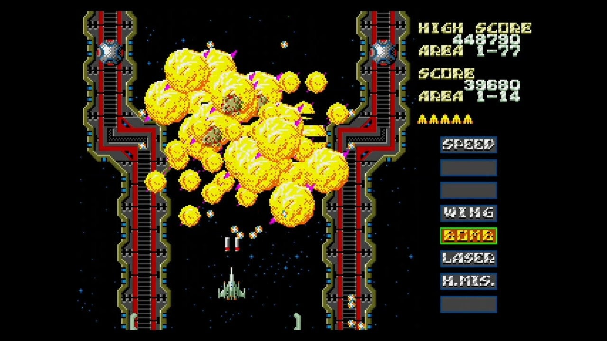

<figure>

</figure>

　昨日も書いたが、**メガドラミニ**を引っ張り出して**『スラップファイトMD』**で遊んでいた。今日はその話。

　**『スラップファイトMD』**は、1993年に発売された**メガドライブ**用のソフトだ。しかし、その元となったアーケード版が1986年の発売だから、移植されたにしてもだいぶ遅い感じだった。

　それでもゲーセンの**『スラップファイト』**が好きだった僕は発売日に手に入れた。当時移植が存在しなかった**『スラップファイト』**が家で遊べるというだけで貴重だったからだ。

　**『スラップファイト』**は『**グラディウス』**の真似をしたかのようなゲージ式のパワーアップシステムで、どちらかと言えば地味というか、あまり鮮烈なイメージを持ってゲームセンターに現れたゲームという感じではない。それでもどこのゲーセンにも置いてあって、割と根強い人気があった印象がある。いつでも誰かがプレイしてるゲームだった。それは、比較的マイルドな難易度と、隠しキャラなどを熟知することで、長時間遊べて、誰でも高得点を叩き出せるゲームデザインが好まれていたのかもしれない。

　一方で、攻略のポイントをしっかり押さえないと、途端に遊びにくくなるゲームでもあった。自機の装備できる武器は、どれも射程が短かったり、特定の敵が固くなったり、一長一短の癖が強くて使いづらいからだ。でも、何回かプレイして覚えると、そこがクリアできる。そんなゲームだった。見た目の地味さに反して、結構とんがったバランス設定だったと言える。

　さて、肝心の**メガドライブ**版だが、割とアーケード版に忠実な移植と、家庭用ならではのアレンジ版の両方が収録されていた。このアレンジ版が本当によくできていたことが**『スラップファイトMD』**を名作たらしめているのだと思う。

　**『スラップファイトMD』**のアレンジ版は、マップが一新されていて、見た目にはほぼ別ゲーだ。そこに**古代祐三**による超絶かっこいいBGMも搭載されていて、これがゲームを思い切り盛り上げてくれる。当時、**『ザ・スーパー忍』**や**『ベアナックル』**で、先進的なゲームミュージックを作っていた**古代祐三**。個人的には初期のわかりやすくかっこいい曲調が消えてしまって寂しい時期だっただけに、**『スラップファイトMD』**のメロディアスかつストレートなゲームミュージックはすごく嬉しかった。

　アレンジ版のゲームシステムは、アーケード版をベースとしながらも、自機の両サイドにウイングを装備するパワーアップが緊急回避のボムになるという大きな変更点があった。**『スラップファイト』**はこのウイングという装備が曲者で、装備することで単純に横幅が広くなり弾がたくさん出るので、そのまま攻撃力がアップする。反面、自機が画面の横幅半分に届こうかと言うぐらい巨大になるため、弾を避けにくいという欠点を持っていた。前述した通りやり過ぎのゲームバランスの一端だ。しかし、**『スラップファイトMD』**では、これをボムとして使うことで、緊急回避をしつつ、巨大になった自機からウイングをパージすることができるという一石二鳥のシステムを実現した。つまり、ウイングを装備→ボム炸裂→またウイングを装備→またまたボム、という遊びやすいサイクルを作り出すことができるのだ。

　さらに、アーケード版では時間制だったシールドという自機を敵弾から守る装備が、アレンジ版では回数制になっているため、シールドを装備しつつ、ウイングを繰り返し装備して、危険になったらボムというプレイを続けると、非常に楽にゲームが進められるのである。

　もちろんゲーセンではこんな生ぬるい難易度というわけにはいかないだろうが、家庭用として気楽に遊ぶには理想的なアレンジだった。（まあ、それを差し引いても**『スラップファイト』**は簡単なゲームだったが）これを、ノリノリのBGMで楽しめるのだから言うことはない。

　**『スラップファイトMD』**は、発売時期が微妙だったこともあり、発売当時あまり売れなかったのかもしれない。後に、幻のソフト扱いで中古価格も高騰していた。口コミでその楽しさが伝わる頃には、ものすごい値段になってしまっていたのだ。しかし、メガドラミニに収録されたことで、それが多くのファンの手もとに届くこととなった。素晴らしいことだ。いや、メガドライブ版を持っているユーザーとしても、HDMI接続で手軽に遊べる**『スラップファイトMD』**が存在することは実にありがたいことだった。今日も、その幸せを噛み締めつつ、このゲームをプレイすることにしよう。

[https://youtu.be/Fu5vJpfIVGo](https://youtu.be/Fu5vJpfIVGo)
