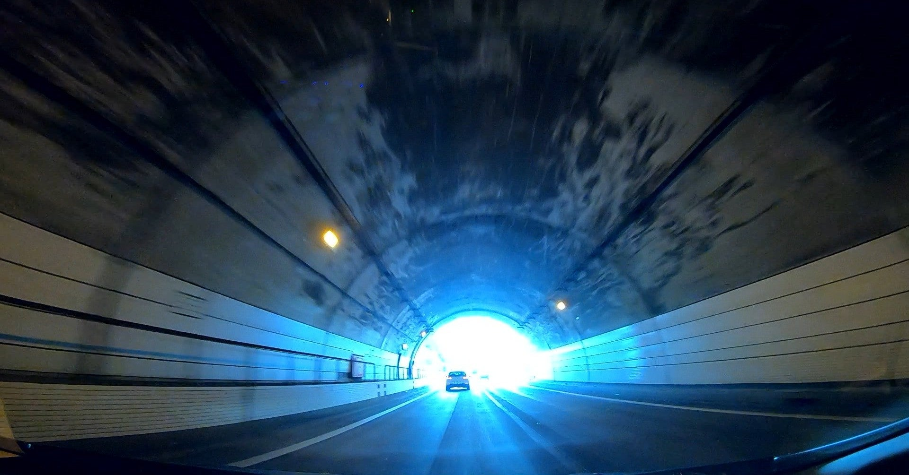

<figure>

</figure>

　昔から車載動画を撮ってみたいと思っていた。自分の運転する車にカメラを載せて、ドライブしている視界を動画に残そうというやつだ。

　実はそう思っていたのには原体験のようなものがある。もう30年以上昔、NHKのBSアナログ放送が試験放送のような映像を流していたことがあるのだが（この辺、記憶が定かでなく記録も残っていないので間違っているかもしれない）、その映像の中に首都高速を中心に、道路を車窓から撮影した映像を延々と流しているものがあったのだ。なんとはなしに見ていた映像だったが、そのときに見た車であちこちを撮影する映像の楽しかったこと。それが印象に残っていて、なんとなく自分でもドライブ映像を撮りたいと思っていたのだ。

　ところが、これが自分でやろうと思うと意外に敷居が高い。まずきれいに撮影できるカメラが高価だ。いわゆるホームビデオなら、もう20年ぐらい前から価格もこなれていたし（miniDVテープなど使っていた時代の話だ）、実際にそういうカメラを車のダッシュボードに固定して撮影したこともある。しかし、ホームビデオは映像が汚い。せいぜい子供の運動会を撮るぐらいの性能しかないのがホームビデオだ。さらに画角も狭く、到底車を運転する視界を映像として収めることはできない。前の車のお尻を撮影しているような映像しか撮れないのだ。

　それが、ここ10年ほどでカメラの方が進化してきた。一眼レフでフルHDの動画が撮影でき、しかも広角のレンズが使える。こういうカメラを使えば、見応えのある映像が取れる。しかし、これはカメラが高い。しかも、一眼レフカメラを車内に固定するにはやはり専用のステーが必要になる。さすがにダッシュボードに固定するには重量や大きさの関係で危険だ。趣味の動画撮影のために運転の安全性を確保できないようでは困る。

　そんなわけで、それなりに見応えのある車載動画を撮影するのはあまり簡単ではなかった。車も一人でのるわけではないので、あまり趣味だけに降った装備にするわけにもいかないのも理由のひとつだ。

　実は、昨年アクションカメラの**Go Pro Hero 7**を買った。スポーツなどのエクストリームな撮影にも使える小型で堅牢、高画質のカメラだ。**Go Pro**は多様なマウントがあり、吸盤式のマウントを使うと車のフロントガラスにも取り付けられる。フロントガラスにカメラを取り付ける場合、道路交通法によって制限があるのだが、**Go Pro**は小型なのでその辺りもクリアできる。しかも、もともと人間の視界を再現するような超広角が売りのカメラなので、車の運転席から見た風景を迫力ある映像で撮影できる。

　で、そんな経緯でようやく自分でも車載動画が撮影できるようになった。そういう映像を撮りたいと思い始めてから30年以上経ってしまったが、ようやく簡単に理想的な撮影ができる時代になったということかもしれない。おかげで最近は車でどこかに出かけるたびに動画撮影を行っている。技術的に難しいことをしなくとも、お手軽にきれいな動画を撮りためられるのは楽しいものだ。

　ただ問題は、すごい勢いでたまっていく車載動画が全く編集できていない点だ。簡単に撮影できるだけに、動画がたまっていくスピードも速い。今未編集のデータが1TB以上たまってしまっている。これをどうするかが次の問題だな。

[https://www.youtube.com/watch?v=b5Eimb2tCeE](https://www.youtube.com/watch?v=b5Eimb2tCeE)
