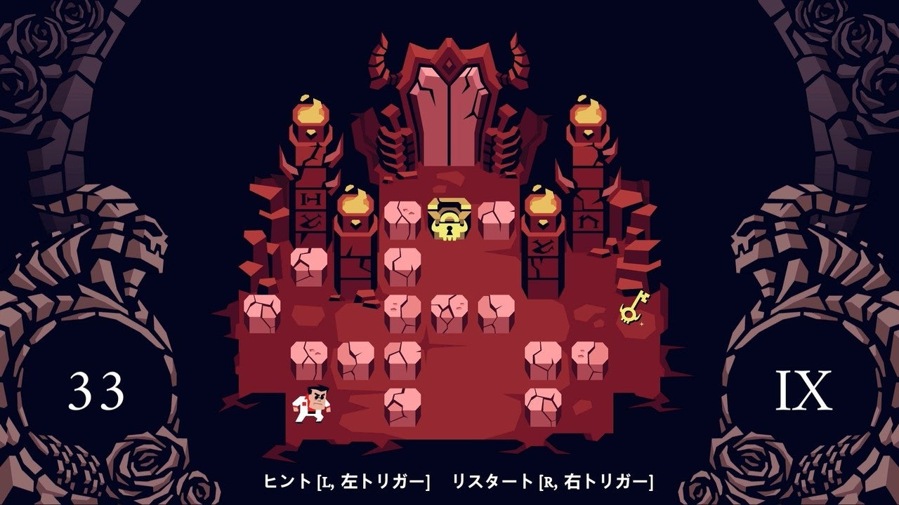
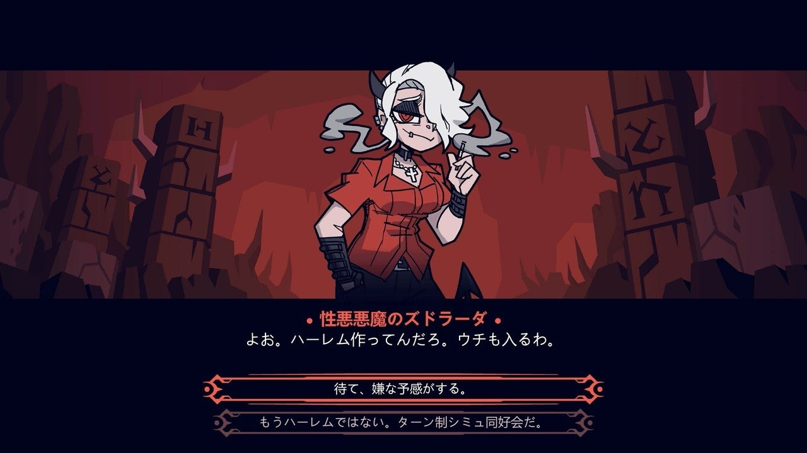
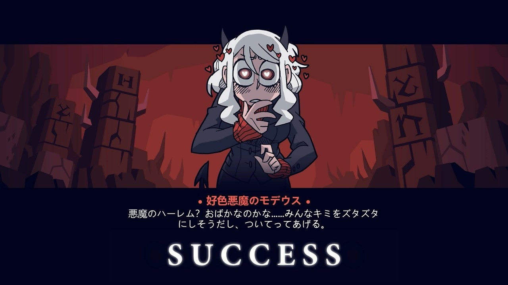
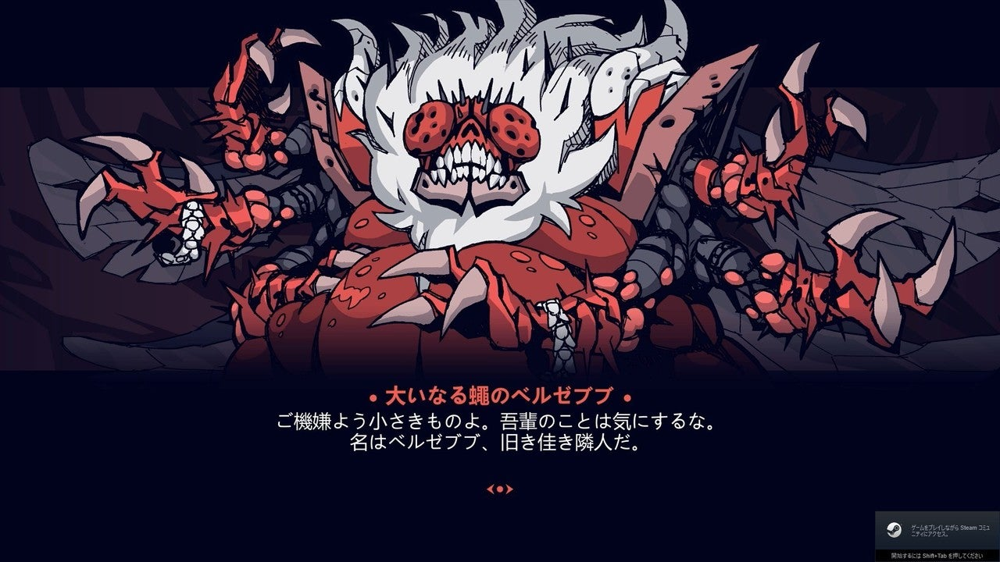

<figure>

</figure>

　ツイッターのタイムラインで、**[『HELLTAKER』](https://store.steampowered.com/app/1289310/Helltaker/)**というゲームが話題になっていた。画面の中に配置された障害物と敵を倉庫番のように押しのけながら、悪魔っ娘のところへゴールするというシンプルなパズルゲームだ。

　画面のデザインを一見してゲームのルールが分かるぐらい秀逸なゲームデザインで、操作性や画面の切り替え、失敗したときのリスタートなども優秀で、実にテンポよくプレイを進めることができる良作だ。

　しかし、ゲームデザインやプレイアビリティの秀逸さもさることながら、このゲームの真骨頂は、パズルクリア後にかわいらしいデザインの悪魔たちと地獄のようなやり取りを交わしながら、なんとか口説き落とす対話モードにある。

　対話モードと言っても、悪魔のセリフに対して二者択一で答えを選択するだけである。ウィットに富んだ答えを選べば、あなたに魅了された悪魔がハーレムづくりの仲間になってくれるだろう。しかし、間違った答えを選べば、そこで魂を取られる。ゲームオーバーだ。

　若干理不尽さを感じなくもない対話モードだが、軽妙な会話文と、かわいい悪魔の姿で全部許せてしまう。ある意味ずるいゲームだ。まあ、悪魔だから仕方ない。失敗したら今解いたパズルの手順をもう一度繰り返してくれたまえ。

　このゲーム、正式には日本語に対応していない。しかし、いち早く有志による日本語化が為されていて、それを適用することでゲームの雰囲気をそのまま伝えてくれる日本語でプレイすることができる。ありがたいことだ。

　それにしても、こういうゲームの噂が流れてくる自分のツイッタータイムラインにも感謝したい。実はまだ途中でパズルに悩んでいるので、これからじっくり取り組んでみたい。これ、全部の悪魔見たくなるでしょ。あなたもベルゼブブの挑発に乗って、一刻も早くハーレムづくりの旅に出るべきだ。

