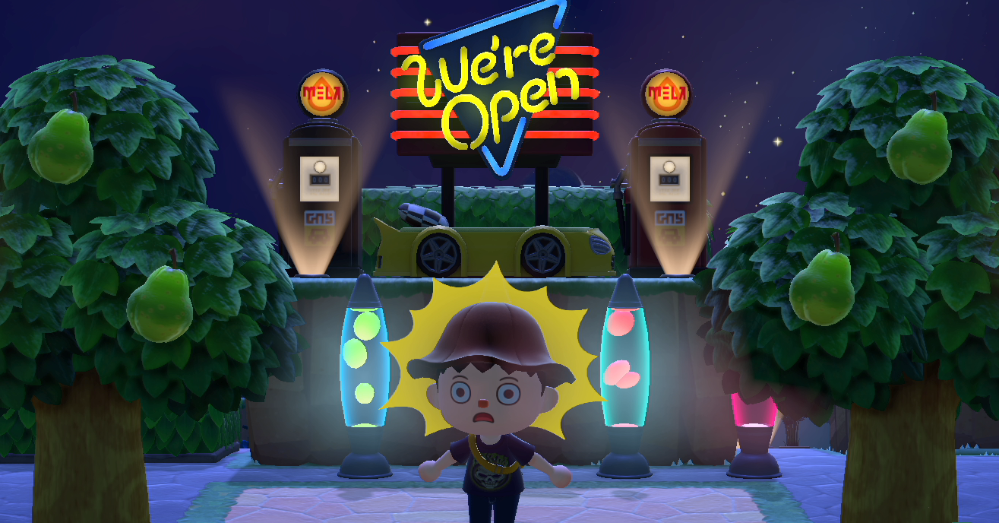

<figure>

</figure>

　先日[**『あつまれどうぶつの森』**](https://note.com/keigox68000/n/n453dcbb7289c)の話を書いた。結局あれから、このゲームが楽しくてずっと遊んでいる。なんだか日に日にプレイ時間が増えて、今では他のゲームには目もくれずに**『あつまれどうぶつの森』**だ。ちょっと遊ぶつもりが、ついつい何時間もプレイするような状況に陥ってたりする。

　それは、なぜか。実は、ゲームをある程度進めると、エンディングというか、スタッフロールが現れてゲームが一区切りする。しかしこのゲーム、ここからが本番だ。今度は「島クリエイター」と呼ばれる、地形をエディットできる機能が解放され、プレイヤーはさらに島全体のカスタマイズができるようになる。

　どうやら、島の形からデザインして、より素敵な自分だけの島を作りなさいというのが、このゲームをデザインした人の考えらしい。この手の居住空間デザインシムのようなゲームは、作り込めば作り込むほど楽しくなり、沼のようにハマったら出てこられない魅力があるわけだが、**『あつまれどうぶつの森』**も、まさにその手の沼ゲーであった。これから遊ぶ方はぜひ注意されたい。（前向きに注意を促したい）

　しかし、いざ島をデザインしてみると、なかなか思うように素敵な島が作れない。僕が造形的デザインセンスに乏しいこともあるが、それにも増して、ゲーム内の空間を彩る様々なアイテムと、それを手に入れるお金が足りないからだ。

　ゲーム中でアイテムを手に入れる方法はいろいろあるが、特定のアイテムは、一度手に入れればお店で買い足すことができる。親切設計だが、実はゲーム内通貨の「ベル」が大量に必要になる。あわせて、自分の家を増築したり、島の環境を整備するのにもお金がかかる。そうなってくると、なんとかゲーム内でお金を作りたいということになる。

　で、このゲームの中で一番手っ取り早く大金を手に入れることができるのが野菜の「カブ」を買うことだ。毎週日曜日の午前中に行商のイノシシから買うことのできるカブは、まるで現実世界の株式のように、日々価格が変動する。つまり、買値より高い値段で売りさばけば、買ったカブの分だけ儲けられるということだ。しかし、その1週間のうちに売らなければ、カブは腐って価値を失う。結構シビアなマネーゲームなのである。

　ここで困るのが、1週間のカブの値動きを見ていても、大きく値段が上がることはめったにないということだ。むしろ損をすることがほとんどである。それならカブなんか買わない方がいいのではないか。実はそうではない。自分の島で安値のカブも、フレンドの島では高騰していることがある。ネットワークで接続したフレンドの島へ出かけて、そこで売れば儲けることが可能なのだ。いや、値上がりの確率を見ていると、フレンドの島を併用して売り抜けることが前提ぐらいの上がり方しかしないようでもある。

　しかし、フレンドがいなかったり、フレンドもあがらなかったりすることはざらである。そうしたら今度は、SNSなどで高騰している島の持ち主を探し、その島のパスワードを教えてもらって出かけていくのだ。こうすることで、かなりの確率で儲けを出すことができる。

　ところが、そうなってくると、高騰している島の持ち主は、カブを売らせる代わりに、様々なレアアイテムやお金、特に他の島へ出かけるために使う「マイル旅行券」（ゲーム内ではお金では買えない）などを要求してくるのだ。

　「島、1往復につきマイル旅行券1枚です」「99000ベル1袋置いていってください」「島に到着したら先に支払ってください」などなど、カブを高値で売る見返りを要求する文言がSNSには飛び交っている。

　リアルマネーでもないし、全然問題ないやり取りではあるが、のんびりとスローライフをゲーム内で実践できるかのような『あつまれどうぶつの森』は、今や貪欲にアイテムを集めるためにレアアイテムの取り引きが盛んな、生き馬の目を抜く経済ゲームと化しているのであった。

　まあ、このゲームがそれだけ楽しいということであろう。ポジティブに考えて今日も島を充実させていこうと思う。

　ちなみに、ゲーム内の島に、特定の住人を呼ぶことができる**『amiiboカード』**というトレーディングカード商品が実店舗で販売されているが、こちらについてはすでに品切れで、ネットでは人気のあるキャラクターのカードが超高額でリアルマネートレードされている。

　うーん、世知辛い。
