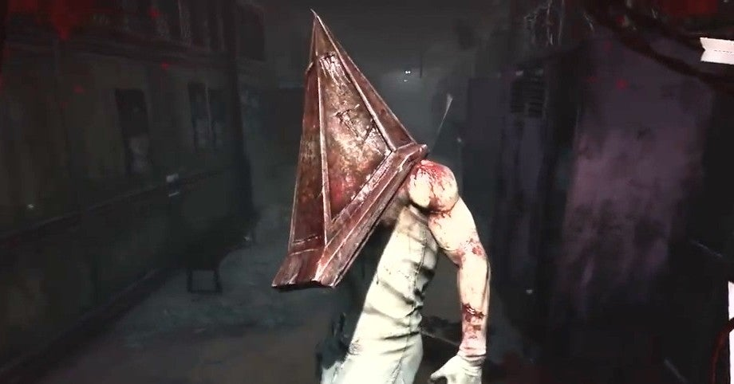

<figure>

</figure>

　三角様は、ゲーム**『サイレントヒル』**に登場する悪夢のようなキャラクターのことだ。**『サイレントヒル』**シリーズを愛するホラーゲームファンからは、愛着を込めてこう呼ばれている彼は、シリーズの2作目以降に登場する。現在の一般的な呼称は**『三角頭』**とか、海外では**『Pyramid Head』**など。

　朝起きたら、**『デッドバイデイライト』**に、その三角様が登場するという話題がネットで流れていた。ゲームファンにとってなんという衝撃的なニュース。それもそのはず、これまでホラー映画やドラマと積極的にコラボして、そのキャラクターを登場させてきた**『デッドバイデイライト』**に、他ゲームのキャラクターが登場するのは初めてなのである。

　実は僕自身は**『サイレントヒル』**シリーズを、あまり楽しいゲームだと思っていない。特に初期のシリーズのもっさりとした操作感、パズルのようで、本編ストーリーとはあまり関係ない謎解き、観念的でわかりにくいストーリーなど、個人的には好みではない要素が多いからだ。

　しかし、ゲームに登場する様々なクリーチャーの造形は実にインパクトがあり、実際にゲームをプレイしていない人たちにも印象深い姿が多いだろう。僕もその一人だ。

　また、個人的には好みではないと評している、ゲームそのものについても、ストーリー部分に意図的にモヤッとした部分を残しているため、ファンによる考察も盛り上がり、そういう意味ではゲームプレイ以外も楽しめるいいゲームとも言えた。いずれにしても、多くの人の記憶に残るゲームで、現在のコナミがあまりゲームの続編などに興味をなくしてしまっているのが残念ではある。

　そんな**『サイレントヒル』**から**『デッドバイデイライト』**に人気キャラクターである三角様が参戦するのだから、これは盛り上がらないわけがない。そのこと自体がちょっと感動的である。

　現在はテストバージョンにのみ登場する三角様だが、正式実装は6月とのこと。僕はPC版をプレイしているので、一足早くテストバージョンを体験してみたい。あの重苦しい悪夢の体験が、**『デッドバイデイライト』**の世界でも蘇ることを期待しつつ。

[https://www.youtube.com/watch?v=6l8yja2TsTI](https://www.youtube.com/watch?v=6l8yja2TsTI)
