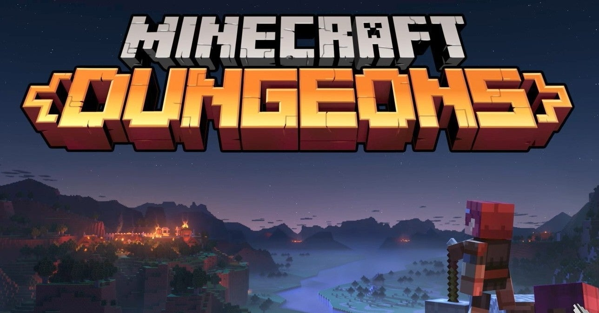
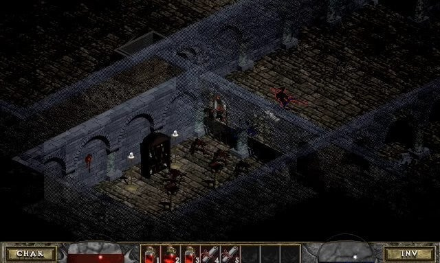
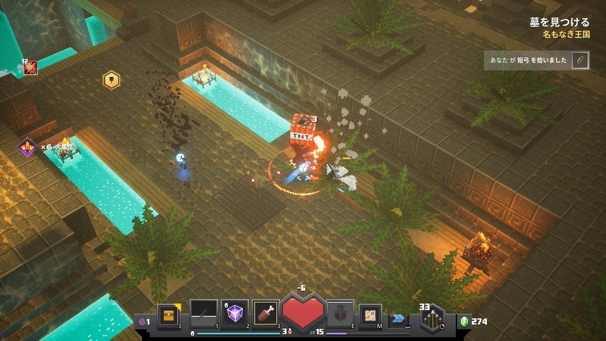

<figure>

</figure>

　少し前から話題になっていた**『マインクラフトダンジョンズ』**が**MOJANG**改め**MOJANG STUDIOS**からリリースされている。PC、任天堂スイッチ、PS4、Xbox Oneなどマルチプラットフォームに渡って同時発売される気合の入れようだ。なお、パブリッシャーは**Xbox Game Studios**になる。僕は、Xbox Game Passでプレイしている。

　ゲーム内容だが、簡単に言って**『マインクラフト』**のキャラクターを使用して**『ディアブロ』**をプレイしているような感覚だ。特に、マウスで操作した場合は、キャラクターの移動やアイテムをポイントして取得する点など、操作にも共通した部分が多い。

　**『ディアブロ』**についても簡単に書いておくと、1997年に米**Blizzard North**社によって開発された、ハック＆スラッシュの元祖のようなアクションRPGだ。3つのクラスから自分のキャラクターを選び、構造がランダムに変化するダンジョンを繰り返し訪れる。プレイヤーは次々と現れる敵をひたすら倒して、より強力な武器を手に入れるというゲーム性が中毒プレイヤーを生んだタイトルだ。特にオンラインでのマルチプレイが盛り上がり、当時ISDN回線でゲームをやっていた僕は、テレホーダイタイムを利用し、夜を徹して遊んでいた。

　そんな**『ディアブロ』**を正当継承するような**『マインクラフトダンジョンズ』**が、実際にプレイしてみたら思ったよりずっと**『ディアブロ』**チックなので一人で喜んでいるというわけだ。

　一方で、意外なほど**『マインクラフト』**要素は少ない。ボクセルで描かれたファンタジーワールドは**『マインクラフト』**そのものであり、登場するモンスターも、クリーパーやエンダーマンなど、**『マインクラフト』**プレイヤーには馴染み深いものばかりだが、**『マインクラフト』**の主要素であるクラフトなどは存在しない。ダンジョンで湧き出る敵をひたすら倒し、ランダムドロップするアイテムからより強いものを選択し、さらに強敵の待つダンジョンへ挑むことの繰り返しだ。

　今のところ、まだクリアには至っていないが、複数あるダンジョンは難易度設定ができ、まだまだキャラクターを強化しても楽しめそうだ。とりあえずソロプレイで遊んでいるのみだが、いずれオンラインで協力プレイもしてみたい。**『ディアブロ』**は際限なく遊んでしまうようなところがあったのだが、**『マインクラフトダンジョンズ』**は、ひとつのダンジョンをクリアするのに30分程度の時間で済むので、1プレイのキリもよくて、この辺り最近のゲームらしい配慮も感じられる。何より、難易度の設定が**『ディアブロ**』よりマイルドで遊びやすい。武器をエンチャントして強化するゲームシステムもわかりやすく、育成の楽しみもあって親しみやすい印象だ。

　さて、最初のプレイ感は良好な**『マインクラフトダンジョンズ』**だが、これがハクスラの新代名詞になるようなゲームであると嬉しいのだが。

[https://www.youtube.com/watch?v=cbQE\_v0PZ9o](https://www.youtube.com/watch?v=cbQE_v0PZ9o)
