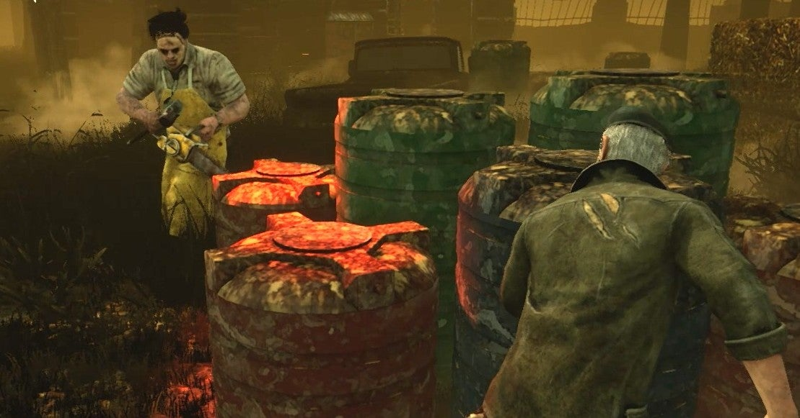

<figure>

</figure>

　Steamのゲームをよく遊んでいるわけだが、Steamにはゲーム中のスクリーンショットをアップロードして、同じゲームを遊んでいる（または遊んでいない人も）プレイヤーたちと、自分のゲームの様子や雰囲気を共有できる機能が実装されている。一緒にゲームをプレイしていなくても、フレンドたちが今どんなことをやっているのか知ることができ、ゲームのコミュニティ全体を盛り上げるのに一役買っている。

　しかし、ゲーム中のスクリーンショットだから、当然ゲームの操作をしながらキーボード上のキャプチャボタンを押さなければならない。別に難しい操作というわけでもなく、本当に気軽にスクリーンショットを残せるのだが、僕の場合このスクリーンショットを撮ること自体を忘れてしまう。ついついゲームに熱中して、その他のことなど頭から消えてしまっているのだ。

　ゲームのプレイは、いつも録画しながら行っている。noteに使ったり、SNSに上げたりする場合は、その動画から改めてキャプチャした画像を使う。これは、ゲームをしていないときにゆっくりキャプチャできるので簡単だ。目的にあった場面を選択するのも容易い。余談だが、こういう記事にゲームの画像を使用する場合も、自分のプレイから引用することにしている。拾い物は使わない。

　だから、ゲーム画面のキャプチャ自体は頻繁にしているのだが、プレイしながらのスクリーンショットとなると、どうもはかどらない。Steamのゲームランチャーにずらずらっと並んでいるフレンドのスクリーンショットを見ると、みんなよく忘れずに名場面を記録しているなあ、と感心してしまう。

　一応、裏技的に、ファイル名を変更したりしてスクリーンショットのフォルダに放り込むと、任意の画像を使用するという方法もあるのだが、これは面倒でやっていない。あくまで、お手軽に……っていうのが理想的なスクリーンショットだ。

　そんなわけで、自分でもSteamのコミュニティでスクリーンショットを共有したいと思いながら、プレイ中には忘れてしまう話だ。この文章を書いて、もう少しスクリーンショットを撮ることに意識を向けようというのが、今日の文章の目的。よし、がんばるぞ。ゲームしてくる。
