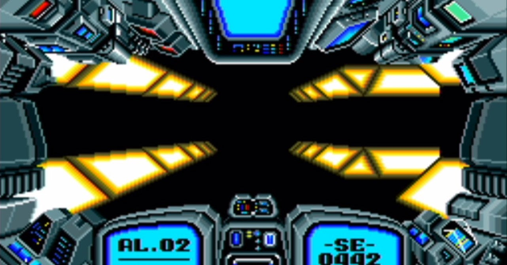

<figure>

</figure>

　今日は**『アウトライブ』**というゲームで遊んでいた。サンソフトが1989年にPCエンジン用としてリリースした、3DダンジョンRPGだ。一応。

　**『アウトライブ』**は、ファンタジーRPGではなく、ロボットが主人公のSF RPGである。画面をひと目見てわかるように、メカと電子のイメージで展開する、極めて硬質でメタリックな世界観のRPGだ。

　しかし、PCエンジンの初期にHuCARDで出されたソフトだけあって、ゲームのそこかしこに、いかにも容量的に厳しい雰囲気が漂っている。ライトで照らされたかのようなダンジョンは、シンプルでクールなデザインではあるものの、明らかに軽量なグラフィックで描かれている。プレイヤーのキャラクターにパーティの概念などはなく、ファイティングワーカー（FW）と呼ばれるロボット単騎で戦う設定が、ハードなロボットアニメを想起させる。男の孤独な戦いを彩る戦闘BGMは1曲のみ。ゲームの終わりまでひたすら同じ曲で戦う。実にストイックでスパルタン。シンプルイズベストみたいなゲームデザインが貫かれている。

　プレイヤーは、古代の科学技術を採掘している惑星ラフラを訪れ、そこで不穏な動きを見せているマーズという組織を調査する任務に就く。FW同士の決闘を行うデュエリストとして潜入した主人公は、最新型FWブラウディスを駆って、惑星ラフラにうごめく謎を解き明かさねばならない。

　プレイヤー側が単騎で戦うため、戦闘はやるかやられるかである。戦術の駆け引きもほとんどなく、レベルアップによってパワーアップするFWが成長しているかどうかで勝負が決まるため、ひたすら自分を強くするクソ経験値稼ぎが**『アウトライブ』**のすべてだ。

　そう聞くと、単純なだけのつまらないゲームに聞こえるかもしれない。しかし当時、確かに**『アウトライブ』**は熱かった。それは、このゲームがシステム的に未熟だったがための、やるかやられるかの緊張感と、貧弱なROM容量から来るシンプルなグラフィック、ひたすら戦闘を盛り上げる1曲のBGM、それらが奇跡的な融合を見せていたからである。

　いろいろな制限があったからこそ表現できた世界観。それが**『アウトライブ』**には存在していた。
