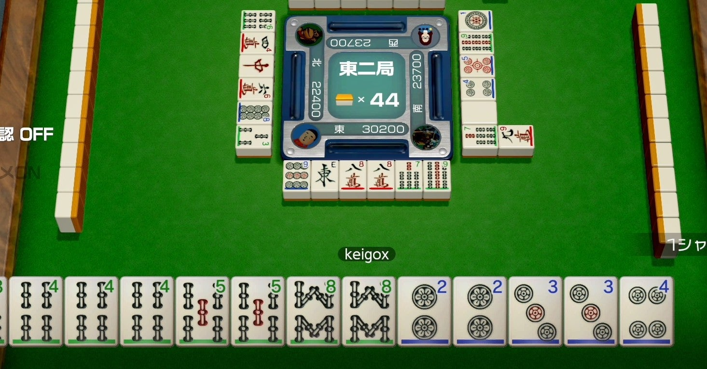

<figure>

</figure>

　今日、任天堂スイッチ用に発売された**『世界のアソビ大全51』**を早速遊んでいる。個人的には、**『マンカラ』『バックギャモン』**などが収録されていてそれだけで嬉しいのだが、ボードゲームに限らず、トランプを使ったゲームやいかにもビデオゲームらしいポリゴン戦車のゲーム、的を狙うガンシューティング的なゲームなど多岐にわたるゲームが収録されている大ボリュームのオムニバスゲームだ。

　その中でも、地味に**『麻雀』**が楽しいわけだが、何よりも任天堂が発売したビッグタイトルというだけあって、初日からマッチングに困らないぐらいの人がオンラインで遊んでいて、それだけでもこのゲームを買った価値があるというものだ。

　**『世界のアソビ大全51』**に収録されている**『麻雀』**は、オンライン麻雀ゲームとして見ると、まずまずの出来と言ったところで、もう少しキビキビ動いてほしいとか、成績の分析が残ってほしいとか、細かい要望はあるものの、見やすい麻雀牌とそれなりに良好な操作性で及第点の完成度である。

　一方で、どのオンライン麻雀でも一番ストレスが溜まるのが、各プレイヤーの捨て牌の遅さである。本物の牌を使った麻雀では、前の人が捨て牌したら、遅滞なく次の人が牌を切らなければならない。卓を囲んだ4人がリズミカルに牌を切っていく音は、まるで正確なリズムマシンのようでもあり、ゲームは淡々と進んでいくのが本物の麻雀である。

　しかし、オンライン麻雀はお互いの顔も見えないし、そもそも誰と打っているのかすらわからない。例えば雀荘へ行って麻雀を打つよりもずっとカジュアルに卓を囲むことができる。しかし、それだけに他のプレイヤーに気を遣う緊張感もない。好きなだけ長考し、場の流れを考えず、自分のいらない牌だけを切ればよい。親のリーチ直後にドラを強打しようとも、リーチ者がいるのに槓をしようとも、まったくの自由だ。嗚呼、すばらしきオンライン麻雀。

　などと書くと、手積みが主流だった時代に麻雀を知ったロートルの愚痴と揶揄されるに違いない。いやいや、これはオンライン麻雀なのだ。それぞれが自由に、気兼ねなく打つのが一番。僕がリーチしたらどんどんドラを切っていただきたい。大明槓をして盛大にドラを載せて盛り上げてもらいたい。若い方々は、どうかマナーや流れなど気にせずに、自由なスタイルで、自分の麻雀を貫いてほしい。

　さて、どんな打ち手が来ようとも、それに合わせて上がりやすいスタイルで打つのが本物の雀士である。僕は、そんな自由な打ち手の奔放な捨て牌をお待ちしている。さあ、一緒に**『世界のアソビ大全51』**で麻雀を楽しもうではないか。

[https://www.youtube.com/watch?v=m7WuRPKHZtE](https://www.youtube.com/watch?v=m7WuRPKHZtE)
