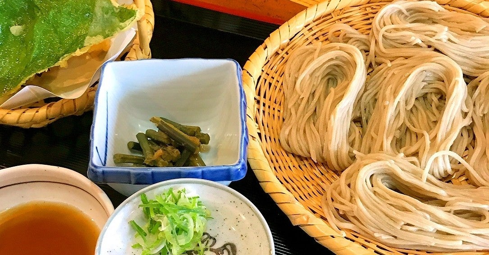

<figure>

</figure>

　少しずつ外出をしていこう、という感じで、自宅からほど近い戸隠へ蕎麦を食べに行ってきた。

　戸隠は旧戸隠村、現在は合併して長野市になっている。地域としては、その長野市の北方に位置し、標高1300mに位置する戸隠神社を中心に広がる高原の地域である。

　名産の戸隠そばは、島根県の出雲そば、岩手県のわんこそばと並ぶ有名な蕎麦で、日本三大そばとも呼ばれている。挽きぐるみと呼ばれる、蕎麦の実の甘皮を取らずに引いたそば粉は、色が濃く、蕎麦の香りがより楽しめる。僕などは、昔からこの挽きぐるみの蕎麦に慣れてしまっているため、真っ白い更科そばなどは、素麺のようにも見えてしまって違和感をおぼえるほどだ。

　この挽きぐるみで打たれた野趣あふれる戸隠そばは、「ぼっち盛り」と言われる、蕎麦を少量ずつ束にして折りたたんだものを竹のザルに乗せるという、独特の盛り付け方で提供されるのが定番だ。普通の盛りは「五ぼっち」と言って5束、「大ざる」など、大盛りの場合は「七ぼっち」と言って7束がザルに乗っているのが普通のようだ。この「ぼっち盛り」は、そば屋としてもこだわりポイントらしく、同じ長野市内でも、戸隠地域から平地へ降りてきた街中のそば屋（当然街中にもそば屋が多い）では、「ぼっち盛り」ではない店が多くなってくる。一方で、戸隠にあっても「ぼっち盛り」ではない店もあり、たぶんその辺りで店の方針や出自が、言葉少なに主張されているのではないかと思う。

　なお、戸隠そばは、食後にめんつゆに入れて飲む「そば湯」が蕎麦とともに出されるのが一般的であるが、僕はこのそば湯を飲まない。そばを茹でた後の、ちょっととろみのついたお湯は、栄養価が高いなどとも言われるのだが、個人的には別に美味しくない。せっかく香り高い蕎麦を頂いた後に、なんだかはっきりしない味のそば湯を飲むことは好きではないのだ。

　などと、蕎麦についてあれこれ書くと、蕎麦にこだわりがあるのだろうと思われるのかもしれない。全然そんなことはないのである。そば屋によって蕎麦の味は結構違うし、美味しいと言われる店はやっぱり美味しいのだが、じゃあスーパーで売っている蕎麦や、もっと言えば乾麺の蕎麦などが美味しくないのかと言えば、そういうのを買ってきて自分で茹でても結構旨い。要するに僕が蕎麦好きなだけで、何か蕎麦に神格化したこだわりがあるわけではないのだ。

　でも、蕎麦には、そういうこだわりを感じさせる雰囲気がまとわりつくのも事実で、1日何食限定とか、蕎麦が終わったら閉店とか、そういう店が行列を作っている様子も見られる。そういうのはちょっと苦手である。あくまで気軽に食べられるから蕎麦は美味しいのだ。

　そんなわけで、皆さんも長野市や戸隠を訪れたら蕎麦を食べてみることをおすすめするが、やっぱり人の多い場所には美味しくないそば屋もあったりして油断ならないのがそば屋の奥の深いところ。どうか気をつけて。さすがに具体的な店名は挙げられない……

※「そば」「蕎麦」の表記ゆれは、漢字との組み合わせで読みやすさを考慮しました
