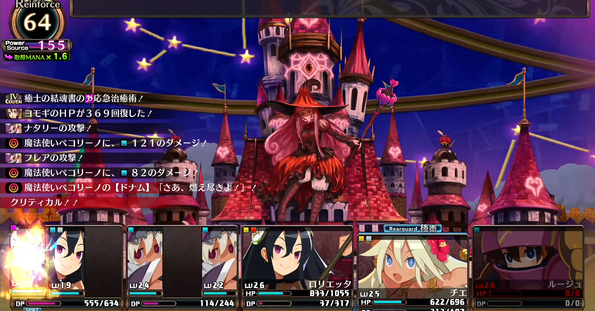

<figure>

</figure>

　結局3DダンジョンRPGは、序盤をプレイしてずっと放置していた**『ルフランの地下迷宮と魔女ノ旅団』**を遊んでいる。2017年にPS4版が発売され、その後PC版とSWITCH版が発売された、日本一ソフトウェア製の3DダンジョンRPGだ。

　**『ルフランの地下迷宮と魔女ノ旅団』**は、5人とか6人でパーティを組むRPGではなく、5枠ある味方の小隊に複数名のキャラクターを組み合わせて配置し、10人を超える大所帯でダンジョンを探索する一風変わったシステムのゲームだ。

　で、今回はゲームの話は置いておいて、いつもゲームを遊ぶときに録画して後でYouTubeにアップしている話である。**『ルフランの地下迷宮と魔女ノ旅団』**はRPGなので、プレイを録画しても、そのほとんどがダンジョンを歩いているだけの動画になる。世の中に出回っているプレイ動画を見ると、ザコ敵との戦闘や、ストーリーに関係ない部分をうまくカットして、ダイジェストを編集してアップしている動画もあったりする。しかし個人的には、そういう手間をかけ始めると続かないので、編集はしないでおこうと思っている。

　どちらかと言えば、ゲーム動画をアップするのは、自分がゲームで遊んだもののログ的な意味合いが強くて、あまりカットしたくないというのもある。それならば、いっそのこと録画→アップロードという流れをやめて、ライブ配信でプレイを垂れ流しながら、そのままアーカイブで残してしまえばいいんじゃないかと思い始めた。

　そんなわけで数日前から、**『ルフランの地下迷宮と魔女ノ旅団』**に限らず、**『あつまれどうぶつの森』**とか**『世界のアソビ大全51』**などなど、必ずしも動画全体が見どころにならないようなゲームは、ライブで流しっぱなしでプレイしている。ログで残すので、マイクで喋るような実況動画でもない。

　自分のYouTubeのアカウントを見返したときに、色々なゲームの動画がランダムにアップされていて混沌としているので、後からそれぞれのゲームのリストに放り込むことだけしている。そんな感じでゲームのプレイログを残している。

　一昔前では、容量的に考えられなかった贅沢なゲームログの残し方。しばらくこれでゲームを遊んでいこう。

　ちなみに、ライブで配信しているのをSNSなどに通知もしないので、誰も見ていないだろうと思うと、意外に見られたりしていてびっくりする。それもそれでおもしろい。
