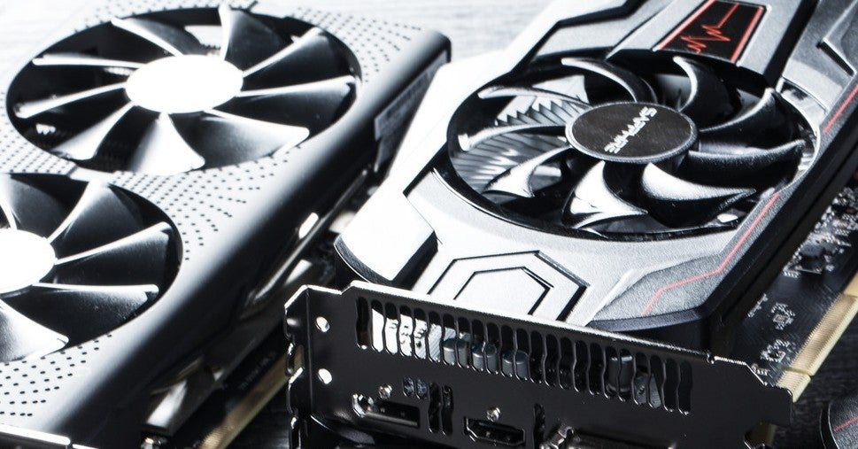

<figure>

</figure>

　言うまでもなく、パソコンでゲームをするときに重要になるパーツがグラボことグラフィックボードだ。CPUはそれなりでも、グラボにパワーがあればなんとかなるというぐらい重要なパーツである。

　僕は1年半前に、久々にゲーミングPCを買ったのだが、当時ハマっていた**『デッドバイデイライト』**が快適に動作するかどうかでスペックを選択した。

　ところが最近、その**『デッドバイデイライト』**が少々重くなってきた。これまでアップデートを重ね、グラフィックの質が向上してきた**『デッドバイデイライト』**は、特に新しいステージにおいてオブジェクトの数が増え、動作が重くなってきているのだ。最近**『サイレントヒル』**とのコラボが発表されて盛り上がっている**『デッドバイデイライト』**だが、テストバージョンを遊んでみたところ、なるほど新ステージが重い。具体的には、これまでゲームを通して60fpsで描画できていたところが、新ステージでは50fpsを下回るようなときもあることがわかった。

　60fpsと50fpsの差なんて大したことないだろうと思われるかもしれない。しかし、**『デッドバイデイライト』**には1秒に満たないジャストタイミングでボタンを押すようなギミックもあり、50fpsの「ちょっとカクカクする」感じが、ゲームプレイでは非常に危うい感じになるのだ。

　そんなわけで、新しいPCを買って1年半で、もうグラボを新調したくなっている。今使っているのがGeForce GTX1600なので、そろそろRTXのすごいやつにしたい。本当はケチらずにモンスタースペックのグラボをドーンと買えば、長寿命で使えるのだが、予算と相談してなかなか踏み切れない事情もある。

　ちなみに、僕のPCより1年ほど遅れて買った奥さんのゲーミングPCは、GTX1660だ。僕のPCよりちょっとだけスペックが高い。**『デッドバイデイライト』**もまだ困るほど重くないようだ。うらやましい。

　それにしても、快適なゲームプレイを求めて買ったゲーミングPCだったはずが、一旦手に入れたが最後、アップグレード沼にハマるとは。いや、逆に言えばいつまでもゲーミング人生を謳歌できるということか。よし、この沼に最後までつきあってやることにしよう。
