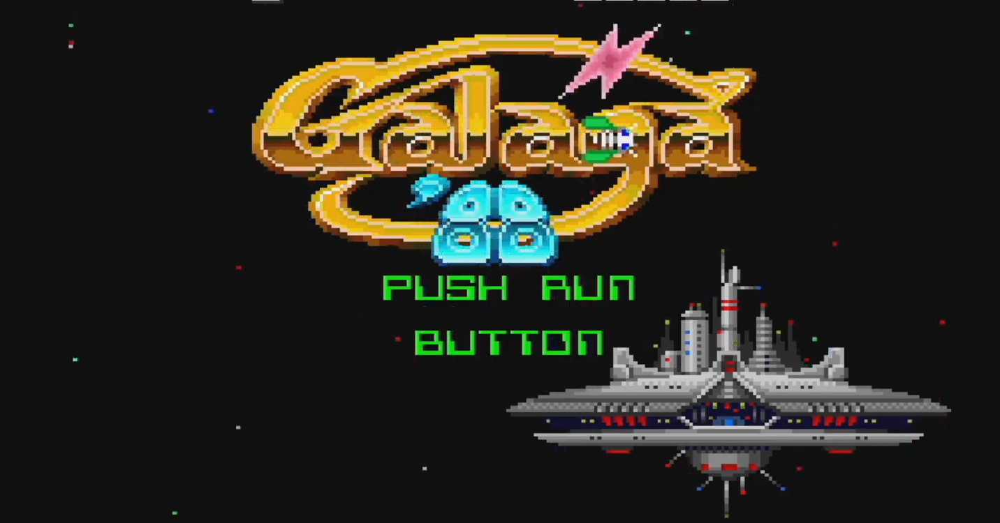

<figure>

</figure>

　**PCエンジンmini**じゃなくて、**コアグラフィックスmini**を買ったので、朝から**『ギャラガ'88』**で遊んでいた。アーケードでも人気だったタイトルの、PCエンジン移植版だ。アーケード版よりは難易度が緩くて遊びやすいため、発売された当時は繰り返し何回も遊んでいた。

　その**『ギャラガ'88』**だが、久しぶりとは言え、簡単なPCエンジン版だから余裕でクリアできるだろうと思っていたら、意外に苦戦してしまった。終盤の攻撃が激しくなるステージでは次々に自機を失い、なんとかラスボスまでたどり着いたものの、結局そこでゲームオーバー。続いて、プレイヤーに有利なアイテムが登場する、PCエンジンオリジナルのアレンジ版をプレイしたが、これも同様にラスボスで死亡。ゲーマーとしては、なんとも残念な話だ。

　何年も（何十年も）遊んでいないゲームを久しぶりに遊ぶと、得てしてこういうことはあるわけだが、それにしてもPCエンジン版じゃないか、という気持ちにはなっていた。リハビリをしないと、往年の勘は戻ってこないだろう。

　かつて精彩を極めたゲームプレイも、長年そのタイトルをプレイしていなければ細かいパターンは忘れるし、自機操作のちょっとした勘所も甘くなるのは当然だ。これってなんとなく、全盛期に神業の如き演奏を聞かせてくれたギタリストが、年令を重ねるとともにエッジの立たない、なるいプレイになってしまうのに似ている。若い頃は天才の閃きとしか思えないギターソロが、なんだかごまかしと手抜きみたいなフレーズの連発になってつまらなくなるのと似ている。

　しかし、それは仕方ないことだ。人間、年とともに身体能力は衰え、感性も鈍くなる。若き日に天才的な弾避けをしていたゲーマーが、つまらないところでミスをして死にまくる凡プレイヤーに成り果てたとしても、自然の摂理なのだ。

　それでも、指が動く限り、目が見える限り、ゲームに挑戦し、かつてのようにクリアを目指すのがゲーマーだ。今日も頑張るぞ。

[https://www.youtube.com/watch?v=Omt4-eW412A](https://www.youtube.com/watch?v=Omt4-eW412A)
