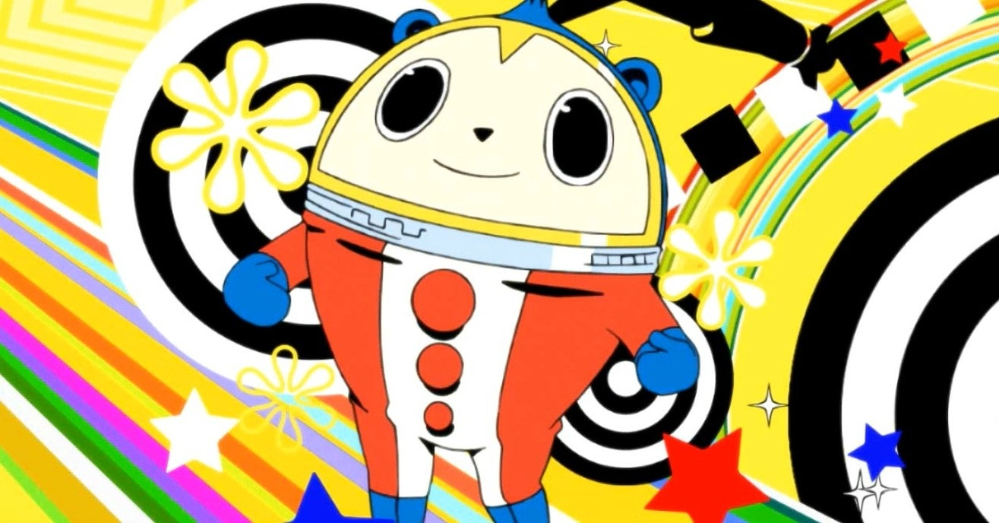

<figure>

</figure>

　**『ペルソナ４ザ・ゴールデン』**は、かつてPlaystation Vita用にリリースされていたRPGである。もともとPS2でリリースされていた**『ペルソナ４』**の人気に押されて登場した、追加シナリオを含んだアッパーバージョンのタイトルである。

　今回、その**『ペルソナ４ザ・ゴールデン』**がPC用になって帰ってきた。基本はベタ移植だが、グラフィックがフルHD化されたことで、今の高解像度モニターでのプレイにも耐えられる、美しい映像になっているのが特徴だ。PC用ということで、マウスオペレーションも可能だが、やはりコントローラでのプレイが快適なようだ。

　もともと**『ペルソナ』**シリーズは、**『女神転生』**シリーズをルーツとするRPGで、プレイステーション向けにリリースされていた初期の作品は、**『女神転生』**に通じる、ダークでオカルティックなテイストがゲーム全体を支配していた。その中で、ペルソナという自分の別人格を呼び出して戦う特殊能力の採用、悪魔召喚というゲームシステムを廃するなど**『女神転生』**シリーズとの差別化を図っていたのが特徴だ。

　しかし、プラットフォームをプレイステーション2に移行してリリースされた**『ペルソナ3』**では、ゲームの雰囲気は一転する。絵柄や音楽が明らかにポップなものに変化し、ストーリーも主人公の学園生活を核に、友人との人間関係がゲームシステムに取り入れるなど、意欲的な作品となる。これによって、**『女神転生』**からの古いファンから、もっと若いファン層を取り込み、**『ペルソナ』**シリーズ自体が若返りとも言える現象を起こす。

　そして、続く**『ペルソナ4**』において、その方向性はより明確に、より強化され、名実ともに大人気シリーズとなったわけだ。個人的には、**『真・女神転生III』**でもサウンドを担当した、**目黒将司**によるギターオリエンテッドなBGMがかなり気に入った。ヴォーカルをフィーチャした斬新な通常戦闘曲と、過去作と比べて、よりドラマティックに振ったようなボス曲が、ゲームに華を添えているのである。

　ところが。ところが、である。これがクリアできないのだ。PS2で**『ペルソナ4』**を、Vitaで**『ペルソナ4ザ・ゴールデン』**を何回かプレイしたのだが、何回やってもゲーム内のスケジュールが夏休みに達する辺りで挫折してしまうのである。

　ゲーム中の夏休みに当たる７月終わりから8月にかけては、その半分以上が日常イベントパートになる。いとこの小学生の宿題を見たり、女の子に誘われて夏祭りに行ったり、そんなことをしながら能力をアップするのが、このゲームの夏休みの過ごし方なのだ。これが耐えられない。いや、楽しいはずなのだが、延々と日常をこなしているうちに、「うわー！　いい加減戦わせてくれー！」となってしまうのだ。

　そんなことを思い出しながら、今回のPC版**『ペルソナ４ザ・ゴールデン』**を買った。実を言うと、奥さんが遊びたいと言うので、奥さんのアカウント用に買った。僕は、それをファミリーシェアリングで遊んでいる。実に弱気だ。しかし、今度はクリアしたい。もう、攻略本でも攻略サイトでもなんでも活用してでもクリアしてやる。かつて**『真・女神転生III NOCTURNEマニアクス』**をクリアした自分にできないわけがないと思いつつ、今**『ペルソナ４ザ・ゴールデン』**の4月を終えるところだ。

　今度は頑張るぞ。

[https://www.youtube.com/watch?v=eb9ui5HCInI](https://www.youtube.com/watch?v=eb9ui5HCInI)
