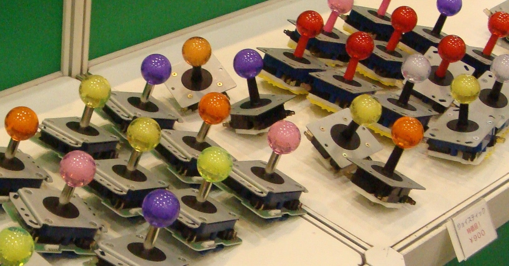
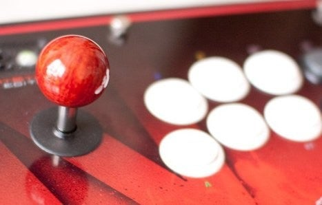
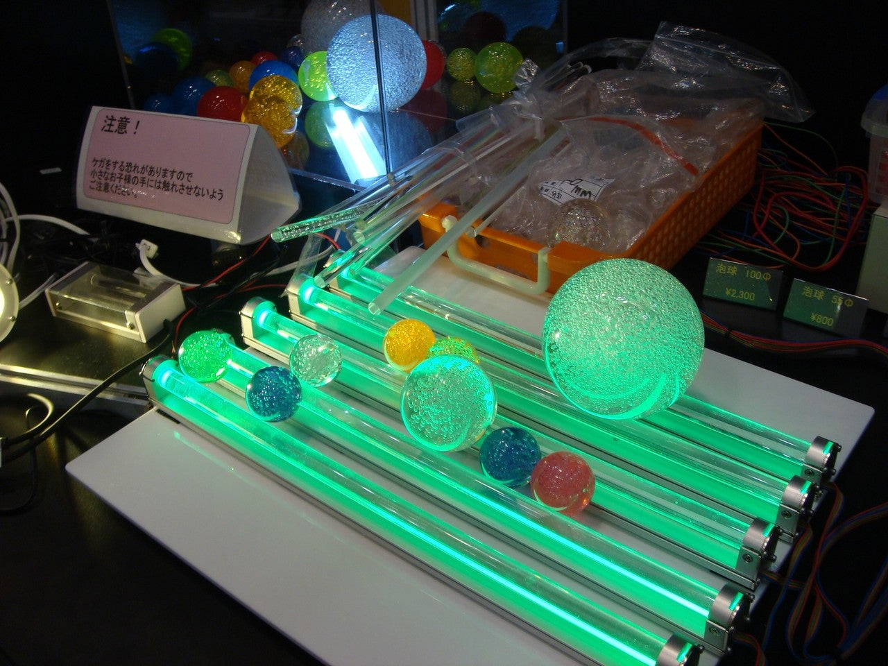

<figure>

</figure>

　我々ゲーセンゲーマーと、ジョイスティックは切っても切れない関係にある。ジョイスティックが完璧にメンテされていることはもちろん、レバーを倒したときの感触や荷重、レバー内部で8方向や4方向に入力しやすいように誘導するガイドパーツ、レバーの長さなどに至るまで、とにかくいろいろな部分を気にするのである。気にしすぎて、ややウザい感はあるが、でも気にならないゲーセンゲーマーはいないのだ。特に、業界最大手の三和電子製とセイミツ工業製のどちらのレバーを使うかという話は、ゲーマーにとって戦争に発展しかねない永遠のテーマである。

　そんな中で、ジョイスティックのメインパーツである、レバーを構成する部品のひとつに『レバーボール』がある。そう、ゲーム筐体に設置されたレバーのてっぺんに、プレイする人が握りやすいように取り付けられた樹脂製のボールのことだ。

　直径は35mm。色はコピックマーカーも顔負けなほど多種多様、好みに応じて交換が可能だ。このボールを交換する際、レバーからボタンを外すためには、レバーパーツ底部のマイナスネジを固定しながら回す必要がある。レバーがくたびれたゲーセンでは、ボールの固定がゆるくなり、ゲーム中に外れてしまうかもしれない。そんなダメメンテは許されない。最近は、クリアパーツのおしゃれなボールや、シルバーに輝くメタリックなイメージのボールも登場している。通常35mmのボールは、30mmや45mmといったサイズ違いのものもあり、現在も一部の専用ゲーム筐体では、見た目と操作性の差別化のためか、大きなボールが搭載されているものもあったりする。

　ちなみに、僕はレバーはセイミツ製。ボタンは三和電子製と決めている。決めているというのは、ゲーセンで違うパーツが装着されていたら遊ばないということではない。しかし、家で使うアーケードスティックは、必ずそのパーツの組み合わせに交換するということだ。この組み合わせじゃないと調子が出ないとか、ゲームができないということもない。単なる好みの問題だ。でも、例えばパソコンのキーボードが、その打鍵感が話題になるように。ピアノ奏者がエレクトーンではキータッチの表情がつけにくいのと同じように、ゲームをプレイしているときの気分には影響する。

　実はそんなレバーボールにも、高級品（？）が存在する。今から10年ぐらい前に、三和電子が企画して登場した**『木製レバーボール』**は、素材にパイプなどに使われるブライヤー（栄樹）という木材を使用した、レバーボールとしてはちょっとあり得ないぐらいの艶と輝きを持った逸品だった。当時、秋葉原の基板屋でのみ販売されたのだが、すぐに売り切れとなったようである。

　この手の高級木製レバーボールは、その後も素材を変え、ゲームショーイベントなどで販売されている。調べたところ、現在は千石電商でも木製レバーボールが販売されているようだ。こちらはローズウッドを使用していて、実際に手にとったわけではないので質感や操作感はわからないが、価格的には高級レバーボールの範疇だろう。

　レバーボールはゲームをプレイする際に、ものすごく必要なパーツというわけではない。多少大きさが違っても、形が違っても、一応それなりにゲームは遊べる。しかし、何十年もあのレバーボールを握り、ひたすら苦行のようなゲームをプレイしていると、いつの間にかその感触や大きさを手が記憶してしまう。今では、お決まりの一品でなければ、なにかモヤッとした違和感を覚え、平和な気持ちでゲームをプレイすることすらできなくなっている。きっとこの先も、ゲーマーたちは35mmの小さなボールにこだわり、理想の握り心地を追求していくのだろう。ぎゅ。

