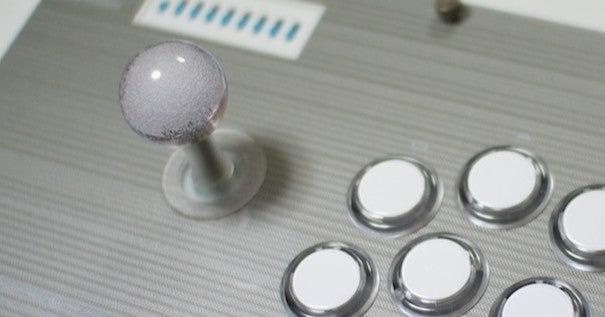
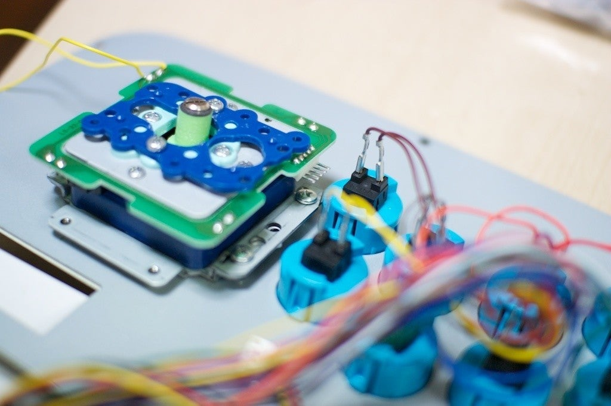

<figure>

</figure>

　今日はレバーの話。肝臓ではない。ジョイスティックについている、ゲームを遊ぶためのレバーだ。

　レバーボールにこだわりがあるのだから、当然レバーにも一家言あるのが一人前のゲーマーというものだ。僕も例外ではない。レバーはセイミツ工業製に限る。目黒のサンマぐらいの勢いで、そう決めている。しかし、三和電子製のレバーも決して悪くない。どちらでゲームをプレイしても、問題なく遊べる。しかし、家で使うために買ってきたアーケードスティックに三和電子製のレバーが装着されていたら、それは容赦なく交換する。慈悲はない。

　僕の感覚では、三和電子製のレバーは、倒したときの感触が柔らかく、内部のマイクロスイッチをカチカチと入力するクリック感が弱い。一方、セイミツ工業製のレバーは、このクリック感が強い。このいかにも「入力している」という感覚が好きなのだ。ちなみに、パソコンのキーボードは、クリック感の王者みたいなメカニカルキーボードは好きじゃない。キーボードはあまり打鍵感がないREALFORCEが好きだ。どういう好みの差なのか、自分でもよくわからない。

　最近は、家庭でアーケードスティックを使って格闘ゲームを遊ぶ人のために、静音レバーなんてものも開発されている。これはどうにもよくない。たぶんさっきも書いたクリック感に関連しているのだろう。静音レバーは好きになれないので、家でもガチャガチャとうるさい音を立ててゲームをやっている。これでいいのだ。

　セイミツ工業のレバーは、内部に4方向、8方向を切り替えるガイドが入っている。ゲームの入力によって、このガイドを付け替えると、誤って入力することが大幅に減るのだ。例えば、古いゲームだが『ドルアーガの塔』というゲームは、4方向入力のゲームだ。これを8方向のレバーでプレイすると、誤入力で、縦横の移動が思わぬ方向に行って事故死が起きる。4方向ガイドにすることで、驚くほど安定したプレイができるのだ。しかし、自分で『ドルアーガの塔』をプレイするときに、マメに方向ガイドを付け替えるかというと、実は面倒で8方向のまま遊んでしまったりする。レバーに散々こだわっておいて、方向ガイドはそれでいいのかという気もするが、まあそんなものだ。マニアのこだわりなんて、明確な理由のないいい加減なものなのだ。

　しかし、**『イメージファイト』**のような、ドット単位で微妙な入力を実現したいシューティングゲームの場合、セイミツ工業製のレバーは、僕にとって頼もしい相棒になる。あの、カチッカチッとマイクロスイッチが押される抵抗感を感じながら、3面ボスの安全地帯に自機を滑り込ませる感覚は、一度味わったら癖になる。こういう感じを、いくつものゲームで経験して、すっかりセイミツ工業製レバーの虜になってしまったのだ。

　実は、少し前にセイミツ工業製のレバーに使用されているマイクロスイッチの生産が終了したという話を聞いた。これを受けてセイミツ工業では、代替品のマイクロスイッチに置き換えが進んでいるという話だ。新しいマイクロスイッチが使われたレバーは、未だ触っていない。

