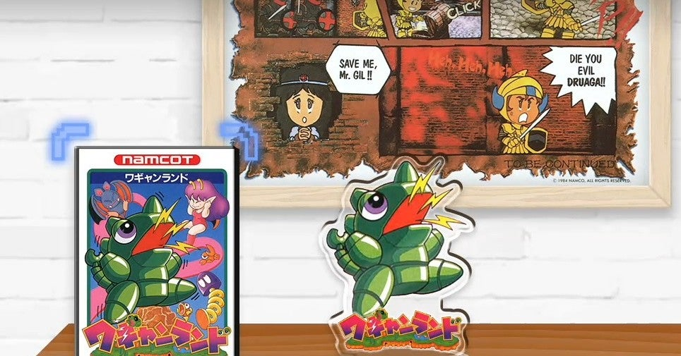

<figure>

</figure>

　ナムコのファミコン用ソフトは、ラインナップのスタートが**『ギャラクシアン』**で、当時ゲーセンでの稼働から5年経った1984年の発売だったため、なんで今さら？　という印象は拭えなかった。で、その次が**『パックマン』**。これもゲーセンの稼働から4年。今でこそ名作と呼ばれる、この2作だが、当時はあまりときめかなかったのが正直なところだ。

　続く3タイトル目が**『ゼビウス』**だった。これは楽しかった。ゲーセンに劣るヴィジュアルであったが、それでもファミコンで**『ゼビウス』**ができるというのは衝撃だった。熱中した。

　しかし、その熱狂もつかの間、4タイトル目と5タイトル目は**『ギャラガ』『ディグダグ』**と、これも大ヒットゲームながら、やっぱりちょっと古さを感じるタイトルだった。**『ギャラガ』**も**『ゼビウス**』も同時期じゃん、とお思いかもしれないが、当時リアルタイムでゲーセンの流行り廃りを感じていたゲーセンキッズにとって、そこの2,3年の差は大きかったのだ。次から次へと新作がリリースされる時代だったからこそ、その頃の少年たちにとって、最新のゲームを求める欲望は、当たり前のものだったのだ。

　その後、**『ワープマン』『バトルシティー』**など、ファミコンオリジナルのタイトルで勝負してきて、どれも一定の面白さがあったものの、どれも過去作の焼き直しという感は否めず、それで僕はナムコのファミコン用ソフトこと**『ナムコット』**はイマイチだなという印象を持つに至ったのだ。

　さて、任天堂スイッチなどで、その**『ナムコット』**のシリーズが、**『ナムコットコレクション』**として復刻リリースされることになったのだが、正直イマイチの再現かな？　などと思ってしまった。しかし、誤配信などのアクシデントもあり、野次馬根性で買って遊んでみたら、これが面白い。特に、過去作の焼き直しと感じていた**『ワープマン』**なんか、シンプルなルールと、ミニマルなBGMで、ちょっと麻薬的な楽しさがあるんじゃないか。キャラクタが小さくて、一見すると見栄えしない**『パックランド』**だが、プレイしてみるとファミコンの機能でなんとかアーケード版の面白さのエッセンスを再現しているし、実際遊んでみると楽しい。ジャンプが思うように伸びないもどかしさもアーケード版そのままだ。**『ギャラクシアン』**なんか、今遊ぶと、実に美しい曲線を描いて飛来する敵が魅惑的で、これは当時大人気になるのもうなずけるというものだ。

　時が経ち、ノスタルジーもあるのかもしれないが、また当時とは違う気持ちでナムコットタイトルを遊ぶことができた。温故知新という言葉を地で行くような体験だ。

　といったところで、今後リリースの続く**『ナムコットコレクション』**だが、気づいたら版権モノの**『デジタル・デビル・ストーリー女神転生**』がラインナップされていて、いや頑張ってるな、という感じである。よく考えたら、こういう熱中してやり込んだタイトルがナムコットには存在して、初期のタイトルのイメージだけでイマイチ扱いしてはいけないなと思い直したりした。ああ、**『カイの冒険』**も裏ステージ含めて相当やり込んだタイトルだ。そう考えて、ちょっと楽しみになってきたぞ。
