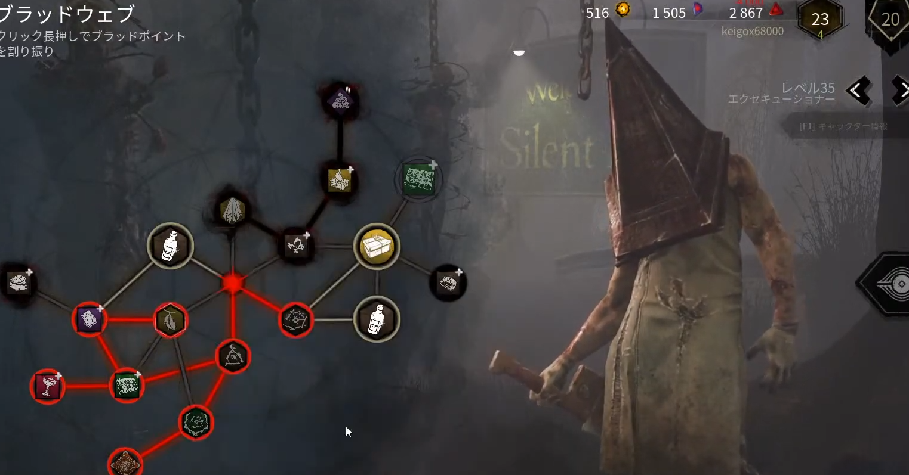

<figure>

</figure>

　**『デッドバイデイライト』**のサイレントヒルチャプターが正式稼働だ。テストバージョンだけでなく、コンシューマ機でも三角様が使える。きっと今頃は、デッドバイデイライトの世界がサイレントヒルと三角様であふれていることだろう。

　そう思って早速プレイしてみた。いない。まったくいない。三角様とのマッチングはなんとゼロ回。誰も使ってないのか！？　いや、キラーはパークを取得するために経験値（ブラッドポイント）を稼ぐのに時間がかかる。きっと今は準備期間。数日後には三角様天国になるに違いない。

　気を取り直して自分で三角様を使ってみる。吊れない。まったく吊れない。パーク不足と、強烈な格差マッチングのおかげで、上手いサバイバーをまったく捉えることができない。しかも三角様、足が速いのに、微妙にリーチが短くて、空振りが多くなる。さらには、特殊能力を使うためのボタンも複数あり、操作が混乱する。どうも練習が必要だ。

　やっぱり、後発のキラーはいろいろと複雑で、プレイする人にとって敷居高いかもしれないな、などと考えてしまう。逆に言えば、初期のキラーは、基本操作で特徴が出ていてシンプルな楽しさがある。まあ、これは時間かけて練習しよう。待望の三角様だしね。

　ところで、今回のアップデートで、キラーの三角様とサバイバーのシェリル以外に追加されていたキャラクターがいた。なんと、**『サイレントヒル3』**に登場するウサギのロビー君が**『デッドバイデイライト』**に登場しているのだ。これは嬉しいサプライズ。仕事中に奥さんからLINEが届いて知った。なんなんだ。

　このロビー君は、キラーのひとり、リージョンのアウトフィットとして登場する。それなら、リージョン使うしかないだろうと意気込んでキラー選択画面を眺めるも、なんとリージョンはレベル1。これでは三角様以上の苦戦は必至である。

　そんなわけで、新チャプターの始まった**『デッドバイデイライト』**、新キラーや新衣装を使って無双するには、まだまだ時間がかかりそうなのであった。

　ちなみに三角様、**『デッドバイデイライト』**での正式名称はエクスキューショナーである。実行を意味する英語 "excution" だが、"Excutioner"となると、死刑執行人の意味だ。昔『ザナドゥ』で覚えた単語だ。（蛇足）
