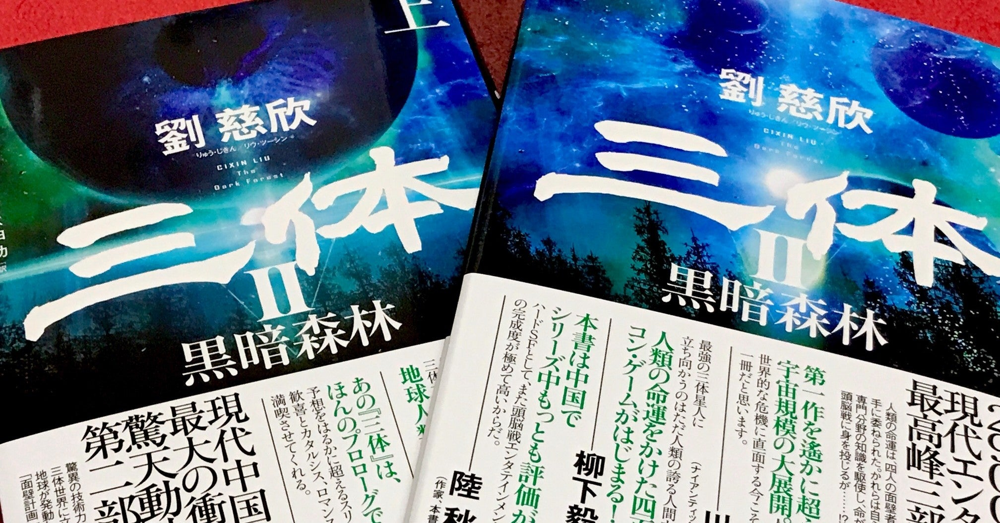

<figure>

</figure>

　**『三体II』**の上下巻を一気に買ってきた。最近読書全然していなくて、そのリハビリを兼ねてガツンと大作を読もうという意図だ。

　本当は、**『三体II』**を読み終えて、その感想をまとまりもしない長文でばばーんと投稿したいところであったのに。

　4月から5月ぐらいにかけて自宅待機期間もあって、徹底して本を読もうと思っていたのだが、意外に他のことに忙殺（？）されて読めなかった印象だ。読書というのは不思議なもので、調子よく読めているときは間髪あけずに次の本を読みたくなるものなのに、1冊に時間を書けていると、なぜかそういう意欲が薄れてくる。

　ときどき読書スランプなどという言葉を耳にすることがあるが、自分ではスランプとはとらえていないものの、ときどき本を読まなくなる時期が訪れるのは確かにある。

　もっとも僕の場合、趣味をあれこれと渡り歩き過ぎで、定期的に凝っているものがぐるぐると回転しているようなところがある。読書もそのひとつで、ときどき他の趣味に取って代わられて出番が少なくなることがあるのだ。

　じゃあ、そういうときはどうするのか。まあ、あまり無理せずに好きなことをやって日々過ごせばいいのだ。そのうち読書の出番が巡ってくる日もある。焦る必要はない。

　今回はそれに加えて、仕事が日常を取り戻し、今まで停滞していた分が一気に忙しくなったような感じがあり、それも本を読まないでいる一因になっている。異動もあって生活時間帯が変わったせいで、夜がとにかく眠い。早寝早起き健康生活！　みたいな自分が信じられないのだが、寝る前の読書時間がすっかり消えてしまった。

　あとは外出を控えていたせいで、本屋へ行かなかったのも大きい。書店に平積みされた本を見ると、うおおおお！　と体の底から湧き上がる物欲に圧倒され、それがそのまま本を読む原動力にもつながっていたのだ。その物欲が消えてしまったのと同時に、2ヶ月ほど本屋へ行ってなかったことで、その間に出版された本が、たまった宿題か何かのように謎のプレッシャーになっているのも原因だ。

　分析すればいろんな要因があって、それが読書離れの原因になっているのだが、本を読むことは義務ではない。あまり気負わずに、今やりたいことをやって過ごすことにしよう。

　あ、でも今日の睡眠前の読書は早速**『三体II』**だ。決めた。
