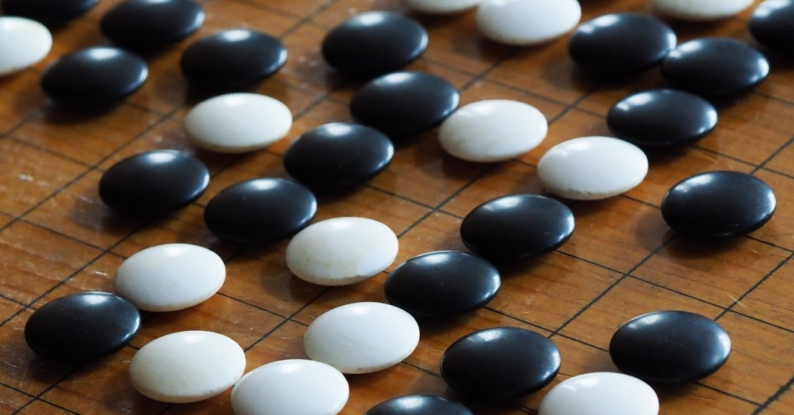

<figure>

</figure>

　小学生のときに**『囲碁』**を覚えた。別に積極的な理由で覚えようとしたわけではない。小学校の授業の一環で、毎週木曜日の5時間目はクラブ活動の時間だったのだが、そのときに囲碁クラブに入っていたのだ。それにしたって、正直に言ってしまえば、入りたくて入った囲碁クラブではない。僕としては電子工作クラブに入りたかったのだが、人気がありすぎて抽選になってしまい、ジャンケンに負けた挙げ句に囲碁クラブに入ったのだ。

　もともと入りたくもないクラブだから、モチベーションは低い。ましてや、ルールも知らない『囲碁』である。だいたい、**『囲碁』**なんてものは年寄りがやる遊びのイメージだった。将棋盤と将棋の駒は自分の家にもあったが、碁盤や碁石は祖父の家にしかなかった。その名の通りお堅いイメージだ。

　いや、よく考えると、小学生に**『囲碁』**をやらせようってクラブ活動もどうなんだろう。ゲームとして難しすぎるんじゃないか。もちろん**『囲碁』**をやる小学生はいるし、強くもなれるけど、一般的には難易度の高いゲームである。そもそも**『囲碁』**は、今自分が有利なのか、不利なのか、それすらもわかりにくい。自陣を増やそうと、闇雲に石を置いていったら、いつの間にか全部相手に取られてしまったなんていうよくわからない逆転劇が起こったりする。少なくとも、小学生の僕にはチンプンカンプンだった。（今もよくわからない）

　そうなると、小学生なのでやることは**『五目並べ』**だ。**『五目並べ』**はわかりやすい。自分の石が縦横斜めのいずれかに、5個連続して置ければ勝ちだ。上達するのは難しいが、何よりルールがわかりやすい。**『囲碁』**は早々に投げ出して、みんなで**『五目並べ』**をやっていた。

　しかし、**『五目並べ』**をやっていると先生が怒るのである。

「ここは囲碁クラブだ！　五目並べをやるところではない！」

　入りたくて入ったわけでもないのになんと理不尽な。ルールがわからないから**『五目並べ』**をやっているだけだというのに、この仕打ちはあまりにもひどい。かくして僕たち、ジャンケンに負けた組は、ルールのよくわからない**『囲碁』**を、小難しい参考書を片手に打っていたのである。

　数年後高校へ入学したら、同級生に**『囲碁』**の強いやつがいた。よくわからないが、段位を持っているそうだ。じゃあ、かつての囲碁クラブの経験を生かして、その友人と**『囲碁』**勝負をしたかと言えば、そんなことはなく、1回も勝負したことはない。**『囲碁』**が上手い人間というのは不思議なもので、**『オセロ』**とか**『将棋』**も上手いのである。**『将棋』**は、別の友人が飛車角金銀落としで負けていた。そんなことあるのか。僕が彼に勝てることがあるのは、**『麻雀』**と**『ファミスタ』**ぐらいだ。とにかく運の絡まないゲームは強くて歯が立たなかった。

　そんなわけで今でも、**『囲碁』**や**『将棋』**の上手い人の思考回路はよく理解できない。どうも僕には先を読んで作戦を立てる能力はないようである。盤上のゲームだけでなく、シューティングゲームとかも、その場の切り返しできええええ！　と避ける方が得意である。これはもう性格とか、向き不向きもあって仕方ないのだろう。

　ところで、囲碁クラブの翌年に入ることのできた電子工作クラブだが、空き缶に穴を開け、紙やすりでメッキを落としたところに、ひたすら導線をハンダ付けする、ハンダ付けクラブであった。後になって思うと、こっちの方がずっとつまらなかったのはなんとも皮肉なことだ。
