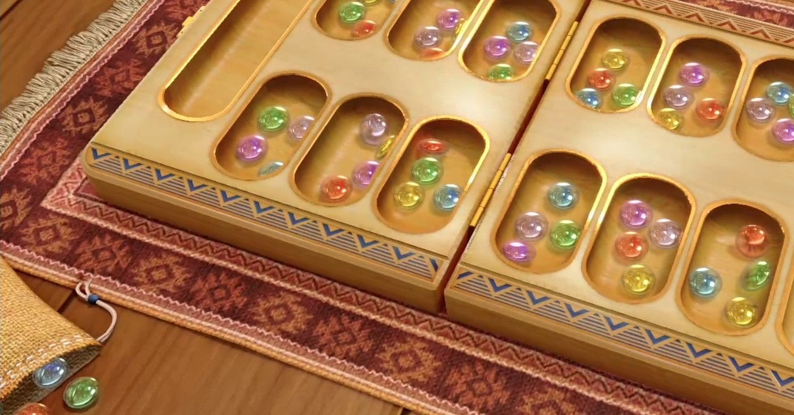

<figure>

</figure>

　今月5日に任天堂スイッチ用ソフト**『世界のアソビ大全51』**が発売された。[以前noteに記事も書いている。](https://note.com/keigox68000/n/n3d9d66b140f9)これは、2005年にニンテンドーDS用にリリースされた**『だれでもアソビ大全』**のパワーアップ版だ。ひとりや、オンライン／オフラインでの対戦に対応したゲームが多数収録されている。

　この**『世界のアソビ大全51』**の数あるボードゲームの中に、**『マンカラ』**というゲームがある。僕が知っている記憶では、アフリカで古代に遊ばれていたゲームで、いくつものくぼみのあるお皿に石を入れ、その石を動かしてお皿の端にある自分のゴールに入れることが目的のゲームである。2人で対戦し、最終的に取得した石の数の多い方が勝ちというルールだ。非常に単純なルールであるが、サイコロなどを使わないため、運の要素の伴わないゲームである。

　実は、この**『マンカラ』**のことは30年以上前から知っていたのだが、プレイするのは今回は初めてだ。80年代終わり頃に読んだ、ボードゲームに関するムックに**『マンカラ』**の紹介が載っていた。当時、ドイツ年間ゲーム大賞を受賞した名作ゲームとして**『スコットランドヤード』**が紹介されていた書籍なので、それぐらいの時代だろう。**『マンカラ』**は、特に決まったメーカーの商品ということもなく、ボードゲームの元祖的な存在としてこういうものがありますよ、という形で、それを所有している作曲家の **すぎやまこういち** とともに紹介されていた。**『マンカラ』**の、ちょっと**『バックギャモン』**にも似た雰囲気からすると、わかるような話である。（**すぎやまこういち** は、日本バックギャモン協会の名誉会長を務める）

　それからも、ボードゲームに関する書籍を読むと度々登場する**『マンカラ』**であったが、結局一度もプレイすることなく、僕自身もそれほど遊びたい！　という気持ちになるわけでもなく、知っているけどプレイしたことがないゲームのままであった。

　その**『マンカラ』**が、今回**『世界のアソビ大全51』**に収録されたことで、やっと遊ぶことができた。待ち望んでいたわけではないのに、ゲームを起動して、真っ先に**『マンカラ』**を遊んだ。イメージしていた通りのゲーム盤と、透明で色のついた美しい石が印象的だ。ちなみに石の色はゲームに関係しない。どうすれば効果的に勝てるのかまったくわからないが、なんの違和感もなく遊べた。ルールをすでに知っていたというのもあるが、それ以上に遊び方がシンプルでわかりやすいからだ。これが**『マンカラ』**か。

　しばらく遊んで少し考えてみると、必勝法ではないものの、効率よく石を運ぶ手がわかってくる。しかし、相手の出方次第では別の手を選択しなければならない。前述したとおり運の要素はないが、石の数が多いため、相当の先読みをしてパターンを考えておく必要がある。とりあえず、**『世界のアソビ大全51』**の一番強いCPUに勝つことはできたが、場合によっては負ける。きっと人間と対戦すると、さらなる先読みが必要になるのは明白だ。古代の人たちは熱い**『マンカラ』**対戦を楽しんでいたのかもしれない。いや、こういう人間の読みだけが勝敗を決するゲームは、もっと抜き差しならない、命をやり取りするような勝負になっていたのかもしれない。

　そんなことを考えながら、人生初**『マンカラ』**を楽しんだ。しかし、こういう定番ボードゲームをやっていると、誰かとボードゲームで遊びたくなる。そういう集まりや、近くにボードゲームカフェなんかもあるのに、出不精でいかんなあ。今度オンラインで**『マンカラ』**やってみようかな。

※ここに紹介した**『マンカラ』**は、**『世界のアソビ大全51』**でのルールに則っています。
