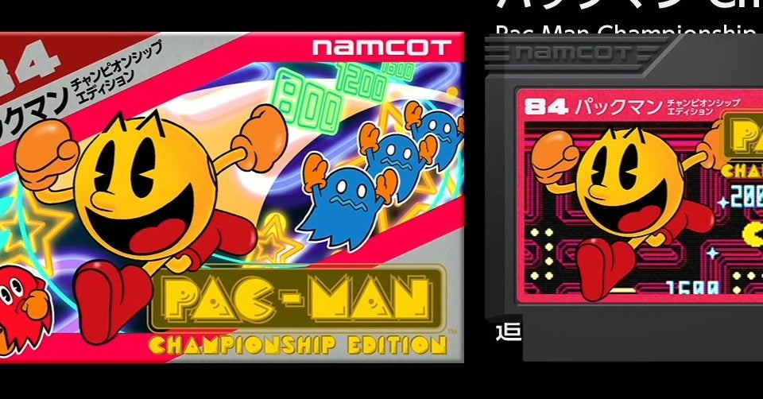

<figure>

</figure>

　かつてXbox360で、**『パックマンチャンピオンシップエディション』**というゲームがリリースされたことがある。2007年のことである。

　**『パックマンチャンピオンシップエディション』**は、キャラクターや画面のデザインこそ初代の**『パックマン』**をベースにした映像で、ひと目で**『パックマン』**の新作だとわかるものの、ルールがまったく新しい完全新作ゲームであった。

　光り輝くような美しいグラフィックで描かれた迷路は、画面中央のモンスター小屋辺りを境に左右のエリアに分けられている。その左右どちらかのエリアに配置されたドットをすべて食べることで、もう片方のエリアにドットが出現する。左右のエリアのドットを交互に食べ尽くし、制限時間内に稼いだ得点を競うというゲームになっている。ミスなくドットを食べるにつれて加速するパックマンをはじめ、ゲーム全体がテンポよく展開するように設計されている。その結果短時間でも熱いプレイが楽しめ、なおかつパワーアップしてモンスターを食べるタイミングなども考えて飛躍的に得点を伸ばすことができるゲームとなっている。

　さらに、**『パックマンチャンピオンシップエディション』**のスコアは、オンラインでランキングを共有され、フレンドのスコアがどれぐらいなのか、すぐに参照できる仕組みもあった。これもゲームプレイをヒートアップさせる一因となっていた。同じ時間にゲームをプレイしなくとも、ゲームを起動すれば、フレンドのスコアを見ることができ、お互いに相手のスコアを目指して日々精進するという、パックマン無限地獄のようなプレイの日々を送ることができる素晴らしいゲームだった。

　今回、任天堂スイッチ用にリリースされた**『ナムコットコレクション』**は、DLCコンテンツである各ゲームソフトを全部購入すると、この**『パックマンチャンピオンシップエディション』**のファミコン版がもらえるという特典がついている。

　**『パックマンチャンピオンシップエディション』**がいかに面白いゲームとは言え、もう10年以上も前にリリースされたタイトルのファミコン移植がなぜ今になって！？　という疑問はあったが、そのピンホールのようなところを狙って得点をぶっ込んでくるのが移植を担当したエムツーらしさである。

　早速、その**『パックマンチャンピオンシップエディションファミコン版』**をプレイしてみる。正直言って、Xbox360版の美しいグラフィックと、スピード感あふれるゲーム展開が再現できるのか疑問ではあったのだが、そんな危惧は杞憂であった。

　見た目は確かにファミコンの画面である。何しろ、実機でも動くように作ってあるという話だから、見た目がファミコン風なのは当たり前だ。しかし、ビートの聞いたBGMとともに、画面内のパックマンが動き出すと、僕たちが知っているファミコンとは異次元の操作感でパックマンが動かせることがわかる。スピード感も申し分なく、確かにXbox360版と似た感覚で遊べる。

　これは、かつてXbox360版の**『パックマンチャンピオンシップエディション』**にハマったからこそ言えるのだが、単にゲームのルールが同じと言うだけではなく、モンスターを振り切るために火花を散らしながら迷路の角を曲がるプレイ。タッチの差でパワーエサを食べて一気にモンスターたちに逆襲する際どさ。そういうものすべてが、Xbox360版のような緊張感を持っている。どちらかと言えば、オブジェクト数も少なく、配色もいかにもレトロゲームと言った感じのファミコン版の画面だが、いざ遊んでみると、元のゲームをプレイしたときの熱さや、プレイ後の消耗する感じまで、すべてが再現されていると言ってもいい。

　さて、この**『ナムコットコレクション』**、今後のDLCの特典には、すでにアナウンスがあるようにファミコン版**『ギャプラス』**が待ち構えているようだ。ゲーム紹介のムービーで一瞬だけ動いている画面を見ることができるが、**『ギャプラス』**のような動きの激しい、しかもキャラクターの数も多いゲームをなんでファミコンで再現する必要があるのか、全然意味がわからない。いい意味で。でも、きっと実現しているであろう異次元の再現度にまた驚かされるに違いない。それを楽しみに、第二弾を待つことにしよう。
