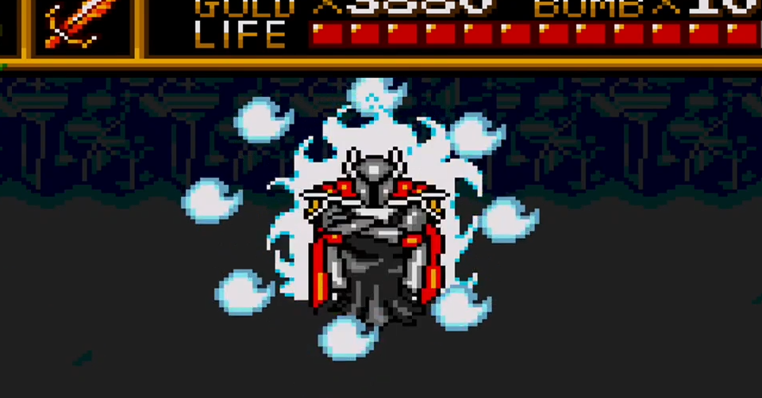

<figure>

</figure>

　**『ニュートピア』**は、1989年にハドソンが発売したPCエンジン用のゲームだ。

　ファミコンの**『ゼルダの伝説』**に酷似したゲームシステム、というよりは、フィールドの移動方法、剣による攻撃、フィールドとダンジョンの構成（その数）など、ほぼ同じゲームと言っていいゲームだ。

　当時もそのことは話題になったものの、実際にプレイしてみると、これがある意味オリジナルの**『ゼルダの伝説』**を超える部分を見せてくれる勢いで完成度が高い。

　特に、PCエンジンならではのカラフルなグラフィック、アーケードゲームのようにアグレッシブに動き回るボスキャラクター、軽妙でロック調のBGMなど、ゲームの各要素が丁寧に作り込まれているのが特徴だ。さらに、通常攻撃の剣の他に杖による魔法攻撃があるが、これがすごく強力で、この魔法の存在がゲームを飛躍的に遊びやすくしている。

　正直、自キャラが強すぎるぐらいの調整が為されているため、簡単なゲームの部類ではあるが、それ故に、今でもときどき遊びたくなるような手軽さがある。僕自身は、このゲームの音楽が大好きで、それを聞くために、楽しくボスと戦うといった感じで、何回もプレイしている。

　**『ニュートピア』**は、発売から30年以上が経つ現在まで、Wiiのバーチャルコンソール、PS3、PSP、WiiUなど、数多くのゲーム機で遊べるように移植されている。もともとの遊びやすさと、遊びたくなる諸要素の完成度に加えて、これまでいつでも遊べるような環境にあったことが重なり合って、今日まで身近なゲームとして遊んできた。

　そんな**『ニュートピア』**だが、今回PCエンジンminiが発売されるにあたり、当然のように収録ゲームにラインナップされてきた。僕が、PCエンジンminiのトータルなラインナップにいまひとつ満足しないながら、それでもどこか欲しくなる気持ちを抑えられなかったのは、この**『ニュートピア』**の存在も大きかったのだ。

　先日、コアグラフィックスminiを買ったことで、また**『ニュートピア』**が手軽に遊べるようになった。今日、何回目になるかわからない**『ニュートピア』**に再々々挑戦を始めたところだ。別にクリアできなくてもいい。気のおもむくままにゲームを始めて、かっこいいBGMにひたり、ボス戦を気持ちよく勝利すれば、それで満足だ。人生に、そんなゲームがあってもいいじゃないかと思う。

　だがしかし、このゲームのラスボスであるラファエルのBGMは、クラシカルでアグレッシブな曲調が魅力的な、出色なできばえのゲームミュージックだ。そう思うと、今回もまた最後まで遊んでしまうと思う。名作だ。

[https://www.youtube.com/watch?v=dg944EGKUTc](https://www.youtube.com/watch?v=dg944EGKUTc)
